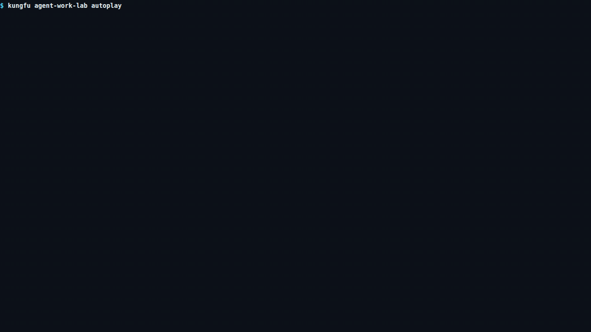
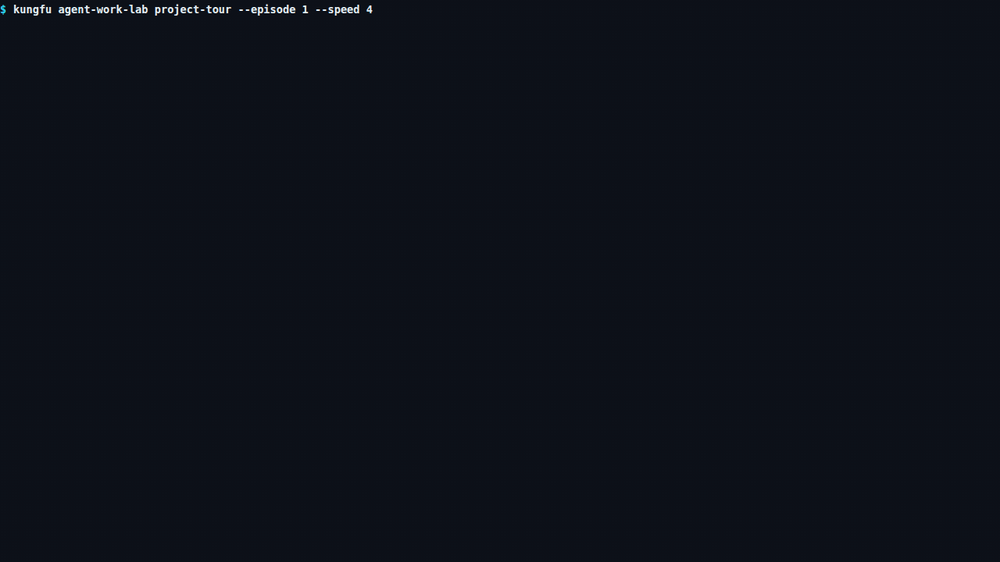
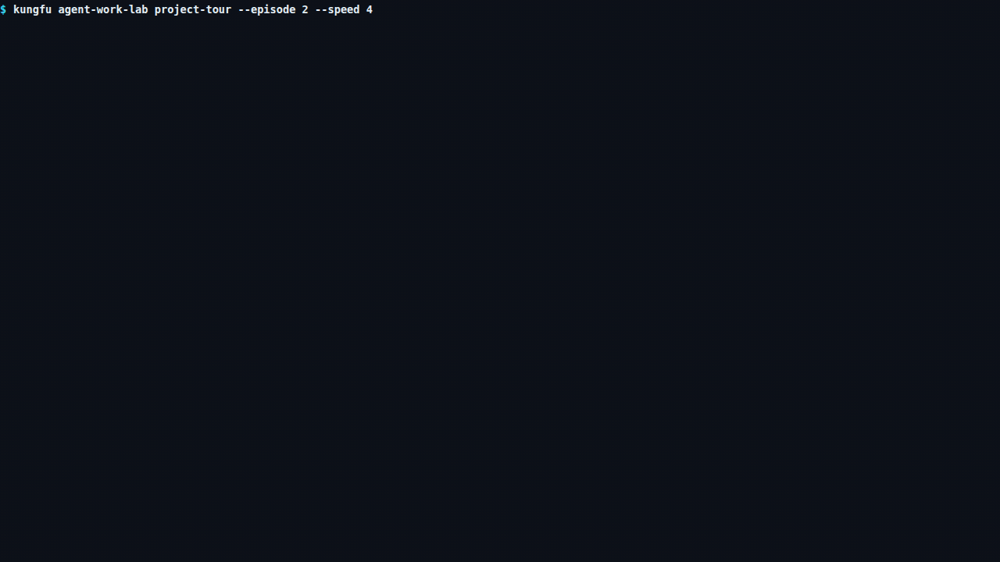

# Kungfu

**Your agents don't hand off the work. You do.**

Every switch means copying context, re-explaining decisions, chasing updates,
and checking what got lost. Kungfu keeps the same work moving, no matter which
agent takes over.

Use the best Agent when it matters. Use a cheaper one when it does not. Keep the
same Work across Codex, Claude, OpenCode, Amp, or your own execution surface.

> **Kungfu UNGFU™** · Never Guess. Facts Unfold. [Why this signature
> exists](docs/concepts/why-kungfu.md).

## See one Work survive failure

Kungfu is currently Alpha. On macOS or Linux, install the CLI with the reviewed
per-user installer:

```sh
curl -fsSL https://kungfu.tech/install.sh | sh
```

It does not use `sudo` or edit your shell profile. Follow the exact `PATH` step
it prints, then open a project and run the deterministic recovery story:

```sh
cd your-project
KUNGFU_MOCK_AGENT_SCENARIO=recovery-story kungfu
```

The built-in Mock Agent needs no provider credentials. It starts the same Work
through three consecutive Attempts: a disconnect, a crash, then a recovered
delivery. Because the scenario is deterministic, it tests Kungfu's local
continuity and recovery path rather than a particular model.

For a quicker onboarding check that crosses a question, an approval, and a
ready-for-review result in one Attempt, run:

```sh
KUNGFU_MOCK_AGENT_SCENARIO=multi-step kungfu
```

See the [installation guide](docs/guides/installing-cli.md) for Windows,
higher-assurance installation, explicit version pinning, and troubleshooting.

## Keep the Agent interface you already use

The Mock Agent covers Work creation and execution. Regular onboarding still
needs a supported real Agent for independent review, so this is not yet an
end-to-end zero-external-Agent path.

**Stay in your current Agent.** Paste this sentence into Codex, Claude, OpenCode,
Amp, or another Agent that can run local commands:

```text
Run `kungfu agent brief`, then guide me through my first Project and Work. Keep me in my current agent, and use Kungfu as the durable Work layer.
```

**Start an Agent through Kungfu.** Use its familiar native console while Kungfu
keeps the Work behind it:

```sh
cd your-project
kungfu run codex
```

Use `claude`, `opencode`, or `amp` instead of `codex` when that is the agent you
already use. Pass a task to create the first Work directly:

```sh
kungfu run codex "Prepare the release notes"
```

**When `.kungfu/` appears.** It is Kungfu's project-local workspace for durable
Work and runtime state. Do not delete it or add the whole directory to Git. Ask
your Agent to run `kungfu agent map --json` and follow its `workspaceGit` policy
before staging anything. Most contents stay local; Kungfu never stages,
commits, or pushes files for you.

**Open the optional global view later.** The Kungfu TUI and GUI can show and
manage Projects and Work across Agent Sessions. They are sidecar views, not a
requirement for every Agent conversation.

## What Kungfu preserves

Kungfu keeps the Work—not the chat—outside every Agent Session: its objective,
progress, evidence, next action, and completion state.

- **Work continuity.** Change the Agent without losing what was done, what
  remains, or which Work is continuing.
- **Verified project understanding.** Declared sources, important omissions,
  conflicts, decisions, and uncertainty remain visible instead of being guessed.
- **Inspectable history.** People and Agents can see what happened, what the
  next action is, and where the supporting evidence came from.
- **Completion authority.** An Agent can produce a result and its evidence;
  independent review and Kungfu settlement decide whether Work is complete.

The first visible value should arrive within minutes. The deeper value appears
over the following days, when the same Work survives context loss, changed
understanding, failed attempts, handoff, and restart.

## One Work, three concepts

A **Project** remembers where related Work belongs. A **Work** keeps one durable
objective and its current truth. An **Attempt** records what one Agent tried,
including failure, without replacing or erasing the Work.

The same Work state is available from native Agent consoles, the Kungfu TUI and
GUI, the CLI, and APIs. If another live Agent already owns a Work, Kungfu stops
a second writer instead of letting two Agents silently diverge.

## Three proofs that Work is durable

Durable Work must answer three questions in order: can it survive a new Agent,
can it survive failure, and who is allowed to complete it?

### 1. Can Work survive a new Agent?

Yes. The first proof isolates continuity: one Work continues across two fresh
Agent Sessions without copied chat.

<!-- kungfu:auditable-demo:agent-work-lab-autoplay:start -->
[](docs/qualification/evidence/auditable-demo/e2952e8c5f44783203bb3a523221412a19424e6374c4b2bf1f16bd8b209f0eee/agent-work-lab-autoplay/public-evidence.json)
<!-- kungfu:auditable-demo:agent-work-lab-autoplay:end -->

### 2. Can Work survive failure?

Yes. The second proof moves from mechanism to real failure conditions. Inside
a disposable Project, the connection drops, a new process resumes, that process
crashes, and both Attempts remain under the same Work.

<!-- kungfu:auditable-demo:project-tour-episode-1:start -->
[](docs/qualification/evidence/auditable-demo/042f9a63bce7db29e7f6df7367351e712c6f3cd5feb1cc2cd2baeb50b2fd18f2/project-tour-episode-1/public-evidence.json)
<!-- kungfu:auditable-demo:project-tour-episode-1:end -->

Work survival is only the first step. If an Agent can declare its own result
complete, continuity still is not trustworthy.

### 3. Who is allowed to complete Work?

Only the governed review and settlement path—not the Agent that did the work.
The third proof separates Agent exit, independent review, and Kungfu settlement.
An Agent can produce the candidate and evidence; it cannot approve its own Work.

<!-- kungfu:auditable-demo:project-tour-episode-2:start -->
[](docs/qualification/evidence/auditable-demo/df1966c3530ea294f6eb8f7a38c6a79cdc2ad6537810faed8ce93364f2e943ca/project-tour-episode-2/public-evidence.json)
<!-- kungfu:auditable-demo:project-tour-episode-2:end -->

These are bounded exact-artifact demonstrations—not provider rankings,
production certification, or authority to complete real Work. See the
[animation technical specification and auditable evidence](docs/qualification/auditable-demo-artifact-pipeline.md).

To enter the Lab yourself instead of watching an artifact, run
`kungfu agent-work-lab`. Its short `open → watch/tour → try → test → report`
journey is documented in the [Agent Work Lab guide](docs/guides/agent-work-lab.md).

Open the optional terminal view whenever you want the larger Work picture:

```sh
kungfu
```

Getting Started leads to the same Agent-first prompt, so this remains a sidecar
rather than a replacement for your familiar Agent interface.

## Contribute with your Agent

You do not need to learn every Kungfu subsystem before making a bounded change.
From a source checkout, give your Agent the task you actually want to complete:

```text
Read `AGENTS.md`. I want to <task>. Use the repository's verified task-context route. Before editing, explain only the concepts, current implementation owners, authority boundaries, and qualification path this task requires.
```

If you are exploring or evaluating the repository rather than changing it,
paste this into your Agent:

```text
Inspect https://github.com/kungfu-systems/kungfu.
Read AGENTS.md first. Explain what Kungfu does and evaluate its architecture.
Give me only the smallest mental model I need; do not make me learn the
repository's full ontology.
```

For a whole-system explanation, start with the [Evolution
Map](docs/evolution/README.md). For a bounded change, Shifu compiles a verified
[Agent Task Chart](docs/guides/xinfa-agent-context.md) and expands it only when
the task requires more context. Required omissions, stale authority, and
ambiguous routing remain visible instead of being filled by guesswork.

## Go deeper when you need to

The README stops at the product entry. Detailed implementation, evidence, and
claim boundaries live in their own maintained routes:

- **Use and understand Kungfu:** [System Overview](docs/concepts/system-overview.md),
  the [Documentation Guide](docs/README.md), and the complete
  [Documentation Map](docs/MAP.md).
- **Build or contribute:** [Contributing to Kungfu](CONTRIBUTING.md),
  [AGENTS.md](AGENTS.md), [Verified Context for Agents](docs/guides/xinfa-agent-context.md),
  and [runtime surface provenance](docs/concepts/runtime-surface-provenance.md).
- **Verify guarantees and current limits:** [Contracts](docs/qualification/contracts.md),
  [Known Limits](docs/qualification/known-limits.md), and the
  [KFD support matrix](docs/qualification/kfd-support-matrix.md).
- **Evaluate release, update, and migration behavior:**
  [Upgrade Kungfu](docs/guides/upgrading.md) and the
  [Exit and version compatibility policy](docs/guides/exit-and-version-compatibility.md).
- **Evaluate the wider ecosystem thesis:** the
  [Agent Supply Chain architecture](docs/architecture/agent-supply-chain.md).

Kungfu v4 is publicly available in Alpha. Download the
[current release artifacts](https://github.com/kungfu-systems/kungfu/releases/latest)
or follow the [installation guide](docs/guides/installing-cli.md). Alpha remains
a prerelease channel, not a stable or generally available release; exact
support, qualification, and non-claims remain in
[Alpha Status](docs/guides/alpha-status.md) and
[Known Limits](docs/qualification/known-limits.md).

<!-- buildchain:badges:start -->
[](https://github.com/kungfu-systems/kungfu/releases/latest/download/buildchain.release.json)
[](https://github.com/kungfu-systems/kungfu/releases/latest/download/buildchain.release.json)
[](https://github.com/kungfu-systems/kungfu/releases/latest/download/buildchain.release.json)
[](https://github.com/kungfu-systems/kungfu/releases/latest/download/buildchain.release.json)
[](https://github.com/kungfu-systems/kungfu/releases/latest/download/buildchain.release.json)
[](https://github.com/kungfu-systems/kungfu/blob/HEAD/LICENSE)
[](https://github.com/kungfu-systems/kungfu/releases/latest/download/buildchain.release.json)
[](https://github.com/kungfu-systems/kungfu/actions/workflows/source-acceptance.yml)
[](https://github.com/kungfu-systems/kungfu/actions/workflows/buildchain-validate.yml)
[](https://github.com/kungfu-systems/kungfu/actions/workflows/dco.yml)
<!-- buildchain:badges:end -->

## Project links

- Product home: <https://kungfu.tech>
- Developer and agent surface: <https://libkungfu.dev>
- Issues and questions: [GitHub issue forms](https://github.com/kungfu-systems/kungfu/issues/new/choose)
- Security reports: [SECURITY.md](SECURITY.md)
- License: [Apache License 2.0](LICENSE)

## Open system repositories

Kungfu's protocol, release infrastructure, build environments, and public
sites are developed in the open:

- [Buildchain](https://github.com/kungfu-systems/buildchain) — auditable build
  and release infrastructure with verifiable Release Passports.
- [KFD](https://github.com/kungfu-systems/kfd) — the open engineering standard
  for reliable action and continuity under uncertainty.
- [Build Images](https://github.com/kungfu-systems/build-images) — source for
  the reproducible environments used to build Kungfu system artifacts.
- [kungfu.tech source](https://github.com/kungfu-systems/site-kungfu-tech) —
  source for the public product site.
- [libkungfu.dev source](https://github.com/kungfu-systems/site-libkungfu-dev) —
  source for the developer and agent surface.
- [All public repositories](https://github.com/kungfu-systems) — the complete
  organization-level source map.
