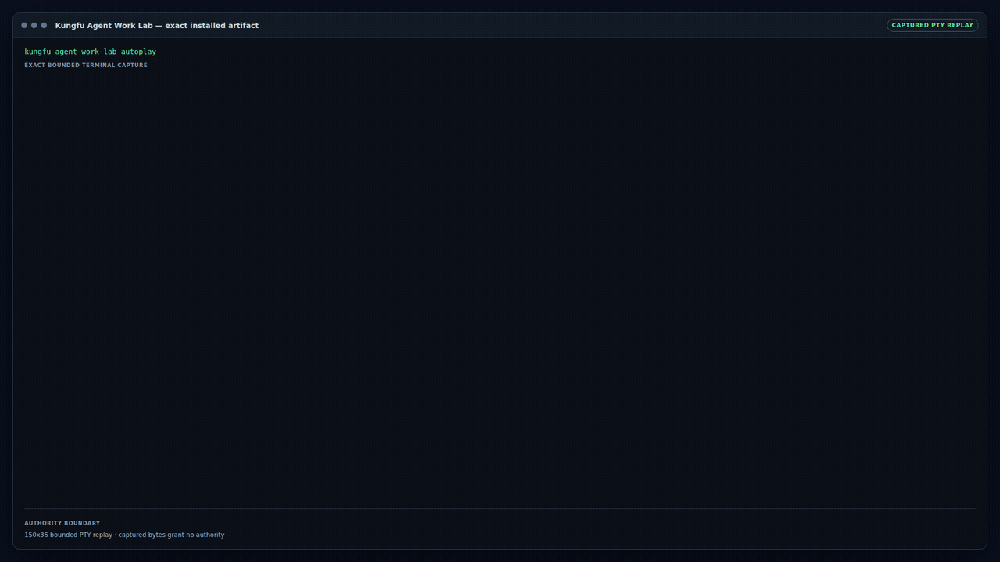

# Kungfu

**Your agents don't hand off the work. You do.**

Every switch means copying context, re-explaining decisions, chasing updates,
and checking what got lost. Kungfu keeps the same work moving, no matter which
agent takes over.

Use the best Agent when it matters. Use a cheaper one when it does not. Keep the
same Work across Codex, Claude, OpenCode, Amp, or your own execution surface.

> **Kungfu UNGFU™** · Never Guess. Facts Unfold. [Why this signature
> exists](docs/concepts/why-kungfu.md).

Before asking an agent to use Kungfu, make sure the `kungfu` command is on its
`PATH`. [Set up the Kungfu command](docs/guides/installing-cli.md#make-kungfu-available-in-path),
then paste this one sentence into the agent you already use:

```text
Run `kungfu agent brief`, then guide me through my first Project and Work. Keep me in my current agent, and use Kungfu as the durable Work layer.
```

Keep working in that agent when you are ready:

```sh
cd your-project
kungfu run codex
```

Use `claude`, `opencode`, or `amp` instead of `codex` when that is the agent you
already use. Pass a task to create the first Work directly:

```sh
kungfu run codex "Prepare the release notes"
```

A successful agent process is retained for independent review; it does not
complete Work by itself.

<!-- kungfu:auditable-demo:agent-work-lab-autoplay:start -->
## See the Work survive an Agent change

**One Work. Two fresh Agent processes. No copied chat.**

Session 1 stops with a partial result. Session 2 starts without the previous
conversation, recovers what was done and what remains, then finishes the same Work.

[](docs/qualification/auditable-demo-artifact-pipeline.md)

<details>
<summary>How this exact installed-artifact demo was verified</summary>

This selectively rendered demo comes from one exact retained Linux build artifact.
The installed `kungfu agent-work-lab autoplay` command ran in a bounded PTY, the
required Buildchain Gate qualified its exact capture, and full media rendered only
from that passing Gate.

[Method and evidence](docs/qualification/auditable-demo-artifact-pipeline.md) · [source `7777de45e3fa`](https://github.com/kungfu-systems/kungfu/commit/7777de45e3fa53c6654d39990314efc2bc9ae99a) · [workflow run](https://github.com/kungfu-systems/kungfu/actions/runs/30646944258)

[Gate bundle](https://github.com/kungfu-systems/kungfu/actions/runs/30646944258/artifacts/8802347879) `sha256:9e73aac549a32458ad132ad8166836aa7ab03885210117a15a5d382ef2687c33` · [media bundle](https://github.com/kungfu-systems/kungfu/actions/runs/30646944258/artifacts/8802406105) `sha256:8353070c7b204bccb9e51e124cd07de215ef64db742a70333614c4fe065c59aa` · [Release Passport](https://github.com/kungfu-systems/kungfu/actions/runs/30646944258/artifacts/8802427227) `sha256:835bde89ae8cee57661dfc2f4ba96bbf6d2be1546d89f42fd0c18a331a7308da`

Evidence class: `exact-installed-artifact-agent-work-lab-autoplay/v1`. This proves only the exact
installed-artifact autoplay and named Gate/render path. The demo grants no
authorization from first-party/System identity, KFD compliance, Product System
metadata, local bundle presence, package metadata, registry history, scan output,
or standalone generation, and makes no production-deployment claim.

</details>
<!-- kungfu:auditable-demo:agent-work-lab-autoplay:end -->

<!-- kungfu:auditable-demo:project-tour-08x:start -->
<!-- kungfu:auditable-demo:project-tour-08x:end -->

Want to explore without leaving Kungfu first? Run the terminal product:

```sh
kungfu
```

Getting Started leads to the same Agent-first prompt. Agent Work Lab is the
lowest-friction optional demonstration, and Guided Project Tour leaves a
Project you can keep using. After onboarding, bare `kungfu` opens Work directly.

## What Kungfu preserves

- **Work continuity.** Change the Agent without losing what was done, what
  remains, or which Work is continuing.
- **Verified project understanding.** Declared sources, important omissions,
  conflicts, decisions, and uncertainty remain visible instead of being guessed.
- **Inspectable history.** People and Agents can see what happened, what the
  next action is, and where the supporting evidence came from.

The first visible value should arrive within minutes. The deeper value appears
over the following days, when the same work survives context loss, changed
understanding, failed attempts, handoff, and restart.

See the [continuity handoff](https://kungfu.tech/#continuity-demo) and
[how it was tested](https://kungfu.tech/how-tested/continuity/), or inspect the
[source protocol and retained evidence](docs/qualification/continuity-pilot.md).
The current result is preparatory fixture evidence—not a provider comparison,
multi-day durability or retention result, or FO10 qualification.

## Change the Agent, not the Work

`kungfu run <agent>` is the scriptable golden path across Codex, Claude Code,
OpenCode, Amp, and other Agent surfaces. Kungfu does not replace those surfaces;
it keeps the Work behind them. The provider-neutral low-level launcher remains
available as the advanced `kungfu run agent` command. Registered third-party
PTY Agents use `kungfu run agent --agent <profile-id>` and the bounded
[native adapter contract](docs/guides/native-agent-adapters.md). The same local
contracts and Work state remain available through the Kungfu TUI, GUI, CLI,
and APIs.

Projects can start blank, use the guided Agent Work Starter template, or safely
remember an existing folder without changing its files. You can open several
terminals in the same Project and run the same bare command in each one; Kungfu
gives every launch its own Console. The Agent binds that Console to exact Work
before it changes the Project. If another live Agent already owns that Work,
Kungfu stops the second writer and points back to the existing attempt. Use
`--work` when more than one captured Work item is eligible.

## Build from source

Public release artifacts are not available yet. To evaluate the current source
tree:

```sh
git clone https://github.com/kungfu-systems/kungfu.git
cd kungfu
./shifu doctor
./shifu sync && ./shifu build
```

## Understand the system

If your goal is to understand Kungfu as a system, do not begin by comparing
repository directories and current modules side by side. Start with the
[Evolution Map](docs/evolution/README.md): it establishes the historical
pressures, abstraction compressions, and authority transitions that produced
the current cross-section. Then use its reader routes to enter the exact
current module, contract, and source authority for your question.

If you already have one bounded implementation or operational task, use
[AGENTS.md](AGENTS.md) and the task-specific Xinfa route instead of loading the
whole history first.

- [Start with Kungfu's longitudinal Evolution Map](docs/evolution/README.md)
- [Why Kungfu begins with a minimal human sovereign core](docs/concepts/bootstrapping-agent-work.md)
- [Inspect and reanalyze the bounded public work sample](https://kungfu.tech/about/bootstrapping/evidence/)
- [How the complete Kungfu system works](docs/concepts/system-overview.md)
- [Agent Supply Chain architecture and evaluation](docs/architecture/agent-supply-chain.md)
- [Documentation Guide](docs/README.md)
- [Documentation Map](docs/MAP.md)
- [Known Limits](docs/qualification/known-limits.md)
- [Build and contribute](CONTRIBUTING.md)

Agents working from a source checkout should begin with [AGENTS.md](AGENTS.md)
and [Verified Context for Agents](docs/guides/xinfa-agent-context.md). An
installed runtime carries its own local agent brief:

```sh
kungfu agent brief
```

To discover the exact Fact and Episode invariants, their owners, current
evidence routes, and residual risks from a source checkout, run:

```sh
./shifu invariant:verify -- --list --json
```

The human route is [Invariant Verification](docs/qualification/invariant-verification.md).

## Trust, portability, and the open system

The following sections expose the release, migration, and interoperability
contracts for technical evaluation. They preserve the evidence behind Kungfu's
claims without making that evidence the first step in understanding the product.

### Release status

Kungfu v4 is **Coming soon**. Source-built capabilities and qualification
slices exist, but public packaging, cross-platform evidence, strong power-loss
durability, and the institutional profile remain staged unless linked evidence
says otherwise.

UNGFU is Kungfu's source-identifying signature, not a second product or runtime.
See [Why Kungfu](docs/concepts/why-kungfu.md) for the naming boundary.

The first public Alpha is additionally gated by one ordered activation
transaction. Artifact publication, Release Passport sealing, exact site
publication, public read-back, and installed-product qualification must all
bind the same product/site source SHAs, artifact root, version, tag, and
channel. Released evidence is synthesized only from those receipts; a
preparation file cannot make a released-use or first-use claim. See
[Trademark public-use qualification](docs/qualification/trademark-public-use.md).

An installed Kungfu gives a person or Agent the same direct answer:

```sh
kungfu release status
kungfu release verify <release-status-or-evidence.json>
kungfu release explain
```

The human result says what passed and what did not; `--json` returns the stable
KFD-3 surface. Before activation, the truthful answer is `VERIFIED, NOT
AVAILABLE`. These commands do not make trademark-registration, legal, or
first-use-date claims.

Design intent, implemented behavior, qualified guarantees, and released
artifacts are deliberately distinct. Before relying on a claim, check
[Contracts](docs/qualification/contracts.md),
[Known Limits](docs/qualification/known-limits.md), and the applicable retained
qualification evidence.

Kungfu's complete KFD-1 through KFD-13 adoption and claim boundary is published
in the generated [KFD support matrix](docs/qualification/kfd-support-matrix.md).
Source implementation, verification, Buildchain gating, and shipped release
support are reported separately; a declared badge is not a release
qualification.

Inspect the current checkout before installing dependencies or initializing a
Kungfu runtime:

```sh
./shifu kfd status
./shifu kfd query KFD-3 --json
./shifu kfd check --json
```

The first command gives an immediate human verdict. The JSON forms expose the
same checked-in facts and non-claims to an Agent. They qualify source evidence,
not an installed product: use `kungfu agent hub qualify` and
`kungfu agent hub verify` for the installed Agent Hub path.

### Exit and migration

Kungfu treats Exit and migration as a product contract. Qualified stable
releases on the same `major.minor` line preserve registered authoritative
semantics, not physical provider paths, caches, or presentation. The current v4
alpha remains exact-evidence-only; it does not yet carry that stable promise.

Read the [Exit, migration, and version compatibility policy](docs/guides/exit-and-version-compatibility.md)
for the support boundary, current qualification matrix, and non-claims. An
installed artifact exposes its exact policy and protocol inventory without
initializing a runtime:

```sh
kungfu exit verify --info --json
```

The public install/update claim is still closed. The exact current matrix,
one-command behavior, activation boundary, rollback guidance, and explicit
non-claims are in [Upgrade Kungfu](docs/guides/upgrading.md); source fixtures
and prepared package-manager adapters are not public release artifacts.

### Kungfu in the Agent Supply Chain

Kungfu lights the first loop by keeping Work alive across the Agents a person
already uses. The Agent experiences explicit capabilities, inspectable evidence,
and durable Work—then can recognize and ask for those qualities elsewhere.

That creates a possible market loop: Agents recommend within human or Hub
authority, builders receive a demand signal, and more Agent-native products can
ship the same qualities. Those products can restart the loop without Kungfu.
This is an adoption thesis, not a claim of broad external demand or a multi-Hub
market. [See the Agent Supply Chain loop](https://kungfu.tech/agent-supply-chain/).

The technical chain is:

```text
KFD-3 discovery -> Buildchain artifact evidence -> KFD-2 assessment
  -> libkungfu / .kungfu durable work facts -> independent Agent Hubs
```

Kungfu and libkungfu own the fourth layer: recording, ordering, querying,
verifying, exporting, and recovering durable work facts and Episodes. The
application still owns its domain facts, and JSON is an edge projection rather
than a second authority. The public KFD Agent Hub profile lets independently
owned products carry bounded responsibility objects across that edge while
each receiver retains admission.

The current proof is exact-source and first-party: source-built runtime slices,
retained qualification, and one OpenCode-shaped reference adapter. It does not
claim OpenCode endorsement, external vendor adoption, a second independent
production Hub, public Kungfu Cloud, stable cross-platform compatibility, or
physical power-loss qualification. Read the
[architecture and evaluation route](docs/architecture/agent-supply-chain.md).

If Kungfu is installed, ask the product itself. The first command runs the
bundled fixed KFD Hub 20 suite and explains the exact result; the second
independently rechecks the retained evidence:

```sh
kungfu agent hub qualify --output-dir ./kungfu-agent-hub-check
kungfu agent hub verify --qualification-dir ./kungfu-agent-hub-check
```

Use `--json` when an Agent is the reader. A pass proves only the named local
artifact, two isolated local authority domains, and the fixed KFD package cut.
It is not KFD certification, security assessment, production fitness,
remote-network interoperability, external adoption, or evidence for an
unobserved platform.

<!-- buildchain:badges:start -->
[](https://github.com/kungfu-systems/kungfu/releases/latest/download/buildchain.release.json)
[](https://github.com/kungfu-systems/kungfu/releases/latest/download/buildchain.release.json)
[](https://github.com/kungfu-systems/kungfu/releases/latest/download/buildchain.release.json)
[](https://github.com/kungfu-systems/kungfu/releases/latest/download/buildchain.release.json)
[](https://github.com/kungfu-systems/kungfu/releases/latest/download/buildchain.release.json)
[](https://github.com/kungfu-systems/kungfu/blob/HEAD/LICENSE)
[](https://github.com/kungfu-systems/kungfu/releases/latest/download/buildchain.release.json)
[](https://github.com/kungfu-systems/kungfu/actions/workflows/source-acceptance.yml)
[](https://github.com/kungfu-systems/kungfu/actions/workflows/buildchain-validate.yml)
[](https://github.com/kungfu-systems/kungfu/actions/workflows/dco.yml)
<!-- buildchain:badges:end -->

## Project links

- Product home: <https://kungfu.tech>
- Developer and agent surface: <https://libkungfu.dev>
- Issues and questions: [GitHub issue forms](https://github.com/kungfu-systems/kungfu/issues/new/choose)
- Security reports: [SECURITY.md](SECURITY.md)
- License: [Apache License 2.0](LICENSE)

## Open system repositories

Kungfu's protocol, release infrastructure, build environments, and public
sites are developed in the open:

- [Buildchain](https://github.com/kungfu-systems/buildchain) — auditable build
  and release infrastructure with verifiable Release Passports.
- [KFD](https://github.com/kungfu-systems/kfd) — the open engineering standard
  for reliable action and continuity under uncertainty.
- [Build Images](https://github.com/kungfu-systems/build-images) — source for
  the reproducible environments used to build Kungfu system artifacts.
- [kungfu.tech source](https://github.com/kungfu-systems/site-kungfu-tech) —
  source for the public product site.
- [libkungfu.dev source](https://github.com/kungfu-systems/site-libkungfu-dev) —
  source for the developer and agent surface.
- [All public repositories](https://github.com/kungfu-systems) — the complete
  organization-level source map.
