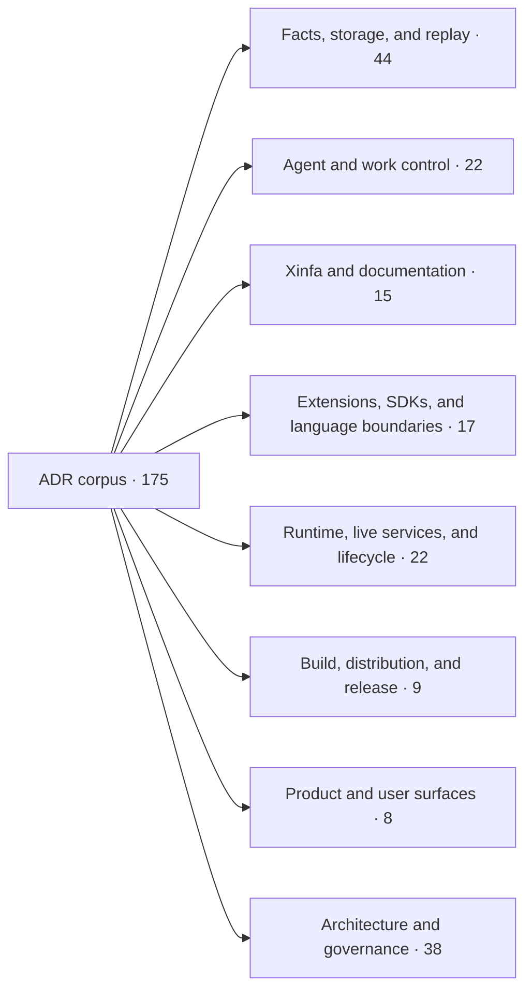
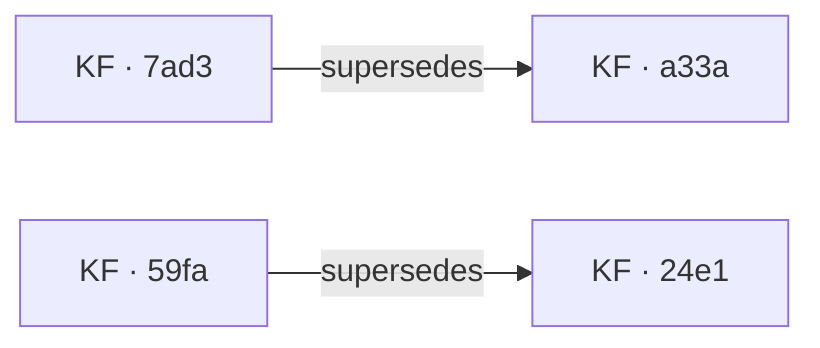

# ADR Map

This generated page is the human navigation projection of the canonical ADR
corpus. It is deliberately layered: start with the domain map, expand one
domain, then open a decision or its bounded neighborhood.

> Authority boundary: solid `supersedes` relations come only from ADR
> frontmatter. Domain membership and nearby links are deterministic
> navigation-only inferences from titles and themes. They do not create
> architecture authority. Xinfa remains the graph, impact, and stale-state
> authority.

Use browser find to search titles, themes, statuses, or compact keys. The
full IDs stay behind links so filenames do not dominate the page.

Coverage: **175 ADRs** across **8 domains**; **2 authoritative edges**.

## Domain overview

## Authoritative decision relations

- [KF · 7ad3](../adr/KF-ADR-019f86da-4f90-71eb-b4c0-376ca7bc7ad3.md) **supersedes** [KF · a33a](../adr/KF-ADR-019f86da-4f90-7a55-9b15-93fcab44a33a.md)
- [KF · 59fa](../adr/KF-ADR-019f86da-4f90-7394-9953-5dbb467859fa.md) **supersedes** [KF · 24e1](../adr/KF-ADR-019f86da-4f90-730a-a068-06e8758324e1.md)

## Browse by domain

Each “Nearby” set is capped at four same-domain decisions, ranked by exact
theme and shared title/theme terms, and explicitly navigation-only. The
reason is shown beside every link. Status is `decision / implementation /
review`; evidence is the number of declared qualification references.

<strong>Facts, storage, and replay</strong> · 44

| Key | Decision | Theme | Status | Evidence | Nearby (navigation only) |
|---|---|---|---|---:|---|
| KF · bf48 | [Observer-relative timeline projection over causal facts](../adr/KF-ADR-019f86da-4f90-704e-9488-a793b1c4bf48.md) | observer-relative-timeline-projection | accepted / staged / self-reviewed | 5 | [KF · 6424](../adr/KF-ADR-019f86da-4f90-7b1a-8633-b9153e586424.md) (shared terms: over, projection) [KF · 41bf](../adr/KF-ADR-019f86da-4f90-7c8c-b8ef-5b46308541bf.md) (shared terms: timeline) [KF · 7ad3](../adr/KF-ADR-019f86da-4f90-71eb-b4c0-376ca7bc7ad3.md) (shared terms: facts) [KF · 6327](../adr/KF-ADR-019f86da-4f90-791c-9b90-4888cca36327.md) (shared terms: causal) |
| KF · d540 | [Xinfa baselines split into tracked witnesses and ignored local material](../adr/KF-ADR-019f86da-4f90-7089-b9b1-e070edf7d540.md) | xinfa-baseline-storage-convergence | accepted / staged / self-reviewed | 2 | [KF · 78d9](../adr/KF-ADR-019f86da-4f90-73f2-a0ac-42f14e0278d9.md) (shared terms: local) [KF · e16a](../adr/KF-ADR-019f86da-4f90-7650-bb2d-932dce8ae16a.md) (shared terms: local) [KF · 9194](../adr/KF-ADR-019f86da-4f90-7f7f-b5cc-b4553aac9194.md) (shared terms: storage) [KF · b0f5](../adr/KF-ADR-019f86da-4f90-7828-9142-46f9bca4b0f5.md) (shared terms: storage) |
| KF · 37de | [Runtime storage service as the persistence contract above journal, payloads, and projections](../adr/KF-ADR-019f86da-4f90-70c5-b572-89ec183b37de.md) | — | accepted / staged / self-reviewed | 4 | [KF · b0f5](../adr/KF-ADR-019f86da-4f90-7828-9142-46f9bca4b0f5.md) (shared terms: contract, service, storage) [KF · 9194](../adr/KF-ADR-019f86da-4f90-7f7f-b5cc-b4553aac9194.md) (shared terms: journal, storage) [KF · 141a](../adr/KF-ADR-019f86da-4f90-71ac-bb91-32456981141a.md) (shared terms: journal, storage) [KF · cd72](../adr/KF-ADR-019f86da-4f90-7fa3-8045-32c1220ecd72.md) (shared terms: journal, projections) |
| KF · 2132 | [schema-registry contract invariants are welded at compile time — tag uniqueness and payload layout↔version binding](../adr/KF-ADR-019f86da-4f90-7105-b400-fa2be0ed2132.md) | — | accepted / implemented / legacy-unreviewed | 1 | [KF · d265](../adr/KF-ADR-019f86da-4f90-7bf2-9789-1b88bf3ed265.md) (shared terms: contract, layout, schema) [KF · 759f](../adr/KF-ADR-019f86da-4f90-7a3d-9578-42b1c711759f.md) (shared terms: registry, schema) [KF · a33a](../adr/KF-ADR-019f86da-4f90-7a55-9b15-93fcab44a33a.md) (shared terms: layout, schema) [KF · 7ad3](../adr/KF-ADR-019f86da-4f90-71eb-b4c0-376ca7bc7ad3.md) (shared terms: schema) |
| KF · 6cc1 | [Storage backend changes are authority-atomic, resumable operations](../adr/KF-ADR-019f86da-4f90-713b-a44c-0677d2446cc1.md) | authority-atomic-storage-backend-switch | accepted / staged / self-reviewed | 6 | [KF · cefb](../adr/KF-ADR-019f86da-4f90-7516-b7ed-5b39a527cefb.md) (shared terms: atomic) [KF · ff1c](../adr/KF-ADR-019f86da-4f90-7c45-8d95-3745dcbbff1c.md) (shared terms: backend) [KF · 9194](../adr/KF-ADR-019f86da-4f90-7f7f-b5cc-b4553aac9194.md) (shared terms: storage) [KF · b0f5](../adr/KF-ADR-019f86da-4f90-7828-9142-46f9bca4b0f5.md) (shared terms: storage) |
| KF · 8910 | [yijinjing journal frame/page publish protocol → `atomic_ref` release/acquire](../adr/KF-ADR-019f86da-4f90-7179-a900-c40bdb498910.md) | — | accepted / implemented / legacy-unreviewed | 2 | [KF · 6692](../adr/KF-ADR-019f86da-4f90-762d-a677-5e8984cc6692.md) (shared terms: journal, yijinjing) [KF · e16a](../adr/KF-ADR-019f86da-4f90-7650-bb2d-932dce8ae16a.md) (shared terms: frame, journal) [KF · 141a](../adr/KF-ADR-019f86da-4f90-71ac-bb91-32456981141a.md) (shared terms: journal, page) [KF · cefb](../adr/KF-ADR-019f86da-4f90-7516-b7ed-5b39a527cefb.md) (shared terms: atomic) |
| KF · 141a | [location role replaces trading category and journal page size is storage policy](../adr/KF-ADR-019f86da-4f90-71ac-bb91-32456981141a.md) | — | accepted / partial / legacy-unreviewed | 0 | [KF · 9194](../adr/KF-ADR-019f86da-4f90-7f7f-b5cc-b4553aac9194.md) (shared terms: journal, storage) [KF · 37de](../adr/KF-ADR-019f86da-4f90-70c5-b572-89ec183b37de.md) (shared terms: journal, storage) [KF · 8910](../adr/KF-ADR-019f86da-4f90-7179-a900-c40bdb498910.md) (shared terms: journal, page) [KF · 6692](../adr/KF-ADR-019f86da-4f90-762d-a677-5e8984cc6692.md) (shared terms: journal) |
| KF · 7ad3 | [authoritative structured facts have one schema owner — Hana POD or FlatBuffers](../adr/KF-ADR-019f86da-4f90-71eb-b4c0-376ca7bc7ad3.md) | — | accepted / staged / legacy-unreviewed | 0 | [KF · 759f](../adr/KF-ADR-019f86da-4f90-7a3d-9578-42b1c711759f.md) (shared terms: authoritative, one, schema) [KF · a33a](../adr/KF-ADR-019f86da-4f90-7a55-9b15-93fcab44a33a.md) (shared terms: flatbuffers, pod, schema) [KF · e7c4](../adr/KF-ADR-019f86da-4f90-7b50-9cb5-715a82f9e7c4.md) (shared terms: schema, structured) [KF · 5cae](../adr/KF-ADR-019f86da-4f90-737e-893f-c095b9a05cae.md) (shared terms: one, pod) |
| KF · 2715 | [Episode Admission is destination-owned and transport-neutral](../adr/KF-ADR-019f86da-4f90-7220-9a21-bdcbedc82715.md) | destination-owned-episode-admission | accepted / staged / self-reviewed | 4 | [KF · e7a8](../adr/KF-ADR-019f86da-4f90-726e-b31f-ed180aa2e7a8.md) (shared terms: episode, owned) [KF · 78d9](../adr/KF-ADR-019f86da-4f90-73f2-a0ac-42f14e0278d9.md) (shared terms: episode) [KF · cefb](../adr/KF-ADR-019f86da-4f90-7516-b7ed-5b39a527cefb.md) (shared terms: episode) [KF · 6327](../adr/KF-ADR-019f86da-4f90-791c-9b90-4888cca36327.md) (shared terms: episode) |
| KF · e7a8 | [Episode bundles carry their owned bytes, and import materializes them](../adr/KF-ADR-019f86da-4f90-726e-b31f-ed180aa2e7a8.md) | self-contained-episode-bundles | accepted / implemented / self-reviewed | 4 | [KF · 2715](../adr/KF-ADR-019f86da-4f90-7220-9a21-bdcbedc82715.md) (shared terms: episode, owned) [KF · 78d9](../adr/KF-ADR-019f86da-4f90-73f2-a0ac-42f14e0278d9.md) (shared terms: episode) [KF · cefb](../adr/KF-ADR-019f86da-4f90-7516-b7ed-5b39a527cefb.md) (shared terms: episode) [KF · 6327](../adr/KF-ADR-019f86da-4f90-791c-9b90-4888cca36327.md) (shared terms: episode) |
| KF · 5cae | [the Episode manifest is the object's trust boundary — POD journal records, one typed fold, and JSON at the edge](../adr/KF-ADR-019f86da-4f90-737e-893f-c095b9a05cae.md) | episode-manifest-trust-boundary | accepted / staged / self-reviewed | 5 | [KF · 6692](../adr/KF-ADR-019f86da-4f90-762d-a677-5e8984cc6692.md) (shared terms: episode, journal, manifest, records) [KF · b0f5](../adr/KF-ADR-019f86da-4f90-7828-9142-46f9bca4b0f5.md) (shared terms: edge, json, records) [KF · 7ad3](../adr/KF-ADR-019f86da-4f90-71eb-b4c0-376ca7bc7ad3.md) (shared terms: one, pod) [KF · 78d9](../adr/KF-ADR-019f86da-4f90-73f2-a0ac-42f14e0278d9.md) (shared terms: episode, manifest) |
| KF · 78d9 | [Episode identity is two layers — a local coordinate plus a sealed content root committed in the manifest](../adr/KF-ADR-019f86da-4f90-73f2-a0ac-42f14e0278d9.md) | — | proposed / not-started / legacy-unreviewed | 0 | [KF · 6692](../adr/KF-ADR-019f86da-4f90-762d-a677-5e8984cc6692.md) (shared terms: episode, manifest) [KF · e16a](../adr/KF-ADR-019f86da-4f90-7650-bb2d-932dce8ae16a.md) (shared terms: identity, local) [KF · c732](../adr/KF-ADR-019f86da-4f90-7b89-895f-21b4008bc732.md) (shared terms: episode, sealed) [KF · 5cae](../adr/KF-ADR-019f86da-4f90-737e-893f-c095b9a05cae.md) (shared terms: episode, manifest) |
| KF · d0df | [the journal container epoch is derived from its layout, and cross-epoch replay is offline conversion](../adr/KF-ADR-019f86da-4f90-741b-8f16-b27fcd99d0df.md) | — | accepted / staged / legacy-unreviewed | 0 | [KF · 41bf](../adr/KF-ADR-019f86da-4f90-7c8c-b8ef-5b46308541bf.md) (shared terms: replay) [KF · 6692](../adr/KF-ADR-019f86da-4f90-762d-a677-5e8984cc6692.md) (shared terms: journal) [KF · e16a](../adr/KF-ADR-019f86da-4f90-7650-bb2d-932dce8ae16a.md) (shared terms: journal) [KF · 9194](../adr/KF-ADR-019f86da-4f90-7f7f-b5cc-b4553aac9194.md) (shared terms: journal) |
| KF · 89ae | [The minimal generic `.kungfu` core closure — libkungfu owns generic maintenance/self-describing primitives; domain interpretation stays in outer rings; expose generic frame decode and frame checksum on the membrane](../adr/KF-ADR-019f86da-4f90-7499-9152-520599d089ae.md) | minimal-generic-core-closure | accepted / staged / self-reviewed | 0 | [KF · d450](../adr/KF-ADR-019f86da-4f90-7a7d-99ba-c5c18088d450.md) (shared terms: checksum, frame) [KF · e7a8](../adr/KF-ADR-019f86da-4f90-726e-b31f-ed180aa2e7a8.md) (shared terms: self) [KF · e16a](../adr/KF-ADR-019f86da-4f90-7650-bb2d-932dce8ae16a.md) (shared terms: frame) [KF · bbb0d5](../adr/KF-ADR-019f86da-4f90-7d72-bf9f-1d5913bbb0d5.md) (shared terms: frame) |
| KF · cefb | [Episode is the atomic safety and fault-containment unit, qualified by evidence under load](../adr/KF-ADR-019f86da-4f90-7516-b7ed-5b39a527cefb.md) | episode-atomic-safety | proposed / not-started / self-reviewed | 0 | [KF · dce4](../adr/KF-ADR-019f86da-4f90-77ba-8f80-470856cedce4.md) (shared terms: episode, evidence, qualified) [KF · c732](../adr/KF-ADR-019f86da-4f90-7b89-895f-21b4008bc732.md) (shared terms: episode, qualified) [KF · e7c4](../adr/KF-ADR-019f86da-4f90-7b50-9cb5-715a82f9e7c4.md) (shared terms: qualified) [KF · 2715](../adr/KF-ADR-019f86da-4f90-7220-9a21-bdcbedc82715.md) (shared terms: episode) |
| KF · 65b0d5 | [KFD-1 durability config requests policy; the runtime earns admission](../adr/KF-ADR-019f86da-4f90-7585-ab0e-eea95d65b0d5.md) | kfd1-durability-policy-runtime-admission | accepted / implemented / self-reviewed | 5 | [KF · 6aca](../adr/KF-ADR-019f86da-4f90-7ec5-a83c-99cfaee56aca.md) (shared terms: admission, durability) [KF · 2715](../adr/KF-ADR-019f86da-4f90-7220-9a21-bdcbedc82715.md) (shared terms: admission) [KF · 141a](../adr/KF-ADR-019f86da-4f90-71ac-bb91-32456981141a.md) (shared terms: policy) [KF · eb04](../adr/KF-ADR-019f86da-4f90-7d53-b594-952ae035eb04.md) (shared terms: runtime) |
| KF · 6692 | [Episode manifest records live in the yijinjing journal format](../adr/KF-ADR-019f86da-4f90-762d-a677-5e8984cc6692.md) | — | accepted / partial / legacy-unreviewed | 0 | [KF · 5cae](../adr/KF-ADR-019f86da-4f90-737e-893f-c095b9a05cae.md) (shared terms: episode, journal, manifest, records) [KF · 78d9](../adr/KF-ADR-019f86da-4f90-73f2-a0ac-42f14e0278d9.md) (shared terms: episode, manifest) [KF · 9194](../adr/KF-ADR-019f86da-4f90-7f7f-b5cc-b4553aac9194.md) (shared terms: episode, journal) [KF · cd72](../adr/KF-ADR-019f86da-4f90-7fa3-8045-32c1220ecd72.md) (shared terms: journal, live) |
| KF · e16a | [frame identity layering — journal-local frame uid, ledger-global stream position](../adr/KF-ADR-019f86da-4f90-7650-bb2d-932dce8ae16a.md) | frame-identity-layering | accepted / staged / self-reviewed | 1 | [KF · 78d9](../adr/KF-ADR-019f86da-4f90-73f2-a0ac-42f14e0278d9.md) (shared terms: identity, local) [KF · dc01](../adr/KF-ADR-019f86da-4f90-7e58-bb03-bee0f101dc01.md) (shared terms: ledger, local) [KF · 8910](../adr/KF-ADR-019f86da-4f90-7179-a900-c40bdb498910.md) (shared terms: frame, journal) [KF · 6692](../adr/KF-ADR-019f86da-4f90-762d-a677-5e8984cc6692.md) (shared terms: journal) |
| KF · dce4 | [Xinfa admits qualified sealed Episodes as sourced successor-Atlas evidence](../adr/KF-ADR-019f86da-4f90-77ba-8f80-470856cedce4.md) | xinfa-qualified-episode-evidence-provider | accepted / implemented / self-reviewed | 4 | [KF · c732](../adr/KF-ADR-019f86da-4f90-7b89-895f-21b4008bc732.md) (shared terms: episode, episodes, provider, qualified) [KF · cefb](../adr/KF-ADR-019f86da-4f90-7516-b7ed-5b39a527cefb.md) (shared terms: episode, evidence, qualified) [KF · e7c4](../adr/KF-ADR-019f86da-4f90-7b50-9cb5-715a82f9e7c4.md) (shared terms: provider, qualified) [KF · 78d9](../adr/KF-ADR-019f86da-4f90-73f2-a0ac-42f14e0278d9.md) (shared terms: episode, sealed) |
| KF · b0f5 | [KF-ADR-019f86da-4f90-70c5-b572-89ec183b37de storage-service records are Hana-core kernel metadata; JSON is an edge projection, not the contract](../adr/KF-ADR-019f86da-4f90-7828-9142-46f9bca4b0f5.md) | — | accepted / implemented / self-reviewed | 3 | [KF · 37de](../adr/KF-ADR-019f86da-4f90-70c5-b572-89ec183b37de.md) (shared terms: contract, service, storage) [KF · 5cae](../adr/KF-ADR-019f86da-4f90-737e-893f-c095b9a05cae.md) (shared terms: edge, json, records) [KF · 7ad3](../adr/KF-ADR-019f86da-4f90-71eb-b4c0-376ca7bc7ad3.md) (shared terms: hana) [KF · 6692](../adr/KF-ADR-019f86da-4f90-762d-a677-5e8984cc6692.md) (shared terms: records) |
| KF · 6327 | [Episode is the first-class causal segment object](../adr/KF-ADR-019f86da-4f90-791c-9b90-4888cca36327.md) | — | accepted / partial / legacy-unreviewed | 0 | [KF · 6365](../adr/KF-ADR-019fe996-1912-7144-8fa5-3fceaa416365.md) (shared terms: class, first) [KF · 5cae](../adr/KF-ADR-019f86da-4f90-737e-893f-c095b9a05cae.md) (shared terms: episode, object) [KF · 2715](../adr/KF-ADR-019f86da-4f90-7220-9a21-bdcbedc82715.md) (shared terms: episode) [KF · e7a8](../adr/KF-ADR-019f86da-4f90-726e-b31f-ed180aa2e7a8.md) (shared terms: episode) |
| KF · 780b | [Native work and Agent Console form one Episode-backed loop](../adr/KF-ADR-019f86da-4f90-7977-9cfc-85d26d41780b.md) | native-work-agent-console-loop | accepted / staged / self-reviewed | 12 | [KF · ff1c](../adr/KF-ADR-019f86da-4f90-7c45-8d95-3745dcbbff1c.md) (shared terms: form, one) [KF · 5cae](../adr/KF-ADR-019f86da-4f90-737e-893f-c095b9a05cae.md) (shared terms: episode, one) [KF · 41bf](../adr/KF-ADR-019f86da-4f90-7c8c-b8ef-5b46308541bf.md) (shared terms: agent) [KF · 861e](../adr/KF-ADR-019f87cc-bd1f-786d-896d-07ea9245861e.md) (shared terms: backed) |
| KF · 759f | [the schema type registry has one authoritative set and trait-derived subsets](../adr/KF-ADR-019f86da-4f90-7a3d-9578-42b1c711759f.md) | — | accepted / partial / legacy-unreviewed | 0 | [KF · 7ad3](../adr/KF-ADR-019f86da-4f90-71eb-b4c0-376ca7bc7ad3.md) (shared terms: authoritative, one, schema) [KF · 2132](../adr/KF-ADR-019f86da-4f90-7105-b400-fa2be0ed2132.md) (shared terms: registry, schema) [KF · e7c4](../adr/KF-ADR-019f86da-4f90-7b50-9cb5-715a82f9e7c4.md) (shared terms: schema) [KF · ff1c](../adr/KF-ADR-019f86da-4f90-7c45-8d95-3745dcbbff1c.md) (shared terms: one) |
| KF · a33a | [yijinjing schema serialization — a FlatBuffers runtime schema over the zero-copy POD layout](../adr/KF-ADR-019f86da-4f90-7a55-9b15-93fcab44a33a.md) | — | superseded / not-applicable / legacy-unreviewed | 0 | [KF · 7ad3](../adr/KF-ADR-019f86da-4f90-71eb-b4c0-376ca7bc7ad3.md) (shared terms: flatbuffers, pod, schema) [KF · eb04](../adr/KF-ADR-019f86da-4f90-7d53-b594-952ae035eb04.md) (shared terms: runtime, schema, yijinjing) [KF · d265](../adr/KF-ADR-019f86da-4f90-7bf2-9789-1b88bf3ed265.md) (shared terms: layout, schema, yijinjing) [KF · 2132](../adr/KF-ADR-019f86da-4f90-7105-b400-fa2be0ed2132.md) (shared terms: layout, schema) |
| KF · d450 | [frame checksum v2 uses CRC32C receipt metadata](../adr/KF-ADR-019f86da-4f90-7a7d-99ba-c5c18088d450.md) | — | accepted / partial / legacy-unreviewed | 0 | [KF · 89ae](../adr/KF-ADR-019f86da-4f90-7499-9152-520599d089ae.md) (shared terms: checksum, frame) [KF · b367](../adr/KF-ADR-019f86da-4f90-7acc-b6dc-d560f0fab367.md) (shared terms: uses) [KF · e16a](../adr/KF-ADR-019f86da-4f90-7650-bb2d-932dce8ae16a.md) (shared terms: frame) [KF · bbb0d5](../adr/KF-ADR-019f86da-4f90-7d72-bf9f-1d5913bbb0d5.md) (shared terms: frame) |
| KF · b367 | [Fact Root v2 uses a closed typed binary preimage](../adr/KF-ADR-019f86da-4f90-7acc-b6dc-d560f0fab367.md) | portable-fact-root-canonical-encoding | accepted / implemented / self-reviewed | 13 | [KF · 861e](../adr/KF-ADR-019f87cc-bd1f-786d-896d-07ea9245861e.md) (shared terms: fact, portable) [KF · 78d9](../adr/KF-ADR-019f86da-4f90-73f2-a0ac-42f14e0278d9.md) (shared terms: root) [KF · ff1c](../adr/KF-ADR-019f86da-4f90-7c45-8d95-3745dcbbff1c.md) (shared terms: fact) [KF · 7ae8](../adr/KF-ADR-019f86da-4f90-7cb5-b65c-b463768e7ae8.md) (shared terms: fact) |
| KF · 6424 | [Product diagnostics are one read-only projection over existing authorities](../adr/KF-ADR-019f86da-4f90-7b1a-8633-b9153e586424.md) | unified-read-only-product-diagnostics | accepted / implemented / self-reviewed | 6 | [KF · bf48](../adr/KF-ADR-019f86da-4f90-704e-9488-a793b1c4bf48.md) (shared terms: over, projection) [KF · c03b](../adr/KF-ADR-019f86da-4f90-7b52-a878-2326be81c03b.md) (shared terms: one, projection) [KF · 7ad3](../adr/KF-ADR-019f86da-4f90-71eb-b4c0-376ca7bc7ad3.md) (shared terms: one) [KF · ff1c](../adr/KF-ADR-019f86da-4f90-7c45-8d95-3745dcbbff1c.md) (shared terms: one) |
| KF · e7c4 | [Codex App Server is a schema-qualified structured-hybrid provider adapter](../adr/KF-ADR-019f86da-4f90-7b50-9cb5-715a82f9e7c4.md) | codex-app-server-structured-hybrid-adapter | accepted / staged / self-reviewed | 9 | [KF · 7ad3](../adr/KF-ADR-019f86da-4f90-71eb-b4c0-376ca7bc7ad3.md) (shared terms: schema, structured) [KF · c732](../adr/KF-ADR-019f86da-4f90-7b89-895f-21b4008bc732.md) (shared terms: provider, qualified) [KF · dce4](../adr/KF-ADR-019f86da-4f90-77ba-8f80-470856cedce4.md) (shared terms: provider, qualified) [KF · cefb](../adr/KF-ADR-019f86da-4f90-7516-b7ed-5b39a527cefb.md) (shared terms: qualified) |
| KF · c03b | [Xinfa compiles bounded Human, Task Chart, and GUI projections from one Atlas](../adr/KF-ADR-019f86da-4f90-7b52-a878-2326be81c03b.md) | xinfa-bounded-projection-task-chart | accepted / implemented / self-reviewed | 4 | [KF · 6424](../adr/KF-ADR-019f86da-4f90-7b1a-8633-b9153e586424.md) (shared terms: one, projection) [KF · dce4](../adr/KF-ADR-019f86da-4f90-77ba-8f80-470856cedce4.md) (shared terms: atlas, xinfa) [KF · 7ad3](../adr/KF-ADR-019f86da-4f90-71eb-b4c0-376ca7bc7ad3.md) (shared terms: one) [KF · ff1c](../adr/KF-ADR-019f86da-4f90-7c45-8d95-3745dcbbff1c.md) (shared terms: one) |
| KF · c732 | [Git Workspace stores qualified sealed Episodes as immutable per-Episode segments](../adr/KF-ADR-019f86da-4f90-7b89-895f-21b4008bc732.md) | git-workspace-episode-provider | accepted / implemented / self-reviewed | 1 | [KF · dce4](../adr/KF-ADR-019f86da-4f90-77ba-8f80-470856cedce4.md) (shared terms: episode, episodes, provider, qualified) [KF · e7c4](../adr/KF-ADR-019f86da-4f90-7b50-9cb5-715a82f9e7c4.md) (shared terms: provider, qualified) [KF · 78d9](../adr/KF-ADR-019f86da-4f90-73f2-a0ac-42f14e0278d9.md) (shared terms: episode, sealed) [KF · cefb](../adr/KF-ADR-019f86da-4f90-7516-b7ed-5b39a527cefb.md) (shared terms: episode, qualified) |
| KF · d265 | [yijinjing schema layout is the v4 greenfield fact contract](../adr/KF-ADR-019f86da-4f90-7bf2-9789-1b88bf3ed265.md) | — | accepted / partial / legacy-unreviewed | 0 | [KF · 2132](../adr/KF-ADR-019f86da-4f90-7105-b400-fa2be0ed2132.md) (shared terms: contract, layout, schema) [KF · a33a](../adr/KF-ADR-019f86da-4f90-7a55-9b15-93fcab44a33a.md) (shared terms: layout, schema, yijinjing) [KF · 6365](../adr/KF-ADR-019fe996-1912-7144-8fa5-3fceaa416365.md) (shared terms: contract, fact) [KF · eb04](../adr/KF-ADR-019f86da-4f90-7d53-b594-952ae035eb04.md) (shared terms: schema, yijinjing) |
| KF · ff1c | [Fact identity, versions, relations, Cuts, refs, CAS, and receipts form one backend-neutral kernel](../adr/KF-ADR-019f86da-4f90-7c45-8d95-3745dcbbff1c.md) | backend-neutral-fact-cut-kernel | accepted / staged / self-reviewed | 39 | [KF · 6365](../adr/KF-ADR-019fe996-1912-7144-8fa5-3fceaa416365.md) (shared terms: fact, relations) [KF · 780b](../adr/KF-ADR-019f86da-4f90-7977-9cfc-85d26d41780b.md) (shared terms: form, one) [KF · 4104](../adr/KF-ADR-019f86da-4f90-7e38-b72f-ef8829e14104.md) (shared terms: fact, one) [KF · 861e](../adr/KF-ADR-019f87cc-bd1f-786d-896d-07ea9245861e.md) (shared terms: fact) |
| KF · 41bf | [Agent action timeline and rewind/replay boundary](../adr/KF-ADR-019f86da-4f90-7c8c-b8ef-5b46308541bf.md) | — | accepted / partial / legacy-unreviewed | 0 | [KF · 7ae8](../adr/KF-ADR-019f86da-4f90-7cb5-b65c-b463768e7ae8.md) (shared terms: action) [KF · 780b](../adr/KF-ADR-019f86da-4f90-7977-9cfc-85d26d41780b.md) (shared terms: agent) [KF · bf48](../adr/KF-ADR-019f86da-4f90-704e-9488-a793b1c4bf48.md) (shared terms: timeline) [KF · 5cae](../adr/KF-ADR-019f86da-4f90-737e-893f-c095b9a05cae.md) (shared terms: boundary) |
| KF · 7ae8 | [Fact-Episode Ontology is distinct from Action Geometry](../adr/KF-ADR-019f86da-4f90-7cb5-b65c-b463768e7ae8.md) | fact-episode-ontology-action-geometry | accepted / staged / self-reviewed | 4 | [KF · 41bf](../adr/KF-ADR-019f86da-4f90-7c8c-b8ef-5b46308541bf.md) (shared terms: action) [KF · 861e](../adr/KF-ADR-019f87cc-bd1f-786d-896d-07ea9245861e.md) (shared terms: fact) [KF · 2715](../adr/KF-ADR-019f86da-4f90-7220-9a21-bdcbedc82715.md) (shared terms: episode) [KF · e7a8](../adr/KF-ADR-019f86da-4f90-726e-b31f-ed180aa2e7a8.md) (shared terms: episode) |
| KF · 8654 | [hash taxonomy separates internal ids, frame checksums, and content hashes](../adr/KF-ADR-019f86da-4f90-7d2c-aaa5-974ca5e38654.md) | — | accepted / partial / legacy-unreviewed | 0 | [KF · 78d9](../adr/KF-ADR-019f86da-4f90-73f2-a0ac-42f14e0278d9.md) (shared terms: content) [KF · d450](../adr/KF-ADR-019f86da-4f90-7a7d-99ba-c5c18088d450.md) (shared terms: frame) [KF · e16a](../adr/KF-ADR-019f86da-4f90-7650-bb2d-932dce8ae16a.md) (shared terms: frame) [KF · bbb0d5](../adr/KF-ADR-019f86da-4f90-7d72-bf9f-1d5913bbb0d5.md) (shared terms: frame) |
| KF · eb04 | [Python yijinjing schema exposes only core public runtime types](../adr/KF-ADR-019f86da-4f90-7d53-b594-952ae035eb04.md) | — | accepted / partial / legacy-unreviewed | 0 | [KF · a33a](../adr/KF-ADR-019f86da-4f90-7a55-9b15-93fcab44a33a.md) (shared terms: runtime, schema, yijinjing) [KF · d265](../adr/KF-ADR-019f86da-4f90-7bf2-9789-1b88bf3ed265.md) (shared terms: schema, yijinjing) [KF · 7ad3](../adr/KF-ADR-019f86da-4f90-71eb-b4c0-376ca7bc7ad3.md) (shared terms: schema) [KF · e7c4](../adr/KF-ADR-019f86da-4f90-7b50-9cb5-715a82f9e7c4.md) (shared terms: schema) |
| KF · bbb0d5 | [frame integrity starts at the C++ recorder and raw carrier_type allocation is gated](../adr/KF-ADR-019f86da-4f90-7d72-bf9f-1d5913bbb0d5.md) | — | accepted / partial / legacy-unreviewed | 0 | [KF · d450](../adr/KF-ADR-019f86da-4f90-7a7d-99ba-c5c18088d450.md) (shared terms: frame) [KF · e16a](../adr/KF-ADR-019f86da-4f90-7650-bb2d-932dce8ae16a.md) (shared terms: frame) [KF · 8654](../adr/KF-ADR-019f86da-4f90-7d2c-aaa5-974ca5e38654.md) (shared terms: frame) [KF · 89ae](../adr/KF-ADR-019f86da-4f90-7499-9152-520599d089ae.md) (shared terms: frame) |
| KF · 4104 | [runtime fact queries use explicit bases, one logical plan, and a proof-carrying changelog](../adr/KF-ADR-019f86da-4f90-7e38-b72f-ef8829e14104.md) | — | accepted / staged / legacy-unreviewed | 0 | [KF · ff1c](../adr/KF-ADR-019f86da-4f90-7c45-8d95-3745dcbbff1c.md) (shared terms: fact, one) [KF · 6365](../adr/KF-ADR-019fe996-1912-7144-8fa5-3fceaa416365.md) (shared terms: fact, proof) [KF · 861e](../adr/KF-ADR-019f87cc-bd1f-786d-896d-07ea9245861e.md) (shared terms: fact) [KF · 7ad3](../adr/KF-ADR-019f86da-4f90-71eb-b4c0-376ca7bc7ad3.md) (shared terms: one) |
| KF · dc01 | [Workspace-local `.kungfu` is the default fact ledger home](../adr/KF-ADR-019f86da-4f90-7e58-bb03-bee0f101dc01.md) | — | accepted / partial / legacy-unreviewed | 0 | [KF · e16a](../adr/KF-ADR-019f86da-4f90-7650-bb2d-932dce8ae16a.md) (shared terms: ledger, local) [KF · 861e](../adr/KF-ADR-019f87cc-bd1f-786d-896d-07ea9245861e.md) (shared terms: fact) [KF · 78d9](../adr/KF-ADR-019f86da-4f90-73f2-a0ac-42f14e0278d9.md) (shared terms: local) [KF · ff1c](../adr/KF-ADR-019f86da-4f90-7c45-8d95-3745dcbbff1c.md) (shared terms: fact) |
| KF · 6aca | [tiered durability separates hot visibility, durable fact admission, projections, and replication](../adr/KF-ADR-019f86da-4f90-7ec5-a83c-99cfaee56aca.md) | tiered-durability-and-crash-recovery | accepted / staged / self-reviewed | 0 | [KF · 65b0d5](../adr/KF-ADR-019f86da-4f90-7585-ab0e-eea95d65b0d5.md) (shared terms: admission, durability) [KF · 861e](../adr/KF-ADR-019f87cc-bd1f-786d-896d-07ea9245861e.md) (shared terms: fact) [KF · 2715](../adr/KF-ADR-019f86da-4f90-7220-9a21-bdcbedc82715.md) (shared terms: admission) [KF · ff1c](../adr/KF-ADR-019f86da-4f90-7c45-8d95-3745dcbbff1c.md) (shared terms: fact) |
| KF · 9194 | [journal lifecycle management belongs to Storage and Episode boundaries](../adr/KF-ADR-019f86da-4f90-7f7f-b5cc-b4553aac9194.md) | legacy-journal-cli-retirement | accepted / staged / maintainer-reviewed | 0 | [KF · 6692](../adr/KF-ADR-019f86da-4f90-762d-a677-5e8984cc6692.md) (shared terms: episode, journal) [KF · 141a](../adr/KF-ADR-019f86da-4f90-71ac-bb91-32456981141a.md) (shared terms: journal, storage) [KF · 37de](../adr/KF-ADR-019f86da-4f90-70c5-b572-89ec183b37de.md) (shared terms: journal, storage) [KF · 5cae](../adr/KF-ADR-019f86da-4f90-737e-893f-c095b9a05cae.md) (shared terms: episode, journal) |
| KF · cd72 | [retire journal Session and separate live state from schema projections](../adr/KF-ADR-019f86da-4f90-7fa3-8045-32c1220ecd72.md) | — | accepted / staged / legacy-unreviewed | 0 | [KF · 6692](../adr/KF-ADR-019f86da-4f90-762d-a677-5e8984cc6692.md) (shared terms: journal, live) [KF · 37de](../adr/KF-ADR-019f86da-4f90-70c5-b572-89ec183b37de.md) (shared terms: journal, projections) [KF · 861e](../adr/KF-ADR-019f87cc-bd1f-786d-896d-07ea9245861e.md) (shared terms: state) [KF · 7ad3](../adr/KF-ADR-019f86da-4f90-71eb-b4c0-376ca7bc7ad3.md) (shared terms: schema) |
| KF · 861e | [Assignment orchestration state is fact-backed and portably sealed](../adr/KF-ADR-019f87cc-bd1f-786d-896d-07ea9245861e.md) | portable-assignment-orchestration-state | accepted / staged / self-reviewed | 7 | [KF · b367](../adr/KF-ADR-019f86da-4f90-7acc-b6dc-d560f0fab367.md) (shared terms: fact, portable) [KF · 78d9](../adr/KF-ADR-019f86da-4f90-73f2-a0ac-42f14e0278d9.md) (shared terms: sealed) [KF · ff1c](../adr/KF-ADR-019f86da-4f90-7c45-8d95-3745dcbbff1c.md) (shared terms: fact) [KF · 7ae8](../adr/KF-ADR-019f86da-4f90-7cb5-b65c-b463768e7ae8.md) (shared terms: fact) |
| KF · 6365 | [Immutable temporal relations and bounded proof paths are first-class Facts](../adr/KF-ADR-019fe996-1912-7144-8fa5-3fceaa416365.md) | temporal-relation-fact-contract | accepted / implemented / self-reviewed | 19 | [KF · 6327](../adr/KF-ADR-019f86da-4f90-791c-9b90-4888cca36327.md) (shared terms: class, first) [KF · ff1c](../adr/KF-ADR-019f86da-4f90-7c45-8d95-3745dcbbff1c.md) (shared terms: fact, relations) [KF · 4104](../adr/KF-ADR-019f86da-4f90-7e38-b72f-ef8829e14104.md) (shared terms: fact, proof) [KF · d265](../adr/KF-ADR-019f86da-4f90-7bf2-9789-1b88bf3ed265.md) (shared terms: contract, fact) |

<strong>Agent and work control</strong> · 22

| Key | Decision | Theme | Status | Evidence | Nearby (navigation only) |
|---|---|---|---|---:|---|
| KF · 5fdf | [Project Cut settlement is agent-first and hook-optional](../adr/KF-ADR-019f86da-4f90-709e-8116-1c8ddf385fdf.md) | project-cut-agent-first-settlement | accepted / implemented / self-reviewed | 6 | [KF · 7e9b](../adr/KF-ADR-019fb2de-4a59-7bf4-8231-b32b62aa7e9b.md) (shared terms: agent, first, project) [KF · 17b1](../adr/KF-ADR-019f86da-4f90-7f46-b195-3af6228d17b1.md) (shared terms: agent, first) [KF · 45f8](../adr/KF-ADR-019f86da-4f90-7667-b89e-18b1002e45f8.md) (shared terms: agent, first) [KF · 7173](../adr/KF-ADR-019f86da-4f90-7a57-a680-9739f5e67173.md) (shared terms: cut, project) |
| KF · 13b1 | [Project Cut history uses explicit rooted bindings outside the Cut preimage](../adr/KF-ADR-019f86da-4f90-7272-b883-cb90fc4613b1.md) | project-cut-git-history-bindings | accepted / implemented / self-reviewed | 2 | [KF · d2be](../adr/KF-ADR-019f86da-4f90-7410-a3fc-f9cdeb55d2be.md) (shared terms: cut, explicit, project, uses) [KF · 7173](../adr/KF-ADR-019f86da-4f90-7a57-a680-9739f5e67173.md) (shared terms: cut, project) [KF · a623](../adr/KF-ADR-019f86da-4f90-77d5-a9ce-e7c798e3a623.md) (shared terms: cut, project) [KF · ad30](../adr/KF-ADR-019f86da-4f90-7b77-a360-0725f23aad30.md) (shared terms: cut, project) |
| KF · 0716 | [Completion review is independent, root-bound, and mechanically continuable](../adr/KF-ADR-019f86da-4f90-732e-826c-e994acc20716.md) | independent-review-exact-continuation | accepted / implemented / self-reviewed | 7 | [KF · 26ba](../adr/KF-ADR-019f86da-4f90-7d75-949b-4b5de42226ba.md) (shared terms: continuation) [KF · 6ed6](../adr/KF-ADR-019fe5dc-0977-7a82-82fb-a751d7766ed6.md) (shared terms: independent) [KF · d2be](../adr/KF-ADR-019f86da-4f90-7410-a3fc-f9cdeb55d2be.md) (shared terms: root) |
| KF · d2be | [Project Cut v1 uses a closed canonical root input and an explicit source projection](../adr/KF-ADR-019f86da-4f90-7410-a3fc-f9cdeb55d2be.md) | project-cut-v1-canonical-root-source-projection | accepted / implemented / self-reviewed | 4 | [KF · 13b1](../adr/KF-ADR-019f86da-4f90-7272-b883-cb90fc4613b1.md) (shared terms: cut, explicit, project, uses) [KF · a623](../adr/KF-ADR-019f86da-4f90-77d5-a9ce-e7c798e3a623.md) (shared terms: cut, project, source) [KF · 7173](../adr/KF-ADR-019f86da-4f90-7a57-a680-9739f5e67173.md) (shared terms: cut, project) [KF · ad30](../adr/KF-ADR-019f86da-4f90-7b77-a360-0725f23aad30.md) (shared terms: cut, project) |
| KF · 03bf | [Kungfu Skill as the agent context layer above kfx](../adr/KF-ADR-019f86da-4f90-74c2-9cbb-24f1c34303bf.md) | — | accepted / partial / legacy-unreviewed | 8 | [KF · 17b1](../adr/KF-ADR-019f86da-4f90-7f46-b195-3af6228d17b1.md) (shared terms: agent, kfx) [KF · 45f8](../adr/KF-ADR-019f86da-4f90-7667-b89e-18b1002e45f8.md) (shared terms: agent, kungfu) [KF · 7e9b](../adr/KF-ADR-019fb2de-4a59-7bf4-8231-b32b62aa7e9b.md) (shared terms: agent, layer) [KF · 6ed6](../adr/KF-ADR-019fe5dc-0977-7a82-82fb-a751d7766ed6.md) (shared terms: agent) |
| KF · 45f8 | [Agent-mediated guidance is a first-class product interface](../adr/KF-ADR-019f86da-4f90-7667-b89e-18b1002e45f8.md) | kungfu-agent-mediated-product | proposed / not-started / unreviewed | 0 | [KF · 7e9b](../adr/KF-ADR-019fb2de-4a59-7bf4-8231-b32b62aa7e9b.md) (shared terms: agent, first, product) [KF · 17b1](../adr/KF-ADR-019f86da-4f90-7f46-b195-3af6228d17b1.md) (shared terms: agent, first) [KF · 7173](../adr/KF-ADR-019f86da-4f90-7a57-a680-9739f5e67173.md) (shared terms: kungfu, product) [KF · 03bf](../adr/KF-ADR-019f86da-4f90-74c2-9cbb-24f1c34303bf.md) (shared terms: agent, kungfu) |
| KF · a623 | [Project Cut binds source, Xinfa Atlas, and Kungfu Episodes without becoming a fourth primitive](../adr/KF-ADR-019f86da-4f90-77d5-a9ce-e7c798e3a623.md) | project-cut-spacetime-publication-boundary | accepted / partial / self-reviewed | 14 | [KF · 7173](../adr/KF-ADR-019f86da-4f90-7a57-a680-9739f5e67173.md) (shared terms: cut, kungfu, project) [KF · ad30](../adr/KF-ADR-019f86da-4f90-7b77-a360-0725f23aad30.md) (shared terms: binds, cut, project) [KF · d2be](../adr/KF-ADR-019f86da-4f90-7410-a3fc-f9cdeb55d2be.md) (shared terms: cut, project, source) [KF · 13b1](../adr/KF-ADR-019f86da-4f90-7272-b883-cb90fc4613b1.md) (shared terms: cut, project) |
| KF · 3917 | [Real-world agent work preserves four independently addressable roles](../adr/KF-ADR-019f86da-4f90-786d-aa24-a97705e13917.md) | four-object-agent-work-state-contract | accepted / staged / self-reviewed | 49 | [KF · 6ed6](../adr/KF-ADR-019fe5dc-0977-7a82-82fb-a751d7766ed6.md) (shared terms: agent, work) [KF · a45f](../adr/KF-ADR-019f8759-ab29-7627-bc04-6aba547ea45f.md) (shared terms: contract, world) [KF · 7e9b](../adr/KF-ADR-019fb2de-4a59-7bf4-8231-b32b62aa7e9b.md) (shared terms: agent, work) [KF · 17b1](../adr/KF-ADR-019f86da-4f90-7f46-b195-3af6228d17b1.md) (shared terms: agent) |
| KF · 7173 | [Kungfu centers the product loop on Project Cut](../adr/KF-ADR-019f86da-4f90-7a57-a680-9739f5e67173.md) | project-cut-centered-product-loop | accepted / partial / self-reviewed | 5 | [KF · a623](../adr/KF-ADR-019f86da-4f90-77d5-a9ce-e7c798e3a623.md) (shared terms: cut, kungfu, project) [KF · e8cf](../adr/KF-ADR-019f87e8-6b8b-735c-b036-fa42d7cee8cf.md) (shared terms: cut, loop, project) [KF · 45f8](../adr/KF-ADR-019f86da-4f90-7667-b89e-18b1002e45f8.md) (shared terms: kungfu, product) [KF · ad30](../adr/KF-ADR-019f86da-4f90-7b77-a360-0725f23aad30.md) (shared terms: cut, project) |
| KF · f302 | [KFD-2 assessments are claim-triggered jobs coordinated by the workspace coordinator](../adr/KF-ADR-019f86da-4f90-7b3f-9ef3-84f5a878f302.md) | — | accepted / staged / legacy-unreviewed | 0 | [KF · 26ba](../adr/KF-ADR-019f86da-4f90-7d75-949b-4b5de42226ba.md) (shared terms: workspace) [KF · 928a](../adr/KF-ADR-019f87cc-bd45-7a5c-9b37-1d6b5917928a.md) (shared terms: claim) [KF · 25a3](../adr/KF-ADR-019f8e99-9354-7ab6-a9ba-b166f83f25a3.md) (shared terms: workspace) |
| KF · ad30 | [Project Cut composition binds concurrent publications without rewriting task Cuts](../adr/KF-ADR-019f86da-4f90-7b77-a360-0725f23aad30.md) | project-cut-merge-safe-composition | accepted / staged / self-reviewed | 6 | [KF · a623](../adr/KF-ADR-019f86da-4f90-77d5-a9ce-e7c798e3a623.md) (shared terms: binds, cut, project) [KF · 7173](../adr/KF-ADR-019f86da-4f90-7a57-a680-9739f5e67173.md) (shared terms: cut, project) [KF · 13b1](../adr/KF-ADR-019f86da-4f90-7272-b883-cb90fc4613b1.md) (shared terms: cut, project) [KF · e8cf](../adr/KF-ADR-019f87e8-6b8b-735c-b036-fa42d7cee8cf.md) (shared terms: cut, project) |
| KF · 26ba | [A Git-settled shadow can open a workspace without becoming runtime authority](../adr/KF-ADR-019f86da-4f90-7d75-949b-4b5de42226ba.md) | shadow-only-workspace-continuation | accepted / staged / self-reviewed | 4 | [KF · 25a3](../adr/KF-ADR-019f8e99-9354-7ab6-a9ba-b166f83f25a3.md) (shared terms: authority, workspace) [KF · 17b1](../adr/KF-ADR-019f86da-4f90-7f46-b195-3af6228d17b1.md) (shared terms: runtime) [KF · bef8](../adr/KF-ADR-019fdb93-19ac-7362-8ab0-f8ed19c7bef8.md) (shared terms: runtime) [KF · 0716](../adr/KF-ADR-019f86da-4f90-732e-826c-e994acc20716.md) (shared terms: continuation) |
| KF · 17b1 | [Agent-first KFX Profile Suites carry domain semantics over a domain-neutral Core](../adr/KF-ADR-019f86da-4f90-7f46-b195-3af6228d17b1.md) | agent-first-kfx-profile-suite-runtime | accepted / staged / self-reviewed | 3 | [KF · bef8](../adr/KF-ADR-019fdb93-19ac-7362-8ab0-f8ed19c7bef8.md) (shared terms: first, neutral, runtime) [KF · 45f8](../adr/KF-ADR-019f86da-4f90-7667-b89e-18b1002e45f8.md) (shared terms: agent, first) [KF · 03bf](../adr/KF-ADR-019f86da-4f90-74c2-9cbb-24f1c34303bf.md) (shared terms: agent, kfx) [KF · 5fdf](../adr/KF-ADR-019f86da-4f90-709e-8116-1c8ddf385fdf.md) (shared terms: agent, first) |
| KF · faef | [one fenced AgentSessionCapsule owns each live agent PTY](../adr/KF-ADR-019f86da-4f90-7fbf-9949-b7ed353dfaef.md) | durable-agent-session-capsule-control-plane | accepted / partial / self-reviewed | 20 | [KF · 6ed6](../adr/KF-ADR-019fe5dc-0977-7a82-82fb-a751d7766ed6.md) (shared terms: agent, session) [KF · a45f](../adr/KF-ADR-019f8759-ab29-7627-bc04-6aba547ea45f.md) (shared terms: control, plane) [KF · 17b1](../adr/KF-ADR-019f86da-4f90-7f46-b195-3af6228d17b1.md) (shared terms: agent) [KF · 45f8](../adr/KF-ADR-019f86da-4f90-7667-b89e-18b1002e45f8.md) (shared terms: agent) |
| KF · a45f | [Initiative and Assignment are the canonical L3 control-plane terms](../adr/KF-ADR-019f8759-ab29-7627-bc04-6aba547ea45f.md) | initiative-assignment-l3-contract-world | accepted / implemented / self-reviewed | 12 | [KF · faef](../adr/KF-ADR-019f86da-4f90-7fbf-9949-b7ed353dfaef.md) (shared terms: control, plane) [KF · 3917](../adr/KF-ADR-019f86da-4f90-786d-aa24-a97705e13917.md) (shared terms: contract, world) [KF · 928a](../adr/KF-ADR-019f87cc-bd45-7a5c-9b37-1d6b5917928a.md) (shared terms: assignment) [KF · bef8](../adr/KF-ADR-019fdb93-19ac-7362-8ab0-f8ed19c7bef8.md) (shared terms: assignment) |
| KF · 9aa5 | [Assignment request capture is build-free, content-addressed, and pre-admission](../adr/KF-ADR-019f878c-5480-7890-bc64-9b2aab7e9aa5.md) | build-free-assignment-request-capture | accepted / staged / self-reviewed | 4 | [KF · 928a](../adr/KF-ADR-019f87cc-bd45-7a5c-9b37-1d6b5917928a.md) (shared terms: assignment) [KF · bef8](../adr/KF-ADR-019fdb93-19ac-7362-8ab0-f8ed19c7bef8.md) (shared terms: assignment) [KF · a45f](../adr/KF-ADR-019f8759-ab29-7627-bc04-6aba547ea45f.md) (shared terms: assignment) [KF · 25a3](../adr/KF-ADR-019f8e99-9354-7ab6-a9ba-b166f83f25a3.md) (shared terms: assignment) |
| KF · 928a | [Assignment claim separates Owner, Agent, Slot, and Lease](../adr/KF-ADR-019f87cc-bd45-7a5c-9b37-1d6b5917928a.md) | assignment-claim-identity-lease | accepted / staged / self-reviewed | 3 | [KF · 6ed6](../adr/KF-ADR-019fe5dc-0977-7a82-82fb-a751d7766ed6.md) (shared terms: agent) [KF · 17b1](../adr/KF-ADR-019f86da-4f90-7f46-b195-3af6228d17b1.md) (shared terms: agent) [KF · 45f8](../adr/KF-ADR-019f86da-4f90-7667-b89e-18b1002e45f8.md) (shared terms: agent) [KF · bef8](../adr/KF-ADR-019fdb93-19ac-7362-8ab0-f8ed19c7bef8.md) (shared terms: assignment) |
| KF · e8cf | [Project Cut is the public Work loop facade](../adr/KF-ADR-019f87e8-6b8b-735c-b036-fa42d7cee8cf.md) | project-cut-public-work-loop | accepted / staged / self-reviewed | 15 | [KF · 7173](../adr/KF-ADR-019f86da-4f90-7a57-a680-9739f5e67173.md) (shared terms: cut, loop, project) [KF · a623](../adr/KF-ADR-019f86da-4f90-77d5-a9ce-e7c798e3a623.md) (shared terms: cut, project) [KF · ad30](../adr/KF-ADR-019f86da-4f90-7b77-a360-0725f23aad30.md) (shared terms: cut, project) [KF · 13b1](../adr/KF-ADR-019f86da-4f90-7272-b883-cb90fc4613b1.md) (shared terms: cut, project) |
| KF · 25a3 | [Workspace Federation and Assignment Graph preserve one authority per workspace](../adr/KF-ADR-019f8e99-9354-7ab6-a9ba-b166f83f25a3.md) | workspace-federation-assignment-graph | accepted / staged / self-reviewed | 7 | [KF · 26ba](../adr/KF-ADR-019f86da-4f90-7d75-949b-4b5de42226ba.md) (shared terms: authority, workspace) [KF · bef8](../adr/KF-ADR-019fdb93-19ac-7362-8ab0-f8ed19c7bef8.md) (shared terms: assignment, one) [KF · 928a](../adr/KF-ADR-019f87cc-bd45-7a5c-9b37-1d6b5917928a.md) (shared terms: assignment) [KF · 9aa5](../adr/KF-ADR-019f878c-5480-7890-bc64-9b2aab7e9aa5.md) (shared terms: assignment) |
| KF · 7e9b | [Project, Work, and Agent are the complete first-layer product model](../adr/KF-ADR-019fb2de-4a59-7bf4-8231-b32b62aa7e9b.md) | project-work-agent-first-layer | accepted / implemented / self-reviewed | 20 | [KF · 45f8](../adr/KF-ADR-019f86da-4f90-7667-b89e-18b1002e45f8.md) (shared terms: agent, first, product) [KF · 5fdf](../adr/KF-ADR-019f86da-4f90-709e-8116-1c8ddf385fdf.md) (shared terms: agent, first, project) [KF · 6ed6](../adr/KF-ADR-019fe5dc-0977-7a82-82fb-a751d7766ed6.md) (shared terms: agent, work) [KF · 17b1](../adr/KF-ADR-019f86da-4f90-7f46-b195-3af6228d17b1.md) (shared terms: agent, first) |
| KF · bef8 | [Assignment clients converge on one local-first transport-neutral Runtime API](../adr/KF-ADR-019fdb93-19ac-7362-8ab0-f8ed19c7bef8.md) | local-first-assignment-runtime-api | accepted / staged / self-reviewed | 12 | [KF · 17b1](../adr/KF-ADR-019f86da-4f90-7f46-b195-3af6228d17b1.md) (shared terms: first, neutral, runtime) [KF · 25a3](../adr/KF-ADR-019f8e99-9354-7ab6-a9ba-b166f83f25a3.md) (shared terms: assignment, one) [KF · 26ba](../adr/KF-ADR-019f86da-4f90-7d75-949b-4b5de42226ba.md) (shared terms: runtime) [KF · 45f8](../adr/KF-ADR-019f86da-4f90-7667-b89e-18b1002e45f8.md) (shared terms: first) |
| KF · 6ed6 | [Agent sessions are independent from Work lifecycle](../adr/KF-ADR-019fe5dc-0977-7a82-82fb-a751d7766ed6.md) | agent-session-work-lifecycle-independence | accepted / staged / self-reviewed | 12 | [KF · faef](../adr/KF-ADR-019f86da-4f90-7fbf-9949-b7ed353dfaef.md) (shared terms: agent, session) [KF · 7e9b](../adr/KF-ADR-019fb2de-4a59-7bf4-8231-b32b62aa7e9b.md) (shared terms: agent, work) [KF · 3917](../adr/KF-ADR-019f86da-4f90-786d-aa24-a97705e13917.md) (shared terms: agent, work) [KF · 17b1](../adr/KF-ADR-019f86da-4f90-7f46-b195-3af6228d17b1.md) (shared terms: agent) |

<strong>Xinfa and documentation</strong> · 15

| Key | Decision | Theme | Status | Evidence | Nearby (navigation only) |
|---|---|---|---|---:|---|
| KF · f164 | [Xinfa onboards unknown repositories through evidence, non-authoritative proposals, and an explicit authority transition](../adr/KF-ADR-019f86da-4f90-70b8-a4e7-fb053a54f164.md) | xinfa-generic-repository-onboarding-authority-transition | accepted / staged / self-reviewed | 6 | [SHIFU · 51d6](../adr/SHIFU-ADR-019f86da-4f90-73bd-a6a9-5d39752151d6.md) (shared terms: authority, xinfa) [KF · 5fff](../adr/KF-ADR-019f86da-4f90-79e3-8411-bbd133d55fff.md) (shared terms: repository, xinfa) [KF · 75b5](../adr/KF-ADR-019f86da-4f90-7af4-883f-3eb7f05d75b5.md) (shared terms: authority, xinfa) [KF · 116a](../adr/KF-ADR-019f86da-4f90-7f1b-87cd-06e3787a116a.md) (shared terms: authority) |
| KF · 3c88 | [Xinfa context quality is a deterministic adversarial ratchet](../adr/KF-ADR-019f86da-4f90-716a-b49f-3ffe646d3c88.md) | xinfa-context-quality-ratchet | accepted / staged / self-reviewed | 4 | [KF · 397f](../adr/KF-ADR-019f86da-4f90-7a58-80ea-4666cc94397f.md) (shared terms: context, xinfa) [KF · 7cf7](../adr/KF-ADR-019f86da-4f90-7cef-a31b-bf3c50bd7cf7.md) (shared terms: context, xinfa) [KF · 5fff](../adr/KF-ADR-019f86da-4f90-79e3-8411-bbd133d55fff.md) (shared terms: context, xinfa) [KF · 3df8](../adr/KF-ADR-019f86da-4f90-7ca2-8757-52f713bd3df8.md) (shared terms: context, xinfa) |
| KF · cc70 | [Automatic go context uses project-declared structured route resolution](../adr/KF-ADR-019f86da-4f90-7178-b0b5-ff507589cc70.md) | structured-go-route-resolution | accepted / staged / self-reviewed | 4 | [KF · 397f](../adr/KF-ADR-019f86da-4f90-7a58-80ea-4666cc94397f.md) (shared terms: context) [KF · 7cf7](../adr/KF-ADR-019f86da-4f90-7cef-a31b-bf3c50bd7cf7.md) (shared terms: context) [KF · 5fff](../adr/KF-ADR-019f86da-4f90-79e3-8411-bbd133d55fff.md) (shared terms: context) [KF · 3c88](../adr/KF-ADR-019f86da-4f90-716a-b49f-3ffe646d3c88.md) (shared terms: context) |
| KF · ba57 | [Xinfa compiles one hash-pinned WebAssembly engine for development execution and receipt verification while the native trunk alone mints production receipts](../adr/KF-ADR-019f86da-4f90-71eb-81b1-f75c7382ba57.md) | xinfa-wasm-engine-native-minting-boundary | accepted / staged / self-reviewed | 2 | [KF · 7cf7](../adr/KF-ADR-019f86da-4f90-7cef-a31b-bf3c50bd7cf7.md) (shared terms: compiles, one, xinfa) [KF · 397f](../adr/KF-ADR-019f86da-4f90-7a58-80ea-4666cc94397f.md) (shared terms: boundary, xinfa) [KF · 5fff](../adr/KF-ADR-019f86da-4f90-79e3-8411-bbd133d55fff.md) (shared terms: compiles, xinfa) [KF · 3df8](../adr/KF-ADR-019f86da-4f90-7ca2-8757-52f713bd3df8.md) (shared terms: boundary, xinfa) |
| KF · 5a56 | [Xinfa joins the canonical Rust workspace without surrendering extraction or product identity](../adr/KF-ADR-019f86da-4f90-72e8-8000-db544fb35a56.md) | xinfa-rust-workspace-unification | accepted / staged / self-reviewed | 7 | [KF · 3df8](../adr/KF-ADR-019f86da-4f90-7ca2-8757-52f713bd3df8.md) (shared terms: product, xinfa) [KF · 0059](../adr/KF-ADR-019f86da-4f90-7740-812b-32762d430059.md) (shared terms: rust, xinfa) [SHIFU · 51d6](../adr/SHIFU-ADR-019f86da-4f90-73bd-a6a9-5d39752151d6.md) (shared terms: xinfa) [KF · 397f](../adr/KF-ADR-019f86da-4f90-7a58-80ea-4666cc94397f.md) (shared terms: xinfa) |
| KF · 0059 | [Xinfa is an independently governed Rust component linked into the Kungfu trunk](../adr/KF-ADR-019f86da-4f90-7740-812b-32762d430059.md) | xinfa-trunk-linked-rust-component | accepted / staged / self-reviewed | 8 | [KF · ba57](../adr/KF-ADR-019f86da-4f90-71eb-81b1-f75c7382ba57.md) (shared terms: trunk, xinfa) [KF · 5a56](../adr/KF-ADR-019f86da-4f90-72e8-8000-db544fb35a56.md) (shared terms: rust, xinfa) [SHIFU · 51d6](../adr/SHIFU-ADR-019f86da-4f90-73bd-a6a9-5d39752151d6.md) (shared terms: xinfa) [KF · 397f](../adr/KF-ADR-019f86da-4f90-7a58-80ea-4666cc94397f.md) (shared terms: xinfa) |
| KF · 3e2b | [Action Geometry and Domain Profiles are separate semantic layers](../adr/KF-ADR-019f86da-4f90-77c0-827b-fe1a3aa43e2b.md) | action-geometry-domain-profile-separation | accepted / staged / self-reviewed | 13 | [KF · 75b5](../adr/KF-ADR-019f86da-4f90-7af4-883f-3eb7f05d75b5.md) (shared terms: semantic) |
| KF · 5fff | [Xinfa compiles portable repository context packs](../adr/KF-ADR-019f86da-4f90-79e3-8411-bbd133d55fff.md) | xinfa-repository-context-pack | accepted / implemented / self-reviewed | 2 | [KF · 7cf7](../adr/KF-ADR-019f86da-4f90-7cef-a31b-bf3c50bd7cf7.md) (shared terms: compiles, context, xinfa) [KF · 397f](../adr/KF-ADR-019f86da-4f90-7a58-80ea-4666cc94397f.md) (shared terms: context, xinfa) [KF · ba57](../adr/KF-ADR-019f86da-4f90-71eb-81b1-f75c7382ba57.md) (shared terms: compiles, xinfa) [KF · 3c88](../adr/KF-ADR-019f86da-4f90-716a-b49f-3ffe646d3c88.md) (shared terms: context, xinfa) |
| KF · 397f | [Xinfa Atlas is the immutable compiled context primitive](../adr/KF-ADR-019f86da-4f90-7a58-80ea-4666cc94397f.md) | xinfa-atlas-primitive-compatibility-boundary | accepted / implemented / self-reviewed | 3 | [KF · 3df8](../adr/KF-ADR-019f86da-4f90-7ca2-8757-52f713bd3df8.md) (shared terms: boundary, context, xinfa) [KF · ba57](../adr/KF-ADR-019f86da-4f90-71eb-81b1-f75c7382ba57.md) (shared terms: boundary, xinfa) [KF · 7cf7](../adr/KF-ADR-019f86da-4f90-7cef-a31b-bf3c50bd7cf7.md) (shared terms: context, xinfa) [KF · 5fff](../adr/KF-ADR-019f86da-4f90-79e3-8411-bbd133d55fff.md) (shared terms: context, xinfa) |
| KF · 75b5 | [Xinfa owns semantic project materialization](../adr/KF-ADR-019f86da-4f90-7af4-883f-3eb7f05d75b5.md) | xinfa-native-semantic-project-authority | accepted / implemented / self-reviewed | 3 | [SHIFU · 51d6](../adr/SHIFU-ADR-019f86da-4f90-73bd-a6a9-5d39752151d6.md) (shared terms: authority, xinfa) [KF · ba57](../adr/KF-ADR-019f86da-4f90-71eb-81b1-f75c7382ba57.md) (shared terms: native, xinfa) [KF · f164](../adr/KF-ADR-019f86da-4f90-70b8-a4e7-fb053a54f164.md) (shared terms: authority, xinfa) [KF · 3e2b](../adr/KF-ADR-019f86da-4f90-77c0-827b-fe1a3aa43e2b.md) (shared terms: semantic) |
| KF · 3df8 | [Xinfa is a standalone context compiler product](../adr/KF-ADR-019f86da-4f90-7ca2-8757-52f713bd3df8.md) | xinfa-product-incubation-boundary | accepted / partial / self-reviewed | 4 | [KF · 397f](../adr/KF-ADR-019f86da-4f90-7a58-80ea-4666cc94397f.md) (shared terms: boundary, context, xinfa) [KF · ba57](../adr/KF-ADR-019f86da-4f90-71eb-81b1-f75c7382ba57.md) (shared terms: boundary, xinfa) [KF · 7cf7](../adr/KF-ADR-019f86da-4f90-7cef-a31b-bf3c50bd7cf7.md) (shared terms: context, xinfa) [KF · 5fff](../adr/KF-ADR-019f86da-4f90-79e3-8411-bbd133d55fff.md) (shared terms: context, xinfa) |
| KF · 7cf7 | [Xinfa compiles one verified context for humans and Agents](../adr/KF-ADR-019f86da-4f90-7cef-a31b-bf3c50bd7cf7.md) | xinfa-dual-first-verified-context-contract | accepted / implemented / self-reviewed | 2 | [KF · ba57](../adr/KF-ADR-019f86da-4f90-71eb-81b1-f75c7382ba57.md) (shared terms: compiles, one, xinfa) [KF · 5fff](../adr/KF-ADR-019f86da-4f90-79e3-8411-bbd133d55fff.md) (shared terms: compiles, context, xinfa) [KF · 397f](../adr/KF-ADR-019f86da-4f90-7a58-80ea-4666cc94397f.md) (shared terms: context, xinfa) [KF · 3c88](../adr/KF-ADR-019f86da-4f90-716a-b49f-3ffe646d3c88.md) (shared terms: context, xinfa) |
| KF · 116a | [Documentation directory authority](../adr/KF-ADR-019f86da-4f90-7f1b-87cd-06e3787a116a.md) | documentation-directory-authority | accepted / implemented / maintainer-reviewed | 3 | [SHIFU · ed82](../adr/SHIFU-ADR-019f86da-4f90-7015-bdde-ae4cc649ed82.md) (shared terms: documentation) [SHIFU · 51d6](../adr/SHIFU-ADR-019f86da-4f90-73bd-a6a9-5d39752151d6.md) (shared terms: authority) [KF · f164](../adr/KF-ADR-019f86da-4f90-70b8-a4e7-fb053a54f164.md) (shared terms: authority) [KF · 75b5](../adr/KF-ADR-019f86da-4f90-7af4-883f-3eb7f05d75b5.md) (shared terms: authority) |
| SHIFU · ed82 | [Documentation Protocol and provider boundary](../adr/SHIFU-ADR-019f86da-4f90-7015-bdde-ae4cc649ed82.md) | shifu-documentation-protocol | accepted / implemented / self-reviewed | 4 | [KF · 116a](../adr/KF-ADR-019f86da-4f90-7f1b-87cd-06e3787a116a.md) (shared terms: documentation) [KF · 397f](../adr/KF-ADR-019f86da-4f90-7a58-80ea-4666cc94397f.md) (shared terms: boundary) [KF · ba57](../adr/KF-ADR-019f86da-4f90-71eb-81b1-f75c7382ba57.md) (shared terms: boundary) [KF · 3df8](../adr/KF-ADR-019f86da-4f90-7ca2-8757-52f713bd3df8.md) (shared terms: boundary) |
| SHIFU · 51d6 | [Human surface closure and Xinfa impact authority](../adr/SHIFU-ADR-019f86da-4f90-73bd-a6a9-5d39752151d6.md) | human-surface-closure | accepted / implemented / self-reviewed | 11 | [KF · f164](../adr/KF-ADR-019f86da-4f90-70b8-a4e7-fb053a54f164.md) (shared terms: authority, xinfa) [KF · 75b5](../adr/KF-ADR-019f86da-4f90-7af4-883f-3eb7f05d75b5.md) (shared terms: authority, xinfa) [KF · 116a](../adr/KF-ADR-019f86da-4f90-7f1b-87cd-06e3787a116a.md) (shared terms: authority) [KF · 397f](../adr/KF-ADR-019f86da-4f90-7a58-80ea-4666cc94397f.md) (shared terms: xinfa) |

<strong>Extensions, SDKs, and language boundaries</strong> · 17

| Key | Decision | Theme | Status | Evidence | Nearby (navigation only) |
|---|---|---|---|---:|---|
| KF · bc81 | [Core action-recording surface lives in the C++ polyglot membrane](../adr/KF-ADR-019f86da-4f90-70f3-9a0e-d502826fbc81.md) | — | accepted / partial / legacy-unreviewed | 0 | [KF · 3f06](../adr/KF-ADR-019f86da-4f90-7a4b-b1a3-256ce6fa3f06.md) (shared terms: membrane, surface) [KF · 8708](../adr/KF-ADR-019f86da-4f90-79d7-a4b7-044fcf998708.md) (shared terms: core) [KF · 8bcc](../adr/KF-ADR-019f86da-4f90-73f3-b027-c343b2bc8bcc.md) (shared terms: core) [KF · 8f82](../adr/KF-ADR-019f86da-4f90-74d7-9ddd-84adc0f38f82.md) (shared terms: c++) |
| KF · 8bcc | [KFX packages are immutable content; Core owns transactional lifecycle state](../adr/KF-ADR-019f86da-4f90-73f3-b027-c343b2bc8bcc.md) | transactional-kfx-package-lifecycle-authority | accepted / implemented / self-reviewed | 3 | [KF · 8708](../adr/KF-ADR-019f86da-4f90-79d7-a4b7-044fcf998708.md) (shared terms: core, kfx) [KF · bc81](../adr/KF-ADR-019f86da-4f90-70f3-9a0e-d502826fbc81.md) (shared terms: core) [KF · 16be](../adr/KF-ADR-019f86da-4f90-7afa-a1e1-0510f00916be.md) (shared terms: kfx) [KF · e8ab](../adr/KF-ADR-019f86da-4f90-7d6c-926a-ddd27dbde8ab.md) (shared terms: kfx) |
| KF · ef05 | [Rust host trunk, layered CLI, and the assembled runtime distribution](../adr/KF-ADR-019f86da-4f90-73ff-9543-f0a4f0beef05.md) | rust-host-trunk-and-assembled-runtime | accepted / staged / self-reviewed | 19 | [KF · 3f06](../adr/KF-ADR-019f86da-4f90-7a4b-b1a3-256ce6fa3f06.md) (shared terms: cli, rust, trunk) [KF · 16be](../adr/KF-ADR-019f86da-4f90-7afa-a1e1-0510f00916be.md) (shared terms: host) [KF · 2847](../adr/KF-ADR-019f86da-4f90-79f1-8716-aca36b142847.md) (shared terms: runtime) [KF · 31c6](../adr/KF-ADR-019f86da-4f90-7d41-a4a0-e6b01d4b31c6.md) (shared terms: rust) |
| KF · 8f82 | [native compilers share one C++ contract; modules remain qualification-only](../adr/KF-ADR-019f86da-4f90-74d7-9ddd-84adc0f38f82.md) | kungfu-cpp-modernization | accepted / staged / self-reviewed | 11 | [KF · b500](../adr/KF-ADR-019f87cb-b4e7-7cda-80ec-be5aceb7b500.md) (shared terms: one, share) [KF · bc81](../adr/KF-ADR-019f86da-4f90-70f3-9a0e-d502826fbc81.md) (shared terms: c++) [KF · 31c6](../adr/KF-ADR-019f86da-4f90-7d41-a4a0-e6b01d4b31c6.md) (shared terms: native) [KF · d390](../adr/KF-ADR-019f86da-4f90-7809-898a-ccc0f52bd390.md) (shared terms: one) |
| KF · aa80 | [v4 frontend = platform (capability SDK + loose kfx contract) + minimal reference app](../adr/KF-ADR-019f86da-4f90-7513-9c95-f19e0c7faa80.md) | — | accepted / partial / legacy-unreviewed | 0 | [KF · 8708](../adr/KF-ADR-019f86da-4f90-79d7-a4b7-044fcf998708.md) (shared terms: capability, kfx) [KF · 16be](../adr/KF-ADR-019f86da-4f90-7afa-a1e1-0510f00916be.md) (shared terms: kfx) [KF · e8ab](../adr/KF-ADR-019f86da-4f90-7d6c-926a-ddd27dbde8ab.md) (shared terms: kfx) [KF · 31c6](../adr/KF-ADR-019f86da-4f90-7d41-a4a0-e6b01d4b31c6.md) (shared terms: kfx) |
| KF · d390 | [One Action MJS package runs in source Node and installed libnode hosts](../adr/KF-ADR-019f86da-4f90-7809-898a-ccc0f52bd390.md) | action-mjs-dual-host-kernel-bootstrap | accepted / staged / self-reviewed | 6 | [KF · 16be](../adr/KF-ADR-019f86da-4f90-7afa-a1e1-0510f00916be.md) (shared terms: dual, host) [KF · 6704](../adr/KF-ADR-019f86da-4f90-7fb3-a803-393d3bbe6704.md) (shared terms: node) [KF · bc81](../adr/KF-ADR-019f86da-4f90-70f3-9a0e-d502826fbc81.md) (shared terms: action) [KF · 8bcc](../adr/KF-ADR-019f86da-4f90-73f3-b027-c343b2bc8bcc.md) (shared terms: package) |
| KF · 8708 | [capability ownership follows Core, System KFX, and Profile KFX boundaries](../adr/KF-ADR-019f86da-4f90-79d7-a4b7-044fcf998708.md) | core-system-kfx-profile-kfx-capability-boundary | accepted / implemented / self-reviewed | 10 | [KF · 8bcc](../adr/KF-ADR-019f86da-4f90-73f3-b027-c343b2bc8bcc.md) (shared terms: core, kfx) [KF · aa80](../adr/KF-ADR-019f86da-4f90-7513-9c95-f19e0c7faa80.md) (shared terms: capability, kfx) [KF · bc81](../adr/KF-ADR-019f86da-4f90-70f3-9a0e-d502826fbc81.md) (shared terms: core) [KF · 16be](../adr/KF-ADR-019f86da-4f90-7afa-a1e1-0510f00916be.md) (shared terms: kfx) |
| KF · 2847 | [extension isolation and the trusted channel on the runtime plane](../adr/KF-ADR-019f86da-4f90-79f1-8716-aca36b142847.md) | — | proposed / not-started / legacy-unreviewed | 0 | [KF · 16be](../adr/KF-ADR-019f86da-4f90-7afa-a1e1-0510f00916be.md) (shared terms: plane) [KF · af2f](../adr/KF-ADR-019fb64f-ba63-7620-a384-063adec7af2f.md) (shared terms: runtime) [KF · ef05](../adr/KF-ADR-019f86da-4f90-73ff-9543-f0a4f0beef05.md) (shared terms: runtime) |
| KF · 053d | [control axis — the Python coroutine integration layer (continue / redesign / drop)](../adr/KF-ADR-019f86da-4f90-7a30-8697-5c648120053d.md) | — | withdrawn / not-applicable / self-reviewed | 0 | [KF · 6704](../adr/KF-ADR-019f86da-4f90-7fb3-a803-393d3bbe6704.md) (shared terms: axis, control) [KF · 3f06](../adr/KF-ADR-019f86da-4f90-7a4b-b1a3-256ce6fa3f06.md) (shared terms: python) [KF · af2f](../adr/KF-ADR-019fb64f-ba63-7620-a384-063adec7af2f.md) (shared terms: python) |
| KF · 3f06 | [CLI implementation split — Rust trunk vs Python, and growing the embedding membrane's diagnostic surface](../adr/KF-ADR-019f86da-4f90-7a4b-b1a3-256ce6fa3f06.md) | cli-implementation-language-split | accepted / partial / self-reviewed | 20 | [KF · ef05](../adr/KF-ADR-019f86da-4f90-73ff-9543-f0a4f0beef05.md) (shared terms: cli, rust, trunk) [KF · bc81](../adr/KF-ADR-019f86da-4f90-70f3-9a0e-d502826fbc81.md) (shared terms: membrane, surface) [KF · 053d](../adr/KF-ADR-019f86da-4f90-7a30-8697-5c648120053d.md) (shared terms: python) [KF · 31c6](../adr/KF-ADR-019f86da-4f90-7d41-a4a0-e6b01d4b31c6.md) (shared terms: rust) |
| KF · 16be | [dual-host kfx loading — a host-agnostic load plan and the background service facet on the OS-sandbox plane](../adr/KF-ADR-019f86da-4f90-7afa-a1e1-0510f00916be.md) | — | proposed / not-started / legacy-unreviewed | 0 | [KF · b201](../adr/KF-ADR-019f9f8a-9f40-7d6e-a4d2-5a334a9ab201.md) (shared terms: host, kfx, service) [KF · d390](../adr/KF-ADR-019f86da-4f90-7809-898a-ccc0f52bd390.md) (shared terms: dual, host) [KF · 8708](../adr/KF-ADR-019f86da-4f90-79d7-a4b7-044fcf998708.md) (shared terms: kfx) [KF · 2847](../adr/KF-ADR-019f86da-4f90-79f1-8716-aca36b142847.md) (shared terms: plane) |
| KF · 31c6 | [KFX execution profiles — Rust-primary native, WebAssembly components, managed runtimes, and subprocesses](../adr/KF-ADR-019f86da-4f90-7d41-a4a0-e6b01d4b31c6.md) | kfx-execution-profiles | accepted / implemented / maintainer-reviewed | 1 | [KF · 8708](../adr/KF-ADR-019f86da-4f90-79d7-a4b7-044fcf998708.md) (shared terms: kfx) [KF · 3f06](../adr/KF-ADR-019f86da-4f90-7a4b-b1a3-256ce6fa3f06.md) (shared terms: rust) [KF · 16be](../adr/KF-ADR-019f86da-4f90-7afa-a1e1-0510f00916be.md) (shared terms: kfx) [KF · e8ab](../adr/KF-ADR-019f86da-4f90-7d6c-926a-ddd27dbde8ab.md) (shared terms: kfx) |
| KF · e8ab | [KFX admission consumes KFD facts and exact Buildchain attestations](../adr/KF-ADR-019f86da-4f90-7d6c-926a-ddd27dbde8ab.md) | kfd-aware-kfx-trust-buildchain-admission | accepted / implemented / self-reviewed | 7 | [KF · 8708](../adr/KF-ADR-019f86da-4f90-79d7-a4b7-044fcf998708.md) (shared terms: kfx) [KF · 16be](../adr/KF-ADR-019f86da-4f90-7afa-a1e1-0510f00916be.md) (shared terms: kfx) [KF · 31c6](../adr/KF-ADR-019f86da-4f90-7d41-a4a0-e6b01d4b31c6.md) (shared terms: kfx) [KF · 8bcc](../adr/KF-ADR-019f86da-4f90-73f3-b027-c343b2bc8bcc.md) (shared terms: kfx) |
| KF · 6704 | [control axis — the Node watcher snapshot model](../adr/KF-ADR-019f86da-4f90-7fb3-a803-393d3bbe6704.md) | — | withdrawn / not-applicable / self-reviewed | 0 | [KF · 053d](../adr/KF-ADR-019f86da-4f90-7a30-8697-5c648120053d.md) (shared terms: axis, control) [KF · d390](../adr/KF-ADR-019f86da-4f90-7809-898a-ccc0f52bd390.md) (shared terms: node) |
| KF · b500 | [Layered APIs share one C ABI waist and each identity protocol owns its canonical bytes](../adr/KF-ADR-019f87cb-b4e7-7cda-80ec-be5aceb7b500.md) | layered-api-and-protocol-owned-canonical-encoding | accepted / staged / self-reviewed | 13 | [KF · 8f82](../adr/KF-ADR-019f86da-4f90-74d7-9ddd-84adc0f38f82.md) (shared terms: one, share) [KF · 8bcc](../adr/KF-ADR-019f86da-4f90-73f3-b027-c343b2bc8bcc.md) (shared terms: owns) [KF · d390](../adr/KF-ADR-019f86da-4f90-7809-898a-ccc0f52bd390.md) (shared terms: one) [KF · ef05](../adr/KF-ADR-019f86da-4f90-73ff-9543-f0a4f0beef05.md) (shared terms: layered) |
| KF · b201 | [stable KFX service and webhook host v1](../adr/KF-ADR-019f9f8a-9f40-7d6e-a4d2-5a334a9ab201.md) | kfx-service-webhook-host | accepted / staged / self-reviewed | 0 | [KF · 16be](../adr/KF-ADR-019f86da-4f90-7afa-a1e1-0510f00916be.md) (shared terms: host, kfx, service) [KF · 8708](../adr/KF-ADR-019f86da-4f90-79d7-a4b7-044fcf998708.md) (shared terms: kfx) [KF · e8ab](../adr/KF-ADR-019f86da-4f90-7d6c-926a-ddd27dbde8ab.md) (shared terms: kfx) [KF · 31c6](../adr/KF-ADR-019f86da-4f90-7d41-a4a0-e6b01d4b31c6.md) (shared terms: kfx) |
| KF · af2f | [Python KFX services use standard asyncio behind a journal bridge](../adr/KF-ADR-019fb64f-ba63-7620-a384-063adec7af2f.md) | python-kfx-asyncio-runtime | accepted / implemented / self-reviewed | 7 | [KF · 8708](../adr/KF-ADR-019f86da-4f90-79d7-a4b7-044fcf998708.md) (shared terms: kfx) [KF · 3f06](../adr/KF-ADR-019f86da-4f90-7a4b-b1a3-256ce6fa3f06.md) (shared terms: python) [KF · 053d](../adr/KF-ADR-019f86da-4f90-7a30-8697-5c648120053d.md) (shared terms: python) [KF · 16be](../adr/KF-ADR-019f86da-4f90-7afa-a1e1-0510f00916be.md) (shared terms: kfx) |

<strong>Runtime, live services, and lifecycle</strong> · 22

| Key | Decision | Theme | Status | Evidence | Nearby (navigation only) |
|---|---|---|---|---:|---|
| KF · 8ad0 | [Kungfu is the only public Action Primitive CLI entrypoint](../adr/KF-ADR-019f86da-4f90-710c-a3b6-5e0cb5a28ad0.md) | kungfu-single-entry-action-primitive-cli | accepted / staged / self-reviewed | 26 | [KF · 69ff](../adr/KF-ADR-019f86da-4f90-738c-b372-e509976f69ff.md) (shared terms: primitive) [KF · eb1c](../adr/KF-ADR-019f86da-4f90-7a1f-a527-7bb8db2ceb1c.md) (shared terms: action) [KF · a63f](../adr/KF-ADR-019f86da-4f90-7c76-bf49-3e804d3ba63f.md) (shared terms: action) [KF · cab6](../adr/KF-ADR-019f86da-4f90-7d58-b5b3-b6d5041dcab6.md) (shared terms: entry) |
| KF · 5950 | [libwasm is a governed product runtime, not a copied spike library](../adr/KF-ADR-019f86da-4f90-7171-9dde-411f02f55950.md) | libwasm-production-runtime | accepted / partial / maintainer-reviewed | 0 | [KF · 08a7](../adr/KF-ADR-019f86da-4f90-7718-8d1f-6402a87408a7.md) (shared terms: product, runtime) [KF · 69ff](../adr/KF-ADR-019f86da-4f90-738c-b372-e509976f69ff.md) (shared terms: runtime) [KF · a5fb](../adr/KF-ADR-019f86da-4f90-7332-a4cd-c9c9b549a5fb.md) (shared terms: runtime) [KF · 3d6c](../adr/KF-ADR-019f86da-4f90-7bc8-a3ed-a7b0a6363d6c.md) (shared terms: runtime) |
| KF · 7d8b | [runtime libraries propagate structured errors; loop owners decide how execution stops](../adr/KF-ADR-019f86da-4f90-71cc-8fc7-58226b337d8b.md) | — | proposed / not-started / legacy-unreviewed | 0 | [KF · 94bd](../adr/KF-ADR-019fcb67-91da-7684-99ac-64b3f63994bd.md) (shared terms: execution, runtime) [KF · 69ff](../adr/KF-ADR-019f86da-4f90-738c-b372-e509976f69ff.md) (shared terms: runtime) [KF · eb1c](../adr/KF-ADR-019f86da-4f90-7a1f-a527-7bb8db2ceb1c.md) (shared terms: loop) [KF · a5fb](../adr/KF-ADR-019f86da-4f90-7332-a4cd-c9c9b549a5fb.md) (shared terms: runtime) |
| KF · 00e0 | [peer communication primitives — layering and domain-neutral channel/outlet naming](../adr/KF-ADR-019f86da-4f90-72ff-a471-26c952d200e0.md) | peer-communication-primitives-layering | accepted / partial / maintainer-reviewed | 1 | [KF · 59fa](../adr/KF-ADR-019f86da-4f90-7394-9953-5dbb467859fa.md) (shared terms: domain, neutral, peer) [KF · e61c](../adr/KF-ADR-019f8c53-6105-71e5-8f34-53f2a81ee61c.md) (shared terms: domain, neutral) [KF · 63a8](../adr/KF-ADR-019f86da-4f90-78ca-b356-4d5d425263a8.md) (shared terms: peer) [KF · 3d6c](../adr/KF-ADR-019f86da-4f90-7bc8-a3ed-a7b0a6363d6c.md) (shared terms: neutral) |
| KF · a5fb | [agent coordination on the live runtime — same-host locks, signals, and audited Episodes](../adr/KF-ADR-019f86da-4f90-7332-a4cd-c9c9b549a5fb.md) | agent-coordination-on-live-runtime | accepted / partial / maintainer-reviewed | 0 | [KF · 3d6c](../adr/KF-ADR-019f86da-4f90-7bc8-a3ed-a7b0a6363d6c.md) (shared terms: live, runtime) [KF · 59fa](../adr/KF-ADR-019f86da-4f90-7394-9953-5dbb467859fa.md) (shared terms: live, runtime) [KF · 69ff](../adr/KF-ADR-019f86da-4f90-738c-b372-e509976f69ff.md) (shared terms: runtime) [KF · eb1c](../adr/KF-ADR-019f86da-4f90-7a1f-a527-7bb8db2ceb1c.md) (shared terms: coordination) |
| KF · 69ff | [a first-class content-addressed store is a runtime fact-ledger primitive, with mutable KV and fleet topology kept as separate capabilities](../adr/KF-ADR-019f86da-4f90-738c-b372-e509976f69ff.md) | runtime-content-addressed-store | accepted / implemented / self-reviewed | 4 | [KF · 3d6c](../adr/KF-ADR-019f86da-4f90-7bc8-a3ed-a7b0a6363d6c.md) (shared terms: runtime, topology) [KF · a5fb](../adr/KF-ADR-019f86da-4f90-7332-a4cd-c9c9b549a5fb.md) (shared terms: runtime) [KF · 231b](../adr/KF-ADR-019f86da-4f90-786d-9fd5-468c3f3d231b.md) (shared terms: topology) [KF · 8ad0](../adr/KF-ADR-019f86da-4f90-710c-a3b6-5e0cb5a28ad0.md) (shared terms: primitive) |
| KF · 59fa | [live runtime internals use reactor, peer, and coordinator](../adr/KF-ADR-019f86da-4f90-7394-9953-5dbb467859fa.md) | domain-neutral-live-runtime-terminology | accepted / staged / maintainer-reviewed | 0 | [KF · 63a8](../adr/KF-ADR-019f86da-4f90-78ca-b356-4d5d425263a8.md) (shared terms: coordinator, live, peer) [KF · 3d6c](../adr/KF-ADR-019f86da-4f90-7bc8-a3ed-a7b0a6363d6c.md) (shared terms: live, neutral, runtime) [KF · 00e0](../adr/KF-ADR-019f86da-4f90-72ff-a471-26c952d200e0.md) (shared terms: domain, neutral, peer) [KF · a5fb](../adr/KF-ADR-019f86da-4f90-7332-a4cd-c9c9b549a5fb.md) (shared terms: live, runtime) |
| KF · 86d0 | [Canonical ADR authority and lifecycle audit](../adr/KF-ADR-019f86da-4f90-74fb-9f80-970c3db586d0.md) | canonical-adr-authority-and-lifecycle-audit | accepted / implemented / maintainer-reviewed | 3 | [KF · e61c](../adr/KF-ADR-019f8c53-6105-71e5-8f34-53f2a81ee61c.md) (shared terms: lifecycle) [KF · 700c](../adr/KF-ADR-019fad41-07fe-7f1e-a37a-a2572357700c.md) (shared terms: lifecycle) [KF · 63a8](../adr/KF-ADR-019f86da-4f90-78ca-b356-4d5d425263a8.md) (shared terms: authority) [KF · 3278](../adr/KF-ADR-019fb66f-1186-7739-9bfa-6418f9d33278.md) (shared terms: lifecycle) |
| KF · 15cf | [runtime exposes a greenfield core surface, not trading typed helpers](../adr/KF-ADR-019f86da-4f90-76b5-847e-1b56562d15cf.md) | — | accepted / partial / legacy-unreviewed | 0 | [KF · 08a7](../adr/KF-ADR-019f86da-4f90-7718-8d1f-6402a87408a7.md) (shared terms: core, runtime) [KF · 94bd](../adr/KF-ADR-019fcb67-91da-7684-99ac-64b3f63994bd.md) (shared terms: runtime, surface) [KF · 69ff](../adr/KF-ADR-019f86da-4f90-738c-b372-e509976f69ff.md) (shared terms: runtime) [KF · a5fb](../adr/KF-ADR-019f86da-4f90-7332-a4cd-c9c9b549a5fb.md) (shared terms: runtime) |
| KF · 08a7 | [product upgrades install immutable runtimes before Core activates them](../adr/KF-ADR-019f86da-4f90-7718-8d1f-6402a87408a7.md) | versioned-product-runtime-upgrade-control-plane | accepted / staged / self-reviewed | 16 | [KF · 7005](../adr/KF-ADR-019f9ec5-fa5d-76a3-9adb-71611ee67005.md) (shared terms: immutable, product, versioned) [KF · 5950](../adr/KF-ADR-019f86da-4f90-7171-9dde-411f02f55950.md) (shared terms: product, runtime) [KF · 15cf](../adr/KF-ADR-019f86da-4f90-76b5-847e-1b56562d15cf.md) (shared terms: core, runtime) [KF · 69ff](../adr/KF-ADR-019f86da-4f90-738c-b372-e509976f69ff.md) (shared terms: runtime) |
| KF · 231b | [Event routes carry declared phase and state access](../adr/KF-ADR-019f86da-4f90-786d-9fd5-468c3f3d231b.md) | declared-event-route-topology | accepted / implemented / self-reviewed | 2 | [KF · 69ff](../adr/KF-ADR-019f86da-4f90-738c-b372-e509976f69ff.md) (shared terms: topology) [KF · 3d6c](../adr/KF-ADR-019f86da-4f90-7bc8-a3ed-a7b0a6363d6c.md) (shared terms: topology) [KF · 94bd](../adr/KF-ADR-019fcb67-91da-7684-99ac-64b3f63994bd.md) (shared terms: carry) |
| KF · 63a8 | [Live peers reconnect through fenced coordinator authority](../adr/KF-ADR-019f86da-4f90-78ca-b356-4d5d425263a8.md) | live-peer-continuity-coordinator-authority | accepted / implemented / self-reviewed | 10 | [KF · 59fa](../adr/KF-ADR-019f86da-4f90-7394-9953-5dbb467859fa.md) (shared terms: coordinator, live, peer) [KF · a5fb](../adr/KF-ADR-019f86da-4f90-7332-a4cd-c9c9b549a5fb.md) (shared terms: live) [KF · 86d0](../adr/KF-ADR-019f86da-4f90-74fb-9f80-970c3db586d0.md) (shared terms: authority) [KF · a63f](../adr/KF-ADR-019f86da-4f90-7c76-bf49-3e804d3ba63f.md) (shared terms: live) |
| KF · eb1c | [Action Loop coordination is receipt-driven and recoverable](../adr/KF-ADR-019f86da-4f90-7a1f-a527-7bb8db2ceb1c.md) | recoverable-action-loop-coordination-contract | accepted / staged / self-reviewed | 13 | [KF · a5fb](../adr/KF-ADR-019f86da-4f90-7332-a4cd-c9c9b549a5fb.md) (shared terms: coordination) [KF · a63f](../adr/KF-ADR-019f86da-4f90-7c76-bf49-3e804d3ba63f.md) (shared terms: action) [KF · 8ad0](../adr/KF-ADR-019f86da-4f90-710c-a3b6-5e0cb5a28ad0.md) (shared terms: action) [KF · 3d6c](../adr/KF-ADR-019f86da-4f90-7bc8-a3ed-a7b0a6363d6c.md) (shared terms: driven) |
| KF · 3d6c | [live runtime activation is capability-driven and topology-neutral](../adr/KF-ADR-019f86da-4f90-7bc8-a3ed-a7b0a6363d6c.md) | topology-neutral-capability-driven-runtime-activation | accepted / implemented / self-reviewed | 4 | [KF · 59fa](../adr/KF-ADR-019f86da-4f90-7394-9953-5dbb467859fa.md) (shared terms: live, neutral, runtime) [KF · 69ff](../adr/KF-ADR-019f86da-4f90-738c-b372-e509976f69ff.md) (shared terms: runtime, topology) [KF · a5fb](../adr/KF-ADR-019f86da-4f90-7332-a4cd-c9c9b549a5fb.md) (shared terms: live, runtime) [KF · eb1c](../adr/KF-ADR-019f86da-4f90-7a1f-a527-7bb8db2ceb1c.md) (shared terms: driven) |
| KF · a63f | [carrier type is transport metadata and business semantics live in action envelopes](../adr/KF-ADR-019f86da-4f90-7c76-bf49-3e804d3ba63f.md) | — | accepted / partial / legacy-unreviewed | 0 | [KF · eb1c](../adr/KF-ADR-019f86da-4f90-7a1f-a527-7bb8db2ceb1c.md) (shared terms: action) [KF · a5fb](../adr/KF-ADR-019f86da-4f90-7332-a4cd-c9c9b549a5fb.md) (shared terms: live) [KF · 8ad0](../adr/KF-ADR-019f86da-4f90-710c-a3b6-5e0cb5a28ad0.md) (shared terms: action) [KF · 63a8](../adr/KF-ADR-019f86da-4f90-78ca-b356-4d5d425263a8.md) (shared terms: live) |
| KF · cab6 | [Unified recovery is a fenced orchestrator over existing authorities](../adr/KF-ADR-019f86da-4f90-7d58-b5b3-b6d5041dcab6.md) | fenced-unified-recovery-entry | accepted / partial / self-reviewed | 5 | [KF · 8ad0](../adr/KF-ADR-019f86da-4f90-710c-a3b6-5e0cb5a28ad0.md) (shared terms: entry) [KF · 63a8](../adr/KF-ADR-019f86da-4f90-78ca-b356-4d5d425263a8.md) (shared terms: fenced) |
| KF · c416 | [Stdlib pruning policy for the assembled runtime](../adr/KF-ADR-019f86da-4f90-7ecd-9660-81f9f74dc416.md) | — | accepted / partial / legacy-unreviewed | 0 | [KF · 69ff](../adr/KF-ADR-019f86da-4f90-738c-b372-e509976f69ff.md) (shared terms: runtime) [KF · a5fb](../adr/KF-ADR-019f86da-4f90-7332-a4cd-c9c9b549a5fb.md) (shared terms: runtime) [KF · 5950](../adr/KF-ADR-019f86da-4f90-7171-9dde-411f02f55950.md) (shared terms: runtime) [KF · 3d6c](../adr/KF-ADR-019f86da-4f90-7bc8-a3ed-a7b0a6363d6c.md) (shared terms: runtime) |
| KF · e61c | [Core Cut is domain-neutral and Work lifecycle shares one native waist](../adr/KF-ADR-019f8c53-6105-71e5-8f34-53f2a81ee61c.md) | core-cut-and-work-lifecycle-waist | accepted / implemented / self-reviewed | 21 | [KF · 700c](../adr/KF-ADR-019fad41-07fe-7f1e-a37a-a2572357700c.md) (shared terms: lifecycle, one) [KF · 59fa](../adr/KF-ADR-019f86da-4f90-7394-9953-5dbb467859fa.md) (shared terms: domain, neutral) [KF · 3278](../adr/KF-ADR-019fb66f-1186-7739-9bfa-6418f9d33278.md) (shared terms: lifecycle, work) [KF · 00e0](../adr/KF-ADR-019f86da-4f90-72ff-a471-26c952d200e0.md) (shared terms: domain, neutral) |
| KF · 7005 | [Product caches live outside immutable artifacts under one versioned cache home](../adr/KF-ADR-019f9ec5-fa5d-76a3-9adb-71611ee67005.md) | — | accepted / implemented / self-reviewed | 4 | [KF · 08a7](../adr/KF-ADR-019f86da-4f90-7718-8d1f-6402a87408a7.md) (shared terms: immutable, product, versioned) [KF · a5fb](../adr/KF-ADR-019f86da-4f90-7332-a4cd-c9c9b549a5fb.md) (shared terms: live) [KF · a63f](../adr/KF-ADR-019f86da-4f90-7c76-bf49-3e804d3ba63f.md) (shared terms: live) [KF · e61c](../adr/KF-ADR-019f8c53-6105-71e5-8f34-53f2a81ee61c.md) (shared terms: one) |
| KF · 700c | [Govern every deprecation through one release lifecycle](../adr/KF-ADR-019fad41-07fe-7f1e-a37a-a2572357700c.md) | deprecation-lifecycle-governance | accepted / implemented / self-reviewed | 6 | [KF · e61c](../adr/KF-ADR-019f8c53-6105-71e5-8f34-53f2a81ee61c.md) (shared terms: lifecycle, one) [KF · 86d0](../adr/KF-ADR-019f86da-4f90-74fb-9f80-970c3db586d0.md) (shared terms: lifecycle) [KF · 3278](../adr/KF-ADR-019fb66f-1186-7739-9bfa-6418f9d33278.md) (shared terms: lifecycle) [KF · 7005](../adr/KF-ADR-019f9ec5-fa5d-76a3-9adb-71611ee67005.md) (shared terms: one) |
| KF · 3278 | [Node watcher lifecycle work runs outside the libuv worker pool](../adr/KF-ADR-019fb66f-1186-7739-9bfa-6418f9d33278.md) | node-watcher-runtime-boundary | accepted / staged / self-reviewed | 4 | [KF · e61c](../adr/KF-ADR-019f8c53-6105-71e5-8f34-53f2a81ee61c.md) (shared terms: lifecycle, work) [KF · 69ff](../adr/KF-ADR-019f86da-4f90-738c-b372-e509976f69ff.md) (shared terms: runtime) [KF · a5fb](../adr/KF-ADR-019f86da-4f90-7332-a4cd-c9c9b549a5fb.md) (shared terms: runtime) [KF · 86d0](../adr/KF-ADR-019f86da-4f90-74fb-9f80-970c3db586d0.md) (shared terms: lifecycle) |
| KF · 94bd | [Runtime execution surfaces carry explicit provenance](../adr/KF-ADR-019fcb67-91da-7684-99ac-64b3f63994bd.md) | runtime-surface-provenance | accepted / staged / self-reviewed | 4 | [KF · 15cf](../adr/KF-ADR-019f86da-4f90-76b5-847e-1b56562d15cf.md) (shared terms: runtime, surface) [KF · 7d8b](../adr/KF-ADR-019f86da-4f90-71cc-8fc7-58226b337d8b.md) (shared terms: execution, runtime) [KF · 69ff](../adr/KF-ADR-019f86da-4f90-738c-b372-e509976f69ff.md) (shared terms: runtime) [KF · a5fb](../adr/KF-ADR-019f86da-4f90-7332-a4cd-c9c9b549a5fb.md) (shared terms: runtime) |

<strong>Build, distribution, and release</strong> · 9

| Key | Decision | Theme | Status | Evidence | Nearby (navigation only) |
|---|---|---|---|---:|---|
| KF · 87f2 | [Buildchain promotion is the settlement boundary for ADR implementation truth](../adr/KF-ADR-019f86da-4f90-7b6b-ae6d-76cea57487f2.md) | buildchain-adr-release-admissibility | accepted / implemented / self-reviewed | 53 | [KF · e848](../adr/KF-ADR-019f8cc4-e796-7b0e-9a16-50c08614e848.md) (shared terms: boundary, release) [SHIFU · 4d50](../adr/SHIFU-ADR-019f86da-4f90-7eac-ad5f-db132ae04d50.md) (shared terms: release) [SHIFU · 4453](../adr/SHIFU-ADR-019f86da-4f90-7885-9597-bfdcb4fd4453.md) (shared terms: promotion) [KF · c2aa](../adr/KF-ADR-019fbd57-00fe-74a6-b2e7-11579923c2aa.md) (shared terms: release) |
| KF · e848 | [Kungfu UNGFU source signature and public-release evidence boundary](../adr/KF-ADR-019f8cc4-e796-7b0e-9a16-50c08614e848.md) | kungfu-ungfu-public-use | accepted / staged / self-reviewed | 15 | [KF · 87f2](../adr/KF-ADR-019f86da-4f90-7b6b-ae6d-76cea57487f2.md) (shared terms: boundary, release) [SHIFU · 4d50](../adr/SHIFU-ADR-019f86da-4f90-7eac-ad5f-db132ae04d50.md) (shared terms: release) [KF · c2aa](../adr/KF-ADR-019fbd57-00fe-74a6-b2e7-11579923c2aa.md) (shared terms: release) [KF · c239](../adr/KF-ADR-019fabb5-62a0-7b8d-8f8d-6505efdbc239.md) (shared terms: release) |
| KF · c239 | [Product Release Cut is the exact updater identity](../adr/KF-ADR-019fabb5-62a0-7b8d-8f8d-6505efdbc239.md) | product-release-cut-updater | accepted / staged / self-reviewed | 10 | [KF · c2aa](../adr/KF-ADR-019fbd57-00fe-74a6-b2e7-11579923c2aa.md) (shared terms: cut, product, release) [KF · 87f2](../adr/KF-ADR-019f86da-4f90-7b6b-ae6d-76cea57487f2.md) (shared terms: release) [SHIFU · 4d50](../adr/SHIFU-ADR-019f86da-4f90-7eac-ad5f-db132ae04d50.md) (shared terms: release) [KF · e848](../adr/KF-ADR-019f8cc4-e796-7b0e-9a16-50c08614e848.md) (shared terms: release) |
| KF · c2aa | [Product Release Cut history is portable independently of caches](../adr/KF-ADR-019fbd57-00fe-74a6-b2e7-11579923c2aa.md) | durable-history-data-protection | accepted / staged / self-reviewed | 4 | [KF · c239](../adr/KF-ADR-019fabb5-62a0-7b8d-8f8d-6505efdbc239.md) (shared terms: cut, product, release) [KF · 87f2](../adr/KF-ADR-019f86da-4f90-7b6b-ae6d-76cea57487f2.md) (shared terms: release) [SHIFU · 4d50](../adr/SHIFU-ADR-019f86da-4f90-7eac-ad5f-db132ae04d50.md) (shared terms: release) [KF · e848](../adr/KF-ADR-019f8cc4-e796-7b0e-9a16-50c08614e848.md) (shared terms: release) |
| KF · fd73 | [Temporal release admission](../adr/KF-ADR-019fedcf-b519-73be-b847-2930340efd73.md) | temporal-release-admission | accepted / implemented / self-reviewed | 6 | [SHIFU · 4d50](../adr/SHIFU-ADR-019f86da-4f90-7eac-ad5f-db132ae04d50.md) (shared terms: admission, release) [KF · 87f2](../adr/KF-ADR-019f86da-4f90-7b6b-ae6d-76cea57487f2.md) (shared terms: release) [KF · e848](../adr/KF-ADR-019f8cc4-e796-7b0e-9a16-50c08614e848.md) (shared terms: release) [KF · c2aa](../adr/KF-ADR-019fbd57-00fe-74a6-b2e7-11579923c2aa.md) (shared terms: release) |
| SHIFU · 7288 | [Cache profile contract and ownership](../adr/SHIFU-ADR-019f86da-4f90-7222-b238-9683f61e7288.md) | shifu-cache-profile-contract | accepted / implemented / self-reviewed | 6 | [SHIFU · 3b13](../adr/SHIFU-ADR-019f86da-4f90-7b07-b137-378fb5533b13.md) (shared terms: cache, shifu) [SHIFU · 4453](../adr/SHIFU-ADR-019f86da-4f90-7885-9597-bfdcb4fd4453.md) (shared terms: shifu) |
| SHIFU · 4453 | [Local artifact catalog and safe promotion](../adr/SHIFU-ADR-019f86da-4f90-7885-9597-bfdcb4fd4453.md) | shifu-local-artifact-catalog | accepted / partial / unreviewed | 0 | [KF · 87f2](../adr/KF-ADR-019f86da-4f90-7b6b-ae6d-76cea57487f2.md) (shared terms: promotion) [SHIFU · 7288](../adr/SHIFU-ADR-019f86da-4f90-7222-b238-9683f61e7288.md) (shared terms: shifu) [SHIFU · 3b13](../adr/SHIFU-ADR-019f86da-4f90-7b07-b137-378fb5533b13.md) (shared terms: shifu) |
| SHIFU · 3b13 | [uv cache enforcement uses a disposable effective lock](../adr/SHIFU-ADR-019f86da-4f90-7b07-b137-378fb5533b13.md) | shifu-uv-effective-lock | accepted / implemented / self-reviewed | 3 | [SHIFU · 7288](../adr/SHIFU-ADR-019f86da-4f90-7222-b238-9683f61e7288.md) (shared terms: cache, shifu) [SHIFU · 4453](../adr/SHIFU-ADR-019f86da-4f90-7885-9597-bfdcb4fd4453.md) (shared terms: shifu) |
| SHIFU · 4d50 | [Closed-world workflow and release admission](../adr/SHIFU-ADR-019f86da-4f90-7eac-ad5f-db132ae04d50.md) | closed-world-release-admission | accepted / implemented / self-reviewed | 7 | [KF · fd73](../adr/KF-ADR-019fedcf-b519-73be-b847-2930340efd73.md) (shared terms: admission, release) [KF · 87f2](../adr/KF-ADR-019f86da-4f90-7b6b-ae6d-76cea57487f2.md) (shared terms: release) [KF · e848](../adr/KF-ADR-019f8cc4-e796-7b0e-9a16-50c08614e848.md) (shared terms: release) [KF · c2aa](../adr/KF-ADR-019fbd57-00fe-74a6-b2e7-11579923c2aa.md) (shared terms: release) |

<strong>Product and user surfaces</strong> · 8

| Key | Decision | Theme | Status | Evidence | Nearby (navigation only) |
|---|---|---|---|---:|---|
| KF · 8c3a | [KFX contributes semantics once; GUI, TUI, CLI, and agents project them](../adr/KF-ADR-019f86da-4f90-72df-add3-948f3ae38c3a.md) | surface-neutral-kfx-contributions-thin-bindings | accepted / implemented / self-reviewed | 5 | [KF · e62e](../adr/KF-ADR-019f86da-4f90-7ef4-b28b-ee1fbaf9e62e.md) (shared terms: agents, cli, gui, kfx) [KF · 341a](../adr/KF-ADR-019f86da-4f90-76ce-8957-f95affe9341a.md) (shared terms: surface, tui) [KF · 8dff](../adr/KF-ADR-019f86da-4f90-7c91-9cc2-6dbd18d68dff.md) (shared terms: neutral) |
| KF · 24e1 | [Per-user supervisor manages per-data-root masters](../adr/KF-ADR-019f86da-4f90-730a-a068-06e8758324e1.md) | — | superseded / not-applicable / legacy-unreviewed | 0 | [KF · 5d36](../adr/KF-ADR-019f86da-4f90-7d61-8afa-33d66ca05d36.md) (shared terms: data) |
| KF · 341a | [v4 TUI = the platform's second reference surface (shell-native, zero-copy, React/Ink)](../adr/KF-ADR-019f86da-4f90-76ce-8957-f95affe9341a.md) | — | accepted / staged / self-reviewed | 3 | [KF · 8c3a](../adr/KF-ADR-019f86da-4f90-72df-add3-948f3ae38c3a.md) (shared terms: surface, tui) [KF · e62e](../adr/KF-ADR-019f86da-4f90-7ef4-b28b-ee1fbaf9e62e.md) (shared terms: native, tui) [KF · 0ff7](../adr/KF-ADR-019fbbe4-40c5-7c67-9ed2-910a65430ff7.md) (shared terms: platform) |
| KF · 8dff | [every product layer is independently complete and the core remains domain-neutral](../adr/KF-ADR-019f86da-4f90-7c91-9cc2-6dbd18d68dff.md) | — | accepted / implemented / legacy-unreviewed | 34 | [KF · 5d36](../adr/KF-ADR-019f86da-4f90-7d61-8afa-33d66ca05d36.md) (shared terms: product) [KF · 1042](../adr/KF-ADR-019f9388-a139-7355-b9f2-f6dd9aa91042.md) (shared terms: product) [KF · 0ff7](../adr/KF-ADR-019fbbe4-40c5-7c67-9ed2-910a65430ff7.md) (shared terms: product) [KF · 8c3a](../adr/KF-ADR-019f86da-4f90-72df-add3-948f3ae38c3a.md) (shared terms: neutral) |
| KF · 5d36 | [Desktop selects one explicit workspace and initializes its data home lazily](../adr/KF-ADR-019f86da-4f90-7d61-8afa-33d66ca05d36.md) | kungfu-workspace-product | proposed / not-started / unreviewed | 0 | [KF · 0ff7](../adr/KF-ADR-019fbbe4-40c5-7c67-9ed2-910a65430ff7.md) (shared terms: kungfu, product) [KF · 1042](../adr/KF-ADR-019f9388-a139-7355-b9f2-f6dd9aa91042.md) (shared terms: product) [KF · 8dff](../adr/KF-ADR-019f86da-4f90-7c91-9cc2-6dbd18d68dff.md) (shared terms: product) [KF · e62e](../adr/KF-ADR-019f86da-4f90-7ef4-b28b-ee1fbaf9e62e.md) (shared terms: one) |
| KF · e62e | [one Core-native KFX runtime serves GUI, TUI, CLI, and agents](../adr/KF-ADR-019f86da-4f90-7ef4-b28b-ee1fbaf9e62e.md) | core-native-multisurface-kfx-runtime | accepted / implemented / self-reviewed | 3 | [KF · 8c3a](../adr/KF-ADR-019f86da-4f90-72df-add3-948f3ae38c3a.md) (shared terms: agents, cli, gui, kfx) [KF · 341a](../adr/KF-ADR-019f86da-4f90-76ce-8957-f95affe9341a.md) (shared terms: native, tui) [KF · 5d36](../adr/KF-ADR-019f86da-4f90-7d61-8afa-33d66ca05d36.md) (shared terms: one) [KF · 8dff](../adr/KF-ADR-019f86da-4f90-7c91-9cc2-6dbd18d68dff.md) (shared terms: core) |
| KF · 1042 | [Docker-first Hub Starter is a product contract before it is an image](../adr/KF-ADR-019f9388-a139-7355-b9f2-f6dd9aa91042.md) | hub-starter-docker | accepted / staged / self-reviewed | 15 | [KF · 5d36](../adr/KF-ADR-019f86da-4f90-7d61-8afa-33d66ca05d36.md) (shared terms: product) [KF · 8dff](../adr/KF-ADR-019f86da-4f90-7c91-9cc2-6dbd18d68dff.md) (shared terms: product) [KF · 0ff7](../adr/KF-ADR-019fbbe4-40c5-7c67-9ed2-910a65430ff7.md) (shared terms: product) |
| KF · 0ff7 | [Intel macOS is unsupported across the Kungfu product](../adr/KF-ADR-019fbbe4-40c5-7c67-9ed2-910a65430ff7.md) | product-platform-support | accepted / staged / self-reviewed | 7 | [KF · 5d36](../adr/KF-ADR-019f86da-4f90-7d61-8afa-33d66ca05d36.md) (shared terms: kungfu, product) [KF · 1042](../adr/KF-ADR-019f9388-a139-7355-b9f2-f6dd9aa91042.md) (shared terms: product) [KF · 8dff](../adr/KF-ADR-019f86da-4f90-7c91-9cc2-6dbd18d68dff.md) (shared terms: product) [KF · 341a](../adr/KF-ADR-019f86da-4f90-76ce-8957-f95affe9341a.md) (shared terms: platform) |

<strong>Architecture and governance</strong> · 38

| Key | Decision | Theme | Status | Evidence | Nearby (navigation only) |
|---|---|---|---|---:|---|
| KF · d844 | [Exit Bundles compose domain roots, closure, loss, capabilities, and receipts without becoming another authority](../adr/KF-ADR-019f86da-4f90-7008-b154-d488eb39d844.md) | domain-neutral-exit-bundle-composition | accepted / staged / self-reviewed | 7 | [KF · 38a9](../adr/KF-ADR-019fbe04-6548-7b3a-8358-22c8fe8238a9.md) (shared terms: authority, domain, exit) [KF · 7733](../adr/KF-ADR-019f8822-1d7a-7594-adea-65ad12c47733.md) (shared terms: domain, neutral) [KF · 0429](../adr/KF-ADR-019f96a2-c686-76e1-9261-f6106aa50429.md) (shared terms: authority, composition) [SHIFU · 7ace](../adr/SHIFU-ADR-019f86ff-a8d6-7431-ae05-0ec95fdb7ace.md) (shared terms: authority) |
| KF · dbab | [generic source service v1](../adr/KF-ADR-019f86da-4f90-7111-9165-691b834edbab.md) | — | accepted / partial / legacy-unreviewed | 0 | [KF · e7d5](../adr/KF-ADR-019f86da-4f90-76a1-8eda-6e49fa70e7d5.md) (shared terms: source) |
| KF · e338 | [Kungfu qualifies one KFD-3 collaboration protocol for conforming Profiles](../adr/KF-ADR-019f86da-4f90-712d-b871-24090476e338.md) | profile-level-kfd3-qualification | accepted / implemented / self-reviewed | 4 | [KF · 03eb](../adr/KF-ADR-019f86da-4f90-7b96-bc7d-4555833303eb.md) (shared terms: kfd, one) [KF · d8bc](../adr/KF-ADR-019f86da-4f90-7a66-b427-f4bcd638d8bc.md) (shared terms: kungfu) [KF · 9a0b](../adr/KF-ADR-019f86da-4f90-7463-89b2-78cb94de9a0b.md) (shared terms: kfd) [KF · 7733](../adr/KF-ADR-019f8822-1d7a-7594-adea-65ad12c47733.md) (shared terms: profile) |
| KF · cb76 | [Freeze workspace `.kungfu` home layout v1](../adr/KF-ADR-019f86da-4f90-713d-8626-d70bca82cb76.md) | workspace-kungfu-home-layout-v1 | accepted / staged / self-reviewed | 14 | [KF · d8bc](../adr/KF-ADR-019f86da-4f90-7a66-b427-f4bcd638d8bc.md) (shared terms: kungfu) [KF · e7d5](../adr/KF-ADR-019f86da-4f90-76a1-8eda-6e49fa70e7d5.md) (shared terms: kungfu) [KF · b9bd](../adr/KF-ADR-019f9771-4c20-7e2c-8e7c-3f3cb3f1b9bd.md) (shared terms: kungfu) [KF · e338](../adr/KF-ADR-019f86da-4f90-712d-b871-24090476e338.md) (shared terms: kungfu) |
| KF · f481 | [managed session host placement — a shared durable host for multi-window session workspaces](../adr/KF-ADR-019f86da-4f90-7153-a6c1-ab7a0a3cf481.md) | — | accepted / partial / legacy-unreviewed | 0 | [KF · dccd](../adr/KF-ADR-019fbee3-68b1-7154-a6d2-860b9506dccd.md) (shared terms: durable) [KF · 38a9](../adr/KF-ADR-019fbe04-6548-7b3a-8358-22c8fe8238a9.md) (shared terms: durable) |
| KF · 9a0b | [adopt KFD-1 — welded-surface registers decide patch, minor, and major](../adr/KF-ADR-019f86da-4f90-7463-89b2-78cb94de9a0b.md) | — | accepted / partial / legacy-unreviewed | 0 | [KF · a40c](../adr/KF-ADR-019f8fb8-579b-78d5-9ebb-da03bb9aa40c.md) (shared terms: decide) [KF · fe03](../adr/KF-ADR-019f86da-4f90-7d81-90a0-d144fc27fe03.md) (shared terms: kfd) [KF · 03eb](../adr/KF-ADR-019f86da-4f90-7b96-bc7d-4555833303eb.md) (shared terms: kfd) [KF · bba2](../adr/KF-ADR-019f86da-4f90-7834-a788-5b65c6a4bba2.md) (shared terms: kfd) |
| KF · 905f | [location middle identity segment is namespace](../adr/KF-ADR-019f86da-4f90-760e-9945-f737049d905f.md) | — | accepted / partial / legacy-unreviewed | 0 | [SHIFU · 7ace](../adr/SHIFU-ADR-019f86ff-a8d6-7431-ae05-0ec95fdb7ace.md) (shared terms: identity) [KF · e7d5](../adr/KF-ADR-019f86da-4f90-76a1-8eda-6e49fa70e7d5.md) (shared terms: location) [SHIFU · 35aa](../adr/SHIFU-ADR-019fab1a-2853-737e-8c67-a9b1aa9035aa.md) (shared terms: identity) |
| KF · abd2 | [The shifu delegation protocol — what installed binaries bake in forever](../adr/KF-ADR-019f86da-4f90-7626-861e-3fdee887abd2.md) | — | accepted / partial / legacy-unreviewed | 0 | [SHIFU · f011](../adr/SHIFU-ADR-019f86da-4f90-79a1-bc85-4b542fecf011.md) (shared terms: shifu) [KF · e338](../adr/KF-ADR-019f86da-4f90-712d-b871-24090476e338.md) (shared terms: protocol) [SHIFU · c58b](../adr/SHIFU-ADR-019f86da-4f90-78f2-9256-43ef0fe3c58b.md) (shared terms: shifu) |
| KF · 328c | [fast internal hashes use XXH3](../adr/KF-ADR-019f86da-4f90-764b-a1f8-90375260328c.md) | — | accepted / partial / legacy-unreviewed | 0 | [KF · 5e00](../adr/KF-ADR-019f86da-4f90-77b2-863d-f04dbb185e00.md) (shared terms: use) |
| KF · 1491 | [manifest-scoped sync root v1](../adr/KF-ADR-019f86da-4f90-765c-9723-069718911491.md) | — | accepted / partial / legacy-unreviewed | 0 | [KF · e7d5](../adr/KF-ADR-019f86da-4f90-76a1-8eda-6e49fa70e7d5.md) (shared terms: sync) [KF · 5d62](../adr/KF-ADR-019fee22-e71d-7da9-8a44-9403c21a5d62.md) (shared terms: scoped) [SHIFU · c58b](../adr/SHIFU-ADR-019f86da-4f90-78f2-9256-43ef0fe3c58b.md) (shared terms: root) |
| KF · e7d5 | [Git-like source sync over Kungfu location and channel](../adr/KF-ADR-019f86da-4f90-76a1-8eda-6e49fa70e7d5.md) | — | accepted / partial / legacy-unreviewed | 0 | [KF · d8bc](../adr/KF-ADR-019f86da-4f90-7a66-b427-f4bcd638d8bc.md) (shared terms: kungfu) [KF · 38a9](../adr/KF-ADR-019fbe04-6548-7b3a-8358-22c8fe8238a9.md) (shared terms: over) [KF · cb76](../adr/KF-ADR-019f86da-4f90-713d-8626-d70bca82cb76.md) (shared terms: kungfu) [KF · dbab](../adr/KF-ADR-019f86da-4f90-7111-9165-691b834edbab.md) (shared terms: source) |
| KF · 4470 | [Load-bearing self-bootstrap — the adoption path is the validation path](../adr/KF-ADR-019f86da-4f90-7739-aa31-52af27bc4470.md) | — | accepted / staged / legacy-unreviewed | 0 | — |
| KF · 3f9f | [C++23 + Rx is the core language strategy](../adr/KF-ADR-019f86da-4f90-7749-b14e-9c0626c03f9f.md) | cpp23-rx-core-language-strategy | accepted / implemented / self-reviewed | 6 | [KF · 7733](../adr/KF-ADR-019f8822-1d7a-7594-adea-65ad12c47733.md) (shared terms: core) [SHIFU · 35aa](../adr/SHIFU-ADR-019fab1a-2853-737e-8c67-a9b1aa9035aa.md) (shared terms: core) |
| KF · acf9 | [the extension execution contract — a uniform capability surface across trust tiers](../adr/KF-ADR-019f86da-4f90-7789-8b48-620aa694acf9.md) | — | accepted / partial / legacy-unreviewed | 0 | [KF · fe03](../adr/KF-ADR-019f86da-4f90-7d81-90a0-d144fc27fe03.md) (shared terms: contract, trust) [KF · 86f1](../adr/KF-ADR-019f86da-4f90-7e5e-ae22-2a8fc24086f1.md) (shared terms: capability, contract) [KF · 9a0b](../adr/KF-ADR-019f86da-4f90-7463-89b2-78cb94de9a0b.md) (shared terms: surface) [KF · 7733](../adr/KF-ADR-019f8822-1d7a-7594-adea-65ad12c47733.md) (shared terms: contract) |
| KF · 5e00 | [Invariants use one authority-bound verification and release-passport system](../adr/KF-ADR-019f86da-4f90-77b2-863d-f04dbb185e00.md) | invariant-verification-system | accepted / implemented / self-reviewed | 4 | [KF · a40c](../adr/KF-ADR-019f8fb8-579b-78d5-9ebb-da03bb9aa40c.md) (shared terms: authority, passport) [SHIFU · 7ace](../adr/SHIFU-ADR-019f86ff-a8d6-7431-ae05-0ec95fdb7ace.md) (shared terms: authority) [KF · d844](../adr/KF-ADR-019f86da-4f90-7008-b154-d488eb39d844.md) (shared terms: authority) [KF · 38a9](../adr/KF-ADR-019fbe04-6548-7b3a-8358-22c8fe8238a9.md) (shared terms: authority) |
| KF · bba2 | [KFD-7 v1 exposes cooperative cancellation and process-bounded deadlines honestly](../adr/KF-ADR-019f86da-4f90-7834-a788-5b65c6a4bba2.md) | kfd7-embedder-operational-semantics | accepted / staged / self-reviewed | 5 | [KF · 03eb](../adr/KF-ADR-019f86da-4f90-7b96-bc7d-4555833303eb.md) (shared terms: kfd, kfd7) [KF · 9a0b](../adr/KF-ADR-019f86da-4f90-7463-89b2-78cb94de9a0b.md) (shared terms: kfd) [KF · dccd](../adr/KF-ADR-019fbee3-68b1-7154-a6d2-860b9506dccd.md) (shared terms: bounded) [KF · fe03](../adr/KF-ADR-019f86da-4f90-7d81-90a0-d144fc27fe03.md) (shared terms: kfd) |
| KF · 10f4 | [yijinjing separates lock-free publication from cursor, write, and page-lifetime ownership](../adr/KF-ADR-019f86da-4f90-79ce-888e-6fd6476f10f4.md) | — | proposed / not-started / legacy-unreviewed | 0 | [KF · a35f](../adr/KF-ADR-019f86da-4f90-7f8a-9bff-e4f7683da35f.md) (shared terms: yijinjing) |
| KF · d8bc | [a single kungfu view interface is the sole FlatBuffers access point; raw FB is not called elsewhere](../adr/KF-ADR-019f86da-4f90-7a66-b427-f4bcd638d8bc.md) | — | accepted / partial / legacy-unreviewed | 0 | [KF · cb76](../adr/KF-ADR-019f86da-4f90-713d-8626-d70bca82cb76.md) (shared terms: kungfu) [KF · e7d5](../adr/KF-ADR-019f86da-4f90-76a1-8eda-6e49fa70e7d5.md) (shared terms: kungfu) [KF · b9bd](../adr/KF-ADR-019f9771-4c20-7e2c-8e7c-3f3cb3f1b9bd.md) (shared terms: kungfu) [KF · e338](../adr/KF-ADR-019f86da-4f90-712d-b871-24090476e338.md) (shared terms: kungfu) |
| KF · 03eb | [KFD-7 fixes the reality-kernel boundary and one successor libkungfu ABI](../adr/KF-ADR-019f86da-4f90-7b96-bc7d-4555833303eb.md) | kfd7-library-boundary-and-successor-abi | accepted / implemented / self-reviewed | 8 | [KF · bba2](../adr/KF-ADR-019f86da-4f90-7834-a788-5b65c6a4bba2.md) (shared terms: kfd, kfd7) [KF · e338](../adr/KF-ADR-019f86da-4f90-712d-b871-24090476e338.md) (shared terms: kfd, one) [KF · 9a0b](../adr/KF-ADR-019f86da-4f90-7463-89b2-78cb94de9a0b.md) (shared terms: kfd) [KF · 5e00](../adr/KF-ADR-019f86da-4f90-77b2-863d-f04dbb185e00.md) (shared terms: one) |
| KF · fe03 | [KFD contract worlds govern fact admission, historical interpretation, and trust assessment](../adr/KF-ADR-019f86da-4f90-7d81-90a0-d144fc27fe03.md) | — | accepted / implemented / self-reviewed | 7 | [KF · acf9](../adr/KF-ADR-019f86da-4f90-7789-8b48-620aa694acf9.md) (shared terms: contract, trust) [KF · 9a0b](../adr/KF-ADR-019f86da-4f90-7463-89b2-78cb94de9a0b.md) (shared terms: kfd) [KF · d412](../adr/KF-ADR-019f86da-4f90-7f7b-90be-c002b024d412.md) (shared terms: assessment) [KF · 7733](../adr/KF-ADR-019f8822-1d7a-7594-adea-65ad12c47733.md) (shared terms: contract) |
| KF · 86f1 | [v4 capability SDK contract — first cut](../adr/KF-ADR-019f86da-4f90-7e5e-ae22-2a8fc24086f1.md) | — | accepted / staged / legacy-unreviewed | 2 | [KF · acf9](../adr/KF-ADR-019f86da-4f90-7789-8b48-620aa694acf9.md) (shared terms: capability, contract) [KF · 7733](../adr/KF-ADR-019f8822-1d7a-7594-adea-65ad12c47733.md) (shared terms: contract) [KF · 90d2](../adr/KF-ADR-019fa773-aae4-7f50-80a5-ce53b08490d2.md) (shared terms: first) [SHIFU · f011](../adr/SHIFU-ADR-019f86da-4f90-79a1-bc85-4b542fecf011.md) (shared terms: contract) |
| KF · d412 | [control / event axis modernization — a meta-assessment](../adr/KF-ADR-019f86da-4f90-7f7b-90be-c002b024d412.md) | — | accepted / not-applicable / self-reviewed | 0 | [SHIFU · f011](../adr/SHIFU-ADR-019f86da-4f90-79a1-bc85-4b542fecf011.md) (shared terms: control) [KF · fe03](../adr/KF-ADR-019f86da-4f90-7d81-90a0-d144fc27fe03.md) (shared terms: assessment) [KF · b9bd](../adr/KF-ADR-019f9771-4c20-7e2c-8e7c-3f3cb3f1b9bd.md) (shared terms: control) |
| KF · a35f | [yijinjing mmap behavior is expressed as explicit policies](../adr/KF-ADR-019f86da-4f90-7f8a-9bff-e4f7683da35f.md) | yijinjing-explicit-mapping-policies | accepted / implemented / maintainer-reviewed | 1 | [KF · 10f4](../adr/KF-ADR-019f86da-4f90-79ce-888e-6fd6476f10f4.md) (shared terms: yijinjing) |
| KF · 7733 | [Domain Profile authoring is declarative, qualified, and Core-neutral](../adr/KF-ADR-019f8822-1d7a-7594-adea-65ad12c47733.md) | domain-profile-authoring-contract | accepted / staged / self-reviewed | 5 | [KF · d844](../adr/KF-ADR-019f86da-4f90-7008-b154-d488eb39d844.md) (shared terms: domain, neutral) [SHIFU · 35aa](../adr/SHIFU-ADR-019fab1a-2853-737e-8c67-a9b1aa9035aa.md) (shared terms: core, qualified) [KF · 3f9f](../adr/KF-ADR-019f86da-4f90-7749-b14e-9c0626c03f9f.md) (shared terms: core) [KF · dccd](../adr/KF-ADR-019fbee3-68b1-7154-a6d2-860b9506dccd.md) (shared terms: domain) |
| KF · a40c | [Incubation passports decide temporary anchors and destined authority](../adr/KF-ADR-019f8fb8-579b-78d5-9ebb-da03bb9aa40c.md) | incubation-passport-governance | accepted / staged / self-reviewed | 10 | [KF · 5e00](../adr/KF-ADR-019f86da-4f90-77b2-863d-f04dbb185e00.md) (shared terms: authority, passport) [KF · 9a0b](../adr/KF-ADR-019f86da-4f90-7463-89b2-78cb94de9a0b.md) (shared terms: decide) [SHIFU · 7ace](../adr/SHIFU-ADR-019f86ff-a8d6-7431-ae05-0ec95fdb7ace.md) (shared terms: authority) [KF · d844](../adr/KF-ADR-019f86da-4f90-7008-b154-d488eb39d844.md) (shared terms: authority) |
| KF · 8aec | [Derive the Primitive Catalog from existing authorities](../adr/KF-ADR-019f917f-d116-70e8-b4a1-2e0209598aec.md) | primitive-management-plane | accepted / implemented / self-reviewed | 5 | [KF · ec85](../adr/KF-ADR-019f9659-5560-7d9d-a143-78766f19ec85.md) (shared terms: management, plane, primitive) [SHIFU · f011](../adr/SHIFU-ADR-019f86da-4f90-79a1-bc85-4b542fecf011.md) (shared terms: plane) |
| KF · ec85 | [Separate Primitive definition, admission, and availability planes](../adr/KF-ADR-019f9659-5560-7d9d-a143-78766f19ec85.md) | primitive-management-three-plane | accepted / implemented / self-reviewed | 5 | [KF · 8aec](../adr/KF-ADR-019f917f-d116-70e8-b4a1-2e0209598aec.md) (shared terms: management, plane, primitive) [SHIFU · f011](../adr/SHIFU-ADR-019f86da-4f90-79a1-bc85-4b542fecf011.md) (shared terms: plane) [KF · fe03](../adr/KF-ADR-019f86da-4f90-7d81-90a0-d144fc27fe03.md) (shared terms: admission) |
| KF · 0429 | [Portable format authority is a composition contract](../adr/KF-ADR-019f96a2-c686-76e1-9261-f6106aa50429.md) | portable-format-authority | accepted / staged / self-reviewed | 50 | [KF · d844](../adr/KF-ADR-019f86da-4f90-7008-b154-d488eb39d844.md) (shared terms: authority, composition) [SHIFU · 7ace](../adr/SHIFU-ADR-019f86ff-a8d6-7431-ae05-0ec95fdb7ace.md) (shared terms: authority) [KF · 7733](../adr/KF-ADR-019f8822-1d7a-7594-adea-65ad12c47733.md) (shared terms: contract) [KF · 38a9](../adr/KF-ADR-019fbe04-6548-7b3a-8358-22c8fe8238a9.md) (shared terms: authority) |
| KF · b9bd | [Kungfu owns native Work Control vocabulary](../adr/KF-ADR-019f9771-4c20-7e2c-8e7c-3f3cb3f1b9bd.md) | kungfu-native-work-control | accepted / implemented / self-reviewed | 21 | [KF · 5d62](../adr/KF-ADR-019fee22-e71d-7da9-8a44-9403c21a5d62.md) (shared terms: kungfu, work) [KF · d8bc](../adr/KF-ADR-019f86da-4f90-7a66-b427-f4bcd638d8bc.md) (shared terms: kungfu) [KF · d412](../adr/KF-ADR-019f86da-4f90-7f7b-90be-c002b024d412.md) (shared terms: control) [KF · cb76](../adr/KF-ADR-019f86da-4f90-713d-8626-d70bca82cb76.md) (shared terms: kungfu) |
| KF · 7ec0 | [Maintainability governance uses read-only composite regression ratchets](../adr/KF-ADR-019f9f04-f8bd-7002-a702-1b9f66827ec0.md) | maintainability-governance | accepted / implemented / self-reviewed | 31 | [KF · a40c](../adr/KF-ADR-019f8fb8-579b-78d5-9ebb-da03bb9aa40c.md) (shared terms: governance) |
| KF · 90d2 | [First-party longitudinal evolution map](../adr/KF-ADR-019fa773-aae4-7f50-80a5-ce53b08490d2.md) | first-party-longitudinal-evolution-map | accepted / implemented / self-reviewed | 7 | [KF · 86f1](../adr/KF-ADR-019f86da-4f90-7e5e-ae22-2a8fc24086f1.md) (shared terms: first) |
| KF · 38a9 | [Exit history surfaces are observers over unchanged domain authority](../adr/KF-ADR-019fbe04-6548-7b3a-8358-22c8fe8238a9.md) | durable-history-data-protection | accepted / staged / self-reviewed | 9 | [KF · dccd](../adr/KF-ADR-019fbee3-68b1-7154-a6d2-860b9506dccd.md) (same theme: durable-history-data-protection; shared terms: data, domain, durable, history) [KF · d844](../adr/KF-ADR-019f86da-4f90-7008-b154-d488eb39d844.md) (shared terms: authority, domain, exit) [SHIFU · 7ace](../adr/SHIFU-ADR-019f86ff-a8d6-7431-ae05-0ec95fdb7ace.md) (shared terms: authority) [KF · 7733](../adr/KF-ADR-019f8822-1d7a-7594-adea-65ad12c47733.md) (shared terms: domain) |
| KF · dccd | [Durable history qualification is a bounded cross-domain proof](../adr/KF-ADR-019fbee3-68b1-7154-a6d2-860b9506dccd.md) | durable-history-data-protection | accepted / staged / self-reviewed | 4 | [KF · 38a9](../adr/KF-ADR-019fbe04-6548-7b3a-8358-22c8fe8238a9.md) (same theme: durable-history-data-protection; shared terms: data, domain, durable, history) [KF · 7733](../adr/KF-ADR-019f8822-1d7a-7594-adea-65ad12c47733.md) (shared terms: domain) [KF · d844](../adr/KF-ADR-019f86da-4f90-7008-b154-d488eb39d844.md) (shared terms: domain) [KF · bba2](../adr/KF-ADR-019f86da-4f90-7834-a788-5b65c6a4bba2.md) (shared terms: bounded) |
| KF · 5d62 | [Kungfu Skill v2 is a content-rooted Work-scoped orchestration contract](../adr/KF-ADR-019fee22-e71d-7da9-8a44-9403c21a5d62.md) | — | accepted / implemented / self-reviewed | 17 | [KF · b9bd](../adr/KF-ADR-019f9771-4c20-7e2c-8e7c-3f3cb3f1b9bd.md) (shared terms: kungfu, work) [KF · d8bc](../adr/KF-ADR-019f86da-4f90-7a66-b427-f4bcd638d8bc.md) (shared terms: kungfu) [KF · 7733](../adr/KF-ADR-019f8822-1d7a-7594-adea-65ad12c47733.md) (shared terms: contract) [KF · cb76](../adr/KF-ADR-019f86da-4f90-713d-8626-d70bca82cb76.md) (shared terms: kungfu) |
| SHIFU · c58b | [Repository root discovery and jurisdiction](../adr/SHIFU-ADR-019f86da-4f90-78f2-9256-43ef0fe3c58b.md) | shifu-repo-root-discovery | accepted / partial / unreviewed | 0 | [SHIFU · f011](../adr/SHIFU-ADR-019f86da-4f90-79a1-bc85-4b542fecf011.md) (shared terms: shifu) [KF · 1491](../adr/KF-ADR-019f86da-4f90-765c-9723-069718911491.md) (shared terms: root) [KF · abd2](../adr/KF-ADR-019f86da-4f90-7626-861e-3fdee887abd2.md) (shared terms: shifu) |
| SHIFU · f011 | [Gate control plane contract](../adr/SHIFU-ADR-019f86da-4f90-79a1-bc85-4b542fecf011.md) | shifu-gate-control-plane | accepted / implemented / self-reviewed | 51 | [KF · d412](../adr/KF-ADR-019f86da-4f90-7f7b-90be-c002b024d412.md) (shared terms: control) [KF · 8aec](../adr/KF-ADR-019f917f-d116-70e8-b4a1-2e0209598aec.md) (shared terms: plane) [KF · 7733](../adr/KF-ADR-019f8822-1d7a-7594-adea-65ad12c47733.md) (shared terms: contract) [KF · fe03](../adr/KF-ADR-019f86da-4f90-7d81-90a0-d144fc27fe03.md) (shared terms: contract) |
| SHIFU · 7ace | [ADR identity is distributed UUIDv7 authority](../adr/SHIFU-ADR-019f86ff-a8d6-7431-ae05-0ec95fdb7ace.md) | — | accepted / implemented / maintainer-reviewed | 5 | [SHIFU · 35aa](../adr/SHIFU-ADR-019fab1a-2853-737e-8c67-a9b1aa9035aa.md) (shared terms: authority, identity) [KF · d844](../adr/KF-ADR-019f86da-4f90-7008-b154-d488eb39d844.md) (shared terms: authority) [KF · 38a9](../adr/KF-ADR-019fbe04-6548-7b3a-8358-22c8fe8238a9.md) (shared terms: authority) [KF · a40c](../adr/KF-ADR-019f8fb8-579b-78d5-9ebb-da03bb9aa40c.md) (shared terms: authority) |
| SHIFU · 35aa | [Qualified Assignment Core artifacts bind identity, qualification, and promotion authority](../adr/SHIFU-ADR-019fab1a-2853-737e-8c67-a9b1aa9035aa.md) | qualified-assignment-core-artifacts | accepted / implemented / maintainer-reviewed | 20 | [SHIFU · 7ace](../adr/SHIFU-ADR-019f86ff-a8d6-7431-ae05-0ec95fdb7ace.md) (shared terms: authority, identity) [KF · 7733](../adr/KF-ADR-019f8822-1d7a-7594-adea-65ad12c47733.md) (shared terms: core, qualified) [KF · 3f9f](../adr/KF-ADR-019f86da-4f90-7749-b14e-9c0626c03f9f.md) (shared terms: core) [KF · dccd](../adr/KF-ADR-019fbee3-68b1-7154-a6d2-860b9506dccd.md) (shared terms: qualification) |

## Machine projection

The exact records, provenance labels, authoritative edges, and bounded
navigation neighbors are available in [`adr-map.json`](adr-map.json).
Regenerate with `./shifu adr:map`; CI runs the same generator in `--check`
mode and rejects drift.
