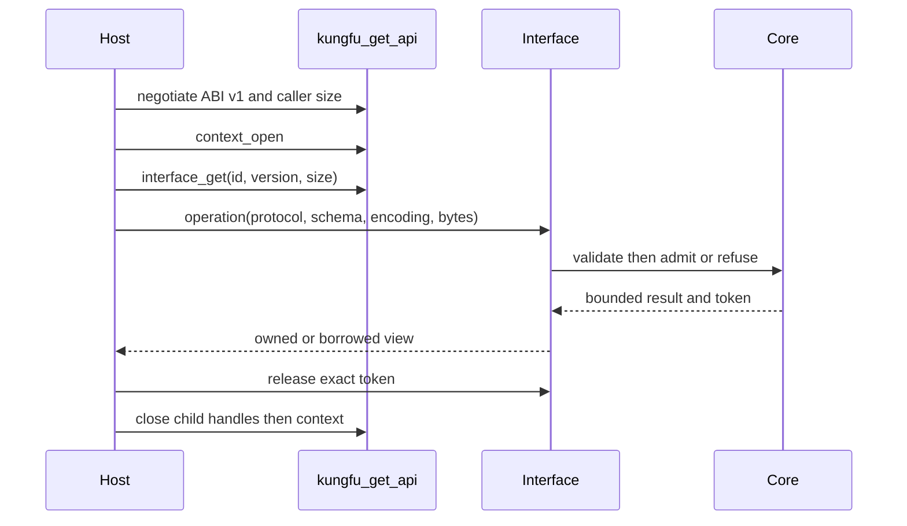

# Consume the KFD-7 libkungfu ABI

The supported installed coordinate is:

```cmake
find_package(Kungfu 4 CONFIG REQUIRED)
target_link_libraries(my_app PRIVATE Kungfu::kungfu)
```

`Kungfu::kungfu` is the narrow public façade. The package also installs its
private `libkungfu_runtime` dependency on macOS and Linux; consumers must not
link, load, or inspect that private artifact directly. On Windows the public
coordinate resolves to the narrow `kungfu.dll` plus its import library.

Only `kungfu/api.h` and `kungfu/api.hpp` are installed public headers.
Repository-internal C++ headers are not part of the installed SDK.

## Start from discovery

Call `kungfu_get_api(KF_ABI_V1, sizeof(kf_api_v1), &api)`, open one
owner-thread context, then request the responsibility-specific table you need:

- discovery: runtime identity, interface registry, contracts, and stable errors;
- stream: borrowed zero-copy journal batches;
- ledger-action: Fact/Episode operations under one exact `ActionBinding`;
- maintenance: diagnostics and explicit maintenance operations.

The complete C and C++ examples are installed under
`share/kungfu/examples/kfd7-consumer`. The C++ convenience wrapper in
`kungfu/api.hpp` owns only handles; it does not add semantics.



## Semantic and lifetime rules

- Every semantic message names its protocol id/version, schema reference,
  encoding, and exact bytes. JSON is explicitly the v1 compatibility encoding;
  it is not Root identity. Ledger-action v1 accepts only
  `KF_SCHEMA_LEDGER_ACTION_REQUEST_V1`; maintenance v1 accepts only
  `KF_SCHEMA_MAINTENANCE_REQUEST_V1`. Unknown schema references fail closed.
- Every `ActionBinding` contains seven canonical roots: Fact Cut, Pursuit,
  Atlas, Warrant, candidate action, preconditions, and resources. Changing one
  input requires a new binding and does not inherit authority or success.
- Contexts and child handles are owner-thread-affine in v1. Cross-thread use
  returns `KF_WRONG_THREAD`.
- A context allows one outstanding discovery/ledger/maintenance result.
  Release the exact token; stale tokens return `KF_STALE_HANDLE`.
- Stream batches remain valid until their reader release call. Closing a
  context with a live reader, binding, batch, or result returns `KF_BUSY`.
- Cancellation is cooperative before native admission. V1 does not promise
  mid-call preemption. `default_timeout_ms` is declared discovery metadata; v1
  does not preempt an already running native call.
- No C++ exception crosses the ABI.

The exact positive/negative corpus is
`share/kungfu/contracts/kfd7-abi-conformance-v1.json`. Public exports are
limited by `libkungfu-symbol-policy.json`.

## Rust, Python, and Node

Bindings must reproduce `api.h` with `repr(C)`/FFI-safe fixed-width types,
start at `kungfu_get_api`, negotiate each interface independently, and treat
all returned pointers as token-bounded views. They may add RAII or language
exceptions after converting a numeric `kf_status`; they may not infer
authority, occurrence, Fact admission, Episode sealing, or Pursuit settlement.

The shipped `kungfu-sdk` Rust crate and Python storage package start at
`kungfu_get_api` and negotiate ledger-action or maintenance explicitly. The
Node package remains a direct in-process C++ `storage_service_api` consumer; it
does not claim to be an ABI reference implementation. New wrapper work must be
generated or checked against `api.h` and the conformance corpus, then
differential-tested against the C consumer before promotion.

## Source/static reality kernel

Consumers that need the source/static reality-ledger kernel may embed
`framework/core/src/libyijinjing` with `add_subdirectory`/`FetchContent` and
link `yijinjing`. Its `fact_ledger_store` owns generic Fact record+receipt
pairing, verified replay, recovery disposition, and exact snapshot export.
Episode manifest authority is in the same source/static target.

This is not a `libyijinjing.so`, an independently versioned binary ABI, or a
separate package. It does not include Profiles, Python, Node, runtime
processes, projections, SQLite/RocksDB providers, or `libkungfu`.

## Migration and known limits

The pre-standard compatibility bootstraps were removed before stable release.
Callers must migrate to the responsibility table that owns their operation;
there is no deprecated stub, hidden alias, or fallback export.

The v1 ledger/maintenance semantic edge is JSON, and cancellation and timeout
do not preempt an admitted call. External adoption and battle-tested maturity
are explicit non-claims.
