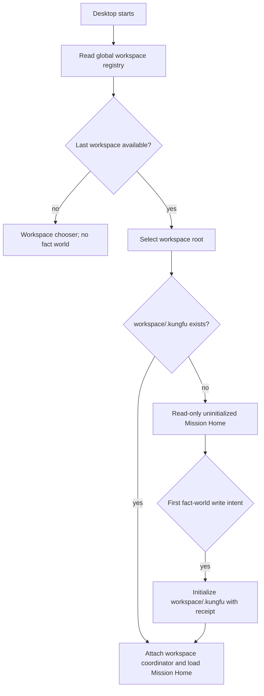

# Mission Control Workspace Product Design

## Product outcome

Kungfu Desktop opens a real project workspace and turns its admitted facts into
one responsibility-oriented home screen. For Atlas dogfood, opening
`~/Code/atlas` should answer five questions before it offers a generic list:

```text
What are we trying to achieve?
What actually happened?
What does the evidence establish at this cut?
Is the delegated work still fit for the purpose that matters?
Who should continue, adjust, stop, approve, or supply evidence next?
```

Mission and Go are not the dashboard's content model by themselves. They are
the responsibility coordinates used to answer those questions over facts,
Episodes, queries, assessments, and decisions.

## Current product evidence

| Surface | What exists now | Product gap |
| --- | --- | --- |
| Default GUI view | `work-dashboard` is already the default profile view | It renders Mission/Goal lists and large inline forms before the responsibility questions |
| Workspace data resolution | ADR-0035 and dev launchers resolve nearest or Git-root `.kungfu` | Packaged Desktop has no Open Workspace or recent-workspace session and defaults to Electron `userData/runtime` |
| Lazy creation | Dev path discovery can return a nonexistent Git-root `.kungfu` without creating it | GUI boot eagerly joins a runtime and writes runtime support files; no uninitialized workspace state exists |
| Mission Control | Atlas import, native Mission/Go, completion claims, ADR-0048 state, ADR-0052 TrustReport, Cost/State/Proof, and bundles exist | These capabilities are exposed as tooling panels, not one Mission Home operating loop |
| Saved Query Catalog | Journal-backed QueryDefinition + ViewSpec revisions, GUI save/delete/run, Node/Python/native parity | It is currently presented under Status/Query Reference and is not composed into Mission Home profiles |
| Shell state | Profile and sidebar state persist in the selected runtime ConfigStore | Last/recent workspace must exist before a workspace runtime and therefore needs global config-home state |

The mechanisms are substantially present. The missing work is composition,
workspace lifecycle, and information architecture.



## Workspace experience

### Cold start

1. Read `<KF_CONFIG_HOME>/gui/workspaces.json`.
2. If the last workspace exists and is accessible, select it before runtime
   boot.
3. If it is missing or inaccessible, show **Open Workspace** plus bounded
   recents; do not choose a machine fact world silently.
4. Display the canonical workspace path and data-home state in the title/header.

### Open Workspace

`File -> Open Workspace…`, the empty-state button, and the command palette use
the same directory-picker action. Selecting a directory:

- canonicalizes and remembers the root;
- detects Git and adapter eligibility;
- checks whether `<root>/.kungfu` exists;
- does not create `.kungfu`, start a coordinator, import Atlas, or modify
  `.gitignore`.

Switching from a live workspace releases its lease and performs a controlled
relaunch in version 1. The reopened window goes directly to Mission Home.

### Workspace states

| State | Home behavior | Allowed actions |
| --- | --- | --- |
| `none-selected` | Workspace chooser | open/recent/inspect only |
| `selected-uninitialized` | Empty Mission Home with detected source hints | create Mission, import, materialize bundle; first write initializes `.kungfu` |
| `ready-empty` | Initialized fact world with no Mission | create/import Mission |
| `ready` | Five-question Mission Home | all admitted read/write actions |
| `unavailable` | Path/permission diagnosis; never fall through | locate, forget, retry |
| `degraded` | Existing data with fsck/migration/missing-evidence warnings | inspect/export/repair actions allowed by diagnosis |

## Mission Home information architecture

### Header and action bar

The fixed top bar contains:

```text
[workspace / switcher] [Mission switcher] [cut: head | historical]
[+ Mission] [+ Go] [Import/Refresh] [Assess] [Export] [...]
```

`+ Mission` and `+ Go` open a modal or right-side drawer. They are never
expanded forms in the default dashboard. `+ Go` inherits the selected Mission
and remains disabled until one is selected. Advanced bundle and claim forms
move under contextual actions.

### The five-question canvas

| Question | Primary content | Authority / evidence | Primary action |
| --- | --- | --- | --- |
| What are we trying to achieve? | selected Mission intent, why it matters, current stage, constraints, last accepted decision | Mission fact fold at selected cut | clarify Mission, select another Mission |
| What actually happened? | material Go/Episode changes since the previous accepted assessment or review cut; blocked/waiting/completed transitions | Episode and admitted fact delta, not latest mutable rows | inspect timeline, attach or correct evidence |
| What does the evidence establish at this cut? | current state, proof coverage, missing/conflicting/stale evidence, declaration and query roots | ADR-0048 result/proof and linked sealed Episodes | inspect proof, change cut, request evidence |
| Is delegated work still fit for purpose? | purpose, fitness, assessment state, residual risk, freshness | ADR-0052 TrustReport for the explicit purpose | reassess, change purpose, adjust delegation |
| Who should act next? | current responsibility, decision inbox, suggested continue/adjust/stop/approve/request-evidence/handoff actions | admitted responsibility facts plus assessment suggestions; human authority remains explicit | record decision or delegate next action |

The dashboard compares two explicit cuts when it says **drift**: normally the
current cut and the cut pinned by the latest accepted assessment/decision. It
does not label ordinary list changes as Mission drift.

### Secondary views

- **Go Board** is reached from the Mission Home Go summary and groups work by
  responsibility state.
- **Mission/Go directory** remains available through switchers and search, not
  as the home screen's dominant content.
- **Observer Timeline**, **Fact Manager**, **Saved Query Catalog**, and **Trust
  Inspector** are progressive-disclosure destinations linked from each answer.
- Raw source material remains last-mile evidence, never the default home view.

### Selection defaults

- One active Mission: select it.
- Several Missions: restore the workspace-local last focus when it still
  exists; otherwise rank Missions needing a decision, showing drift, or lacking
  evidence before offering the full directory.
- No Mission: show the five-question skeleton with honest empty answers and the
  top-bar Create/Import actions.

## Atlas dogfood behavior

Opening `~/Code/atlas` sets the workspace root and candidate data home to
`~/Code/atlas/.kungfu`.

- If a completed Atlas import already exists in that `.kungfu`, Mission Home
  loads it immediately. It shows import source/head/time and the bridge-authority
  badge; it does not ask for another import.
- If `.kungfu` exists but the import is stale, show **Refresh Atlas facts** and
  the source delta. Refresh creates a new sealed import Episode and cannot
  reinterpret an old cut.
- If no import exists, detect the Atlas adapter and offer **Import Atlas facts**.
  This is explicit and initializes `.kungfu` if necessary.
- Imported Missions/Goals remain Atlas-authority observations. Kungfu-native Go,
  claim, assessment, and decision facts identify their own source authority and
  never masquerade as Atlas write-back.

The first dogfood dashboard should default to one real Atlas Mission and show:

- its north star/current operating line;
- Go and worktree facts since the prior decision cut;
- the current proof/degraded state;
- fitness for `continue-delegation` or another selected purpose;
- concrete responsibility for the next decision/evidence/action.

## Storage contract

### Workspace `.kungfu`

Authoritative or evidence-bearing workspace state:

- KFD declarations and admission receipts;
- Mission, Go, claim, decision, correction, and source observations;
- Episodes, manifest journals, payloads, content roots, source registry;
- assessment requests, Assessment Episodes, TrustReports;
- observer/cut metadata needed to reproduce a state;
- Saved Query Catalog revisions: QueryDefinition + ViewSpec;
- imported Atlas snapshot Episodes and source coordinates.

Workspace policy pins also live here: the exact fact type, schema, kfx/skill
version, capability grant, or trust-policy revision that participated in this
fact world. They are not mutable references to whichever package is installed
globally today.

Rebuildable workspace-local state:

- SQLite/index projections and query caches;
- coordinator process state and live routing files;
- workspace-specific shell focus/layout that does not claim domain authority.

Deleting a projection may change performance or temporary availability; it
must not delete Mission, proof, assessment, or saved-query authority.

### Global `~/.kungfu-config`

- config contract override and user UI preferences;
- recent/last workspace registry;
- installed kfx/skill metadata and global policy;
- user-level supervisor routing/process state;
- global shortcuts and appearance.

It must not contain workspace Mission/Go bodies, proof, imported Atlas content,
or Saved Query Catalog revisions.

Global installation and workspace use are separate. The config home may own an
installed package/cache and user-level default policy; `.kungfu` owns the exact
workspace pin, enablement/grant, declaration, and receipt. Updating a globally
installed package cannot retroactively change the contract world of an older
cut.

### Machine fallback and `~/.kungfu`

The platform fallback supports the no-workspace shell, caches, services, and
explicitly machine-scoped facts. It is not a hidden aggregate Mission world.

`~/.kungfu` is not a default config or data merge point. It may later be opened
explicitly as a Personal Workspace, but nothing is copied from or into an
opened project workspace implicitly.

## Saved Query Catalog decision

Saved Query Catalog is related to workspace `.kungfu` and its current storage
choice is correct:

- a saved query pins a QueryDefinition and ViewSpec for one declared fact world;
- rows, proof, and changelog state are rebuilt rather than stored as GUI truth;
- the Mission Home's built-in five-question profile is shipped product logic,
  not a mutable saved query;
- user-customized Mission views may be saved into that workspace's catalog;
- moving a saved view uses explicit JSON export/import or a containing portable
  bundle, never a global catalog that silently follows every workspace.

Built-in examples and presentation defaults may be global/read-only. Once a
definition is saved or revised against workspace facts, its revision is
workspace state.

## Agent and CLI parity

Agents need intent-level operations, not instructions to edit local JSON:

```text
kungfu workspace inspect <path> --json
kungfu workspace list --json
kungfu workspace current --json
kungfu workspace select <path> --json

kungfu atlas create-mission ... --workspace <path> --json
kungfu atlas create-go ... --workspace <path> --json
kungfu atlas import --repo <path> --workspace <path> --json
kungfu atlas assess-mission ... --workspace <path> --json
```

GUI actions call the same application service. Every write receipt reports the
canonical workspace, data home, initialization state, source authority, and
created fact/Episode/assessment identity. A GUI-only database or hidden current
workspace is forbidden.

## Delivery slices

| Slice | Deliverable | Falsifiable gate |
| --- | --- | --- |
| 1. Workspace registry | versioned config-home registry, inspect/list/current/select CLI, path canonicalization | selecting a fresh repo changes only the registry; `.kungfu` remains absent |
| 2. Desktop workspace shell | Open Workspace, recents, cold-start restore, unavailable state, header/switcher | restart reopens the same root; missing root never falls through silently |
| 3. Lazy data-home lifecycle | uninitialized runtime state, ensure gate, initialization receipt, coordinator attach | first read is filesystem-neutral; first Mission/import/saved-query write creates one root |
| 4. Mission Home read model | one application service composing Mission fold, delta, proof, TrustReport, responsibility decision surface | GUI/CLI return the same five answer identities and cut/proof roots |
| 5. Mission Home UX | five-question canvas, compact action bar, modal/drawer authoring, progressive disclosure | default screenshot contains no expanded create/import/bundle forms and no all-Mission list wall |
| 6. Atlas dogfood | real Atlas import freshness, focus selection, drift between accepted cuts, decision inbox | opening imported Atlas answers all five questions for one real Mission |
| 7. Saved Query composition | custom Mission views stored in workspace catalog, explicit transfer | query saved in workspace A is absent in B until imported; rebuilt result preserves definition identity |
| 8. Qualification | cross-platform filesystem, restart, switch, migration, deletion, GUI/CLI parity fixtures | release evidence proves no read-side creation and no cross-workspace leakage |

## Product acceptance journey

1. Start Desktop with no registry: see Open Workspace; no workspace data is
   created.
2. Open `~/Code/atlas` without `.kungfu`: path is remembered, Mission Home is
   honestly empty, filesystem is unchanged.
3. Import Atlas or create a Mission: exactly `~/Code/atlas/.kungfu` initializes
   and the receipt names the trigger.
4. Restart Desktop: Atlas reopens and existing Mission/Go/query/assessment data
   appears without re-import.
5. Select one Mission: the home answers the five questions at `head` and can
   switch to the latest accepted decision cut.
6. Create a Go from the top action bar: a drawer collects the bounded intent;
   after admission the responsibility and next-action sections update.
7. Save a custom evidence view: it appears in Atlas's Saved Query Catalog but
   not another workspace.
8. Switch workspace: the old coordinator lease and runtime handles are gone;
   no old Mission is visible.

## Explicit non-goals for the first release

- several live workspaces inside one Desktop process;
- automatic Atlas import merely because a directory looks compatible;
- a universal ontology or generic workflow designer;
- storing Mission truth in React state, Electron `userData`, or global config;
- silently editing `.gitignore`;
- making KFD-2 decide whether the Mission itself is valuable.

## Product risks

- A five-question dashboard can still become five decorative summaries. Every
  answer must expose its cut, proof, degraded state, and next action.
- Automatic Mission ranking must remain an attention projection, not hidden
  authority over human priority.
- Recent workspace paths are sensitive local metadata and must not enter
  portable bundles or telemetry.
- Workspace initialization is a cross-layer side effect. Qualification must
  test before/after filesystem state rather than trusting UI text.
