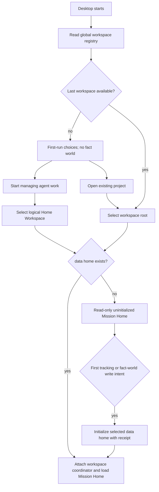

# Mission Control Workspace Product Design

## Product outcome

Kungfu Desktop opens one explicit fact world and turns its admitted facts into
one responsibility-oriented home screen. That fact world may be the user's
Home Workspace when no project repository exists, or a project workspace such
as `~/Code/atlas`. In both cases the home should answer five
questions before it offers a generic list:

```text
What are we trying to achieve?
What actually happened?
What does the evidence establish at this cut?
Is the delegated work still fit for the purpose that matters?
Who should continue, adjust, stop, approve, or supply evidence next?
```

Mission and Go are not the dashboard's content model by themselves. They are
the responsibility coordinates used to answer those questions over facts,
Episodes, queries, assessments, and decisions.

## Current product evidence

| Surface | What exists now | Product gap |
| --- | --- | --- |
| Default GUI view | `work-dashboard` is already the default profile view | It renders Mission/Goal lists and large inline forms before the responsibility questions |
| Workspace data resolution | [KF-ADR-019f86da-4f90-7e58-bb03-bee0f101dc01](../adr/KF-ADR-019f86da-4f90-7e58-bb03-bee0f101dc01.md) and dev launchers resolve nearest or Git-root `.kungfu` | Packaged Desktop has no Open Workspace or recent-workspace session and defaults to Electron `userData/runtime` |
| Lazy creation | Dev path discovery and GUI inspection can return an uninitialized or shadow-only Git-root `.kungfu` without creating runtime state | Explicit first continuation or another fact-bearing action creates the local runtime through the shared Workspace ensure gate |
| Mission Control | Atlas import, native Mission/Go, completion claims, [KF-ADR-019f86da-4f90-7e38-b72f-ef8829e14104](../adr/KF-ADR-019f86da-4f90-7e38-b72f-ef8829e14104.md) state, [KF-ADR-019f86da-4f90-7b3f-9ef3-84f5a878f302](../adr/KF-ADR-019f86da-4f90-7b3f-9ef3-84f5a878f302.md) TrustReport, Cost/State/Proof, and bundles exist | Mission Home now renders the five resolved query-profile answers; decision recording and cross-cut drift remain later slices |
| Saved Query Catalog | Journal-backed QueryDefinition + ViewSpec revisions, GUI save/delete/run, Node/Python/native parity | Five built-in Mission Control views now share this catalog; override/fork/restore policy still needs a dedicated manager flow |
| Shell state | Profile and sidebar state persist in the selected runtime ConfigStore | Last/recent workspace must exist before a workspace runtime and therefore needs global config-home state |

The mechanisms are substantially present. The missing work is composition,
workspace lifecycle, and information architecture.



## Workspace experience

### Cold start

1. Read `<KF_CONFIG_HOME>/gui/workspaces.json`.
2. If the last workspace exists and is accessible, select it before runtime
   boot.
3. On first install, show **Start managing agent work** as the recommended
   path, plus **Open existing project** and bounded recents. The recommended
   path selects Home; it does not require a
   repository, Markdown files, Git, or prior Mission vocabulary.
4. If an existing last workspace is missing or inaccessible, show the same
   choices with diagnosis; do not choose a different fact world silently.
5. Display the canonical workspace identity and data-home state in the
   title/header.

Installing or launching Kungfu creates neither `~/.kungfu` nor a project
`.kungfu`. Choosing Home establishes the user's intended fact
world. Its first managed agent run, Mission/Go creation, import, saved query, or
other fact-bearing write passes through the same lazy initialization gate.

### Home Workspace

Every user has one logical Home Workspace with stable identity `home`, display
name **Home**, and data home `~/.kungfu`. It is the first-class path for users
who want Kungfu to manage agent work alongside arbitrary projects without
preparing a local knowledge repository. The identity exists before the
directory; installation, launch, and selection remain read-only until the first
fact-bearing write lazily materializes it.

It may contain personal or cross-project Missions, unassigned agent work,
Episodes, facts, proof, assessments, decisions, and saved queries. Project
directories and files can later be attached as sources or evidence; their mere
presence does not make them authority and Kungfu does not copy their contents
automatically.

Home does not mean globally merged. Opening a project workspace selects a
different fact world. Moving a Mission or Episode between them requires an
explicit full or thin bundle export/import, with missing material and authority
degradation reported rather than hidden dual writes.

### Open Workspace

`File -> Open Workspace…`, the empty-state button, and the command palette use
the same directory-picker action. Selecting a directory:

- canonicalizes and remembers the root;
- detects Git and adapter eligibility;
- checks whether `<root>/.kungfu` exists;
- does not create `.kungfu`, start a coordinator, import Atlas, or modify
  `.gitignore`.

Switching from a live workspace releases its lease and performs a controlled
relaunch in version 1. The reopened window goes directly to Mission Home.

### Workspace states

| State | Home behavior | Allowed actions |
| --- | --- | --- |
| `none-selected` | First-run/Workspace chooser | start Home, open/recent/inspect only |
| `uninitialized` | Empty Mission Home or Agent Work Inbox with detected source hints | start managed run, create Mission, import, materialize bundle; first write initializes the selected data home |
| `shadow-only` | Qualified Git-settled Episode/Project Cut history, with no local runtime authority | inspect settled history, request/import full evidence, or explicitly start a local continuation |
| `live-runtime` | Initialized fact world; Home may show unassigned work or the five-question Mission Home | all admitted read/write actions |
| `unavailable` | Path/permission diagnosis; never fall through | locate, forget, retry |
| `evidence-degraded` | Tracked history or existing data with fsck/migration/missing-evidence warnings | inspect/export/request full evidence; continuation remains blocked until repair or qualified import |

## Mission Home information architecture

### Header and action bar

The fixed top bar contains:

```text
[workspace / switcher] [Mission switcher] [cut: head | historical]
[+ Mission] [+ Go] [Import/Refresh] [Assess] [Export] [...]
```

`+ Mission` and `+ Go` open a modal or right-side drawer. They are never
expanded forms in the default dashboard. `+ Go` inherits the selected Mission
and remains disabled until one is selected. Advanced bundle and claim forms
move under contextual actions.

### The five-question canvas

| Question | Primary content | Authority / evidence | Primary action |
| --- | --- | --- | --- |
| What are we trying to achieve? | selected Mission intent, why it matters, current stage, constraints, last accepted decision | Mission fact fold at selected cut | clarify Mission, select another Mission |
| What actually happened? | material Go/Episode changes since the previous accepted assessment or review cut; blocked/waiting/completed transitions | Episode and admitted fact delta, not latest mutable rows | inspect timeline, attach or correct evidence |
| What does the evidence establish at this cut? | current state, proof coverage, missing/conflicting/stale evidence, declaration and query roots | [KF-ADR-019f86da-4f90-7e38-b72f-ef8829e14104](../adr/KF-ADR-019f86da-4f90-7e38-b72f-ef8829e14104.md) result/proof and linked sealed Episodes | inspect proof, change cut, request evidence |
| Is delegated work still fit for purpose? | purpose, fitness, assessment state, residual risk, freshness | [KF-ADR-019f86da-4f90-7b3f-9ef3-84f5a878f302](../adr/KF-ADR-019f86da-4f90-7b3f-9ef3-84f5a878f302.md) TrustReport for the explicit purpose | reassess, change purpose, adjust delegation |
| Who should act next? | current responsibility, decision inbox, suggested continue/adjust/stop/approve/request-evidence/handoff actions | admitted responsibility facts plus assessment suggestions; human authority remains explicit | record decision or delegate next action |

The dashboard compares two explicit cuts when it says **drift**: normally the
current cut and the cut pinned by the latest accepted assessment/decision. It
does not label ordinary list changes as Mission drift.

### Secondary views

- **Go Board** is reached from the Mission Home Go summary and groups work by
  responsibility state.
- **Mission/Go directory** remains available through switchers and search, not
  as the home screen's dominant content.
- **Observer Timeline**, **Fact Manager**, **Saved Query Catalog**, and **Trust
  Inspector** are progressive-disclosure destinations linked from each answer.
- Raw source material remains last-mile evidence, never the default home view.

### Selection defaults

- One active Mission: select it.
- Several Missions: restore the workspace-local last focus when it still
  exists; otherwise rank Missions needing a decision, showing drift, or lacking
  evidence before offering the full directory.
- No Mission: show the five-question skeleton with honest empty answers and the
  top-bar Create/Import actions. In Home, also show an
  **Agent Work Inbox** for captured work not yet attached to a Mission.

### Agent Work Inbox before Mission

A new user may start an agent run before they can articulate a Mission. Kungfu
must preserve that work without inventing purpose:

- **What are we trying to achieve?** Not yet declared; offer Create Mission or
  Ask agent to propose one.
- **What actually happened?** Show the admitted run/Episode events.
- **What does the evidence establish?** Show receipts, proof coverage, and
  attribution quality.
- **Is it fit for purpose?** `insufficient`: no purpose has been declared.
- **Who should act next?** Ask the user or agent to attach/clarify purpose or
  supply missing evidence.

Attaching an inbox Episode to a later Mission/Go adds an admitted relationship;
it does not rewrite the Episode identity or pretend the purpose existed at run
time.

### Capture and attribution modes

| Agent path | What Kungfu can establish | Required presentation |
| --- | --- | --- |
| Kungfu launches a managed run | supervisor/run/Episode identity and bounded runtime facts | exact attribution where receipts and frame checks pass |
| Agent uses Kungfu CLI/API/skill | explicit action and evidence receipts from that integration | sourced attribution with declared capture boundary |
| External agent is imported after the fact | only the observed files/traces/material supplied | observed or ambiguous; never exact causality by inference |

“Sidecar management” is therefore a product integration contract, not magical
passive observation of every agent. Degraded attribution remains useful, but it
must remain visible and cannot be promoted by UI wording.

### Home is the default capture target, not a global fallback

An independent CLI resolves its target as follows:

```text
explicit --workspace / --home
  -> explicit process environment
  -> nearest discovered project workspace
  -> command-specific no-project behavior
  -> fail with target diagnosis
```

The CLI never inherits the Desktop's last workspace implicitly. When no project
workspace exists, capture-only operations such as Episode import or a managed
agent run may materialize Home and write to its Agent Work Inbox. The receipt
must report:

```text
workspace_id=home
workspace_kind=home
data_home=~/.kungfu
resolution_reason=no-project-workspace
association=unassigned
source_working_directory=<captured cwd>
```

The build-free Assignment ingress implements this exact capture-only order:

```sh
./shifu assignment capture --request request.json --json
```

It stores canonical request material and a content-addressed receipt under
`.kungfu/inbox/assignment-requests/`. It does not initialize `runtime/`, append
the journal, or admit or claim an Assignment. Expiry is dry-run-first and writes
an exact-plan retirement receipt while retaining the captured bytes; see
[Build-free Assignment request capture](../adr/KF-ADR-019f878c-5480-7890-bc64-9b2aab7e9aa5.md).

This establishes capture, not project membership or Mission purpose. Bundle
validation may remain workspace-free. Non-interactive semantic writes,
assessment, correction, repair, migration, and destructive operations require
an explicit or discovered target; they do not use Home as a silent catch-all.

### Progressive project and Git guidance

Home is a real workspace, not a temporary error state. Kungfu recommends a
project workspace only when admitted evidence shows project gravity:

- repeated unassigned Episodes from one source root;
- an existing Git repository;
- a Mission with stable project coordinates;
- a collaboration, transfer, long-term drift, or recovery requirement.

The recommendation shows the triggering facts and offers **Create project
workspace**, **Keep in Home**, and **Do not ask again for this source**. Before
execution it previews which Episodes will be related or materialized, which
material remains in Home, and which filesystem or Git effects are excluded.

Kungfu strongly recommends a project workspace at the root of an existing Git
repository for long-lived software or document work, but it does not require
Git and never runs `git init`, edits `.gitignore`, stages, commits, creates a
remote, or pushes as an implied part of workspace creation.

A Git-backed workspace does not mean the whole `.kungfu` directory belongs in
Git. Git is suited to low-frequency, reviewable declarations, policy/schema/kfx
pins, portable query definitions, and other declared contract inputs. Kungfu's
high-frequency Episode journals, payloads, runtime facts, coordinator state,
and rebuildable projections remain in the fact ledger and move through
explicit bundles or a future declared sync contract. The exact tracked contract
layout must be qualified before any automatic Git integration ships.

An **All Workspaces** view may join Home and project attention as a read-only
projection. It is not another fact world and cannot accept writes.

### Agent-mediated guidance

Users may ask an agent to operate Kungfu instead of navigating every mechanical
flow. Under [KF-ADR-019f86da-4f90-7667-b89e-18b1002e45f8](../adr/KF-ADR-019f86da-4f90-7667-b89e-18b1002e45f8.md), Kungfu produces the evidence-backed advice, impact preview,
authorization requirement, and execution receipt; the agent explains the
choice, asks for the bounded decision, and invokes the intent-level operation.

For example, Kungfu may report seven unassigned Episodes from one Git root and
recommend a project workspace. The agent can explain why, compare **Keep in
Home**, and execute the selected plan. It cannot infer project authority,
expand approval into Git mutation, or substitute its prose for a receipt.

The reusable interaction contract is:

```text
inspect -> advise -> preview -> authorize -> execute -> receipt -> verify
```

The GUI renders the same advice and decision identities, so guidance remains
visible and recoverable even when the conversation ends or another agent takes
over.

## Atlas dogfood behavior

Opening `~/Code/atlas` sets the workspace root and candidate data home to
`~/Code/atlas/.kungfu`.

- If a completed Atlas import already exists in that `.kungfu`, Mission Home
  loads it immediately. It shows import source/head/time and the bridge-authority
  badge; it does not ask for another import.
- If `.kungfu` exists but the import is stale, show **Refresh Atlas facts** and
  the source delta. Refresh creates a new sealed import Episode and cannot
  reinterpret an old cut.
- If no import exists, detect the Atlas adapter and offer **Import Atlas facts**.
  This is explicit and initializes `.kungfu` if necessary.
- Imported Missions/Goals remain Atlas-authority observations. Kungfu-native Go,
  claim, assessment, and decision facts identify their own source authority and
  never masquerade as Atlas write-back.

The first dogfood dashboard should default to one real Atlas Mission and show:

- its north star/current operating line;
- Go and worktree facts since the prior decision cut;
- the current proof/degraded state;
- fitness for `continue-delegation` or another selected purpose;
- concrete responsibility for the next decision/evidence/action.

## Storage contract

### Workspace `.kungfu`

Authoritative or evidence-bearing workspace state:

- KFD declarations and admission receipts;
- Mission, Go, claim, decision, correction, and source observations;
- Episodes, manifest journals, payloads, content roots, source registry;
- assessment requests, Assessment Episodes, TrustReports;
- observer/cut metadata needed to reproduce a state;
- Saved Query Catalog revisions: QueryDefinition + ViewSpec;
- imported Atlas snapshot Episodes and source coordinates.

Workspace policy pins also live here: the exact fact type, schema, kfx/skill
version, capability grant, or trust-policy revision that participated in this
fact world. They are not mutable references to whichever package is installed
globally today.

Rebuildable workspace-local state:

- SQLite/index projections and query caches;
- coordinator process state and live routing files;
- workspace-specific shell focus/layout that does not claim domain authority.

Deleting a projection may change performance or temporary availability; it
must not delete Mission, proof, assessment, or saved-query authority.

### Global `~/.kungfu-config`

- config contract override and user UI preferences;
- recent/last workspace registry;
- installed kfx/skill metadata and global policy;
- user-level supervisor routing/process state;
- global shortcuts and appearance.

It must not contain workspace Mission/Go bodies, proof, imported Atlas content,
or Saved Query Catalog revisions.

Global installation and workspace use are separate. The config home may own an
installed package/cache and user-level default policy; `.kungfu` owns the exact
workspace pin, enablement/grant, declaration, and receipt. Updating a globally
installed package cannot retroactively change the contract world of an older
cut.

### Machine fallback and Home `~/.kungfu`

The platform fallback supports the no-workspace shell, caches, services, and
explicitly machine-scoped facts. It is not a hidden aggregate Mission world.

`~/.kungfu` is the Home Workspace data home. It is created
only after the user chooses Home and performs the first tracking
or fact-world write. It is not config, a machine cache, or an implicit merge
point. Nothing is copied from or into an opened project workspace implicitly.

## Saved Query Catalog decision

Saved Query Catalog belongs to the selected fact world—Home `~/.kungfu` or
project `<workspace>/.kungfu`—and its current storage choice is correct:

- a saved query pins a QueryDefinition and ViewSpec for one declared fact world;
- rows, proof, and changelog state are rebuilt rather than stored as GUI truth;
- the Mission Home's built-in five-question profile is shipped product logic,
  not a mutable saved query;
- user-customized Mission views may be saved into that workspace's catalog;
- the Mission Go-card field persists its versioned filter, sort, hierarchy, and
  closed-child policy as a Mission Control ViewSpec, while QueryDefinition still
  owns the fact world and cut;
- moving a saved view uses explicit JSON export/import or a containing portable
  bundle, never a global catalog that silently follows every workspace.

Built-in examples and presentation defaults may be global/read-only. Once a
definition is saved or revised against workspace facts, its revision is
workspace state.

## Agent and CLI parity

Agents need intent-level operations, not instructions to edit local JSON:

```text
kungfu workspace inspect <path> --json
kungfu workspace list --json
kungfu workspace current --json
kungfu workspace select <path> --json
kungfu workspace select-home --json
kungfu workspace request-full-evidence <path> --json
kungfu workspace import-full-evidence <path> --from <bundle> [--execute] --json
kungfu workspace advise --json
kungfu workspace preview <advice-id> --json
kungfu workspace apply <preview-id> --json

kungfu atlas create-mission ... --workspace <path> --json
kungfu atlas create-go ... --workspace <path> --json
kungfu atlas import --repo <path> --workspace <path> --json
kungfu atlas assess-mission ... --workspace <path> --json
```

Continuation retains three deliberately different layers. Tracked qualified
Episode and Project Cut shadows remain the thin review authority;
content-addressed successor Atlas baselines under
`.xinfa/baselines/sha256/<atlas-root>/` track only their witness files
(`manifest.json` and `receipt.json` at every layer) while Atlas bodies stay
local immutable material, so a clean clone verifies every published Cut but
must restore retained material or recompile from the recorded source cut
before compiling the next Cut ([KF-ADR-019f86da-4f90-7089-b9b1-e070edf7d540](../adr/KF-ADR-019f86da-4f90-7089-b9b1-e070edf7d540.md)); optional full Episode bundles
remain local runtime evidence and gain replay, requalification, and
disaster-recovery capabilities only after an exact root-bound import
receipt. Runtime journals are the live write authority.
`.kungfu/cache`, derived projections, and indexes are rebuildable and never
substitute for any of those retained roots.

GUI actions call the same application service. Every write receipt reports the
canonical workspace, data home, initialization state, source authority, and
created fact/Episode/assessment identity. A GUI-only database or hidden current
workspace is forbidden.

Exact subcommand names may change during implementation, but inspect, advice,
preview, authorized execution, receipt, and verification are required semantic
surfaces. Prompt text or an installed skill may teach an agent to use them; it
is not the enforcement boundary.

## Delivery slices

| Slice | Deliverable | Falsifiable gate |
| --- | --- | --- |
| 1. Workspace registry | versioned config-home registry with `home`/`project` kind, inspect/list/current/select CLI, path canonicalization | selecting either fresh candidate changes only the registry; no data home exists |
| 2. First-run and Home Workspace | onboarding choices, Home selection, Agent Work Inbox, restart restore | a user with no repo records one managed run and reopens it without learning Git or editing JSON |
| 3. Desktop project workspace shell | Open Workspace, recents, unavailable state, header/switcher | restart reopens the same root; missing root never falls through silently |
| 4. Lazy data-home lifecycle | uninitialized runtime state, ensure gate, initialization receipt, coordinator attach | install/open is filesystem-neutral; first tracking/Mission/import/query write creates exactly one root |
| 5. Agent capture contract | managed-run receipts, CLI/API integration receipts, degraded external import | unintegrated external activity cannot be presented as exact attribution |
| 6. Advice/action protocol | typed inspect/advice/preview/authorization/action/receipt services shared by GUI and agents | stale advice cannot execute; GUI and CLI expose the same reason and receipt identities |
| 7. Project promotion and Git boundary | project-gravity advice, Home-to-project preview, suppression, separate Git effects | keep-in-Home works; workspace creation changes no Git state without separate authorization |
| 8. Mission Home read model | one application service composing Mission fold, inbox, delta, proof, TrustReport, responsibility decision surface | GUI/CLI return the same five answer identities and cut/proof roots |
| 9. Mission Home UX | five-question canvas, compact action bar, modal/drawer authoring, progressive disclosure | default screenshot contains no expanded create/import/bundle forms and no all-Mission list wall |
| 10. Atlas dogfood | real Atlas import freshness, focus selection, drift between accepted cuts, decision inbox | opening imported Atlas answers all five questions for one real Mission |
| 11. Saved Query and transfer | custom views stored per fact world, explicit Home-to-project bundle transfer | Home query/Mission is absent in project until imported; identities and missing material remain explicit |
| 12. Qualification | cross-platform filesystem, restart, switch, migration, deletion, GUI/CLI parity and stale-agent fixtures | release evidence proves no read-side creation, cross-workspace leakage, or authority expansion through agent prose |

## Product acceptance journey

1. Install and start Desktop with no registry: see **Start managing agent
   work** and **Open existing project**; neither `~/.kungfu` nor a project data
   home is created.
2. Choose Home and start one managed agent run: `~/.kungfu`
   initializes with a receipt; the run appears in Agent Work Inbox without an
   invented Mission, and fitness reports insufficient until purpose exists.
3. Attach that Episode to a new Mission: its original identity and capture time
   remain unchanged. Restart Desktop and Home reopens.
4. Run an Episode import outside a project: the receipt targets Home Inbox,
   records the source directory, and reports `association=unassigned`.
5. After repeated Episodes from one Git root, inspect the shared GUI/agent
   advice, keep them in Home once, then preview project promotion. Creating the
   workspace performs no Git mutation.
6. Open `~/Code/atlas` without `.kungfu`: path is remembered, Mission Home is
   honestly empty, filesystem is unchanged.
7. Import Atlas or create a Mission: exactly `~/Code/atlas/.kungfu` initializes
   and the receipt names the trigger.
8. Restart Desktop: Atlas reopens and existing Mission/Go/query/assessment data
   appears without re-import.
9. Select one Mission: the home answers the five questions at `head` and can
   switch to the latest accepted decision cut.
10. Create a Go from the top action bar: a drawer collects the bounded intent;
   after admission the responsibility and next-action sections update.
11. Save a custom evidence view: it appears in Atlas's Saved Query Catalog but
   not another workspace.
12. Filter the Go-card field to high-importance attention work, sort by trust
   risk, and save the workspace view. Update the same saved query through the
   CLI: the open GUI adopts the new revision on refresh without restarting.
13. Export a Home Mission as a full bundle and import it into Atlas: the
   declared roots persist, while no global/project shared authority is created.
14. Switch workspace: the old coordinator lease and runtime handles are gone;
   no old Mission is visible.

## Explicit non-goals for the first release

- several live workspaces inside one Desktop process;
- automatic Atlas import merely because a directory looks compatible;
- claiming passive, exact observation of an agent that emitted no Kungfu
  integration receipt or importable evidence;
- a universal ontology or generic workflow designer;
- storing Mission truth in React state, Electron `userData`, or global config;
- silently editing `.gitignore`;
- making KFD-2 decide whether the Mission itself is valuable.

## Product risks

- A five-question dashboard can still become five decorative summaries. Every
  answer must expose its cut, proof, degraded state, and next action.
- Automatic Mission ranking must remain an attention projection, not hidden
  authority over human priority.
- Recent workspace paths are sensitive local metadata and must not enter
  portable bundles or telemetry.
- Workspace initialization is a cross-layer side effect. Qualification must
  test before/after filesystem state rather than trusting UI text.
