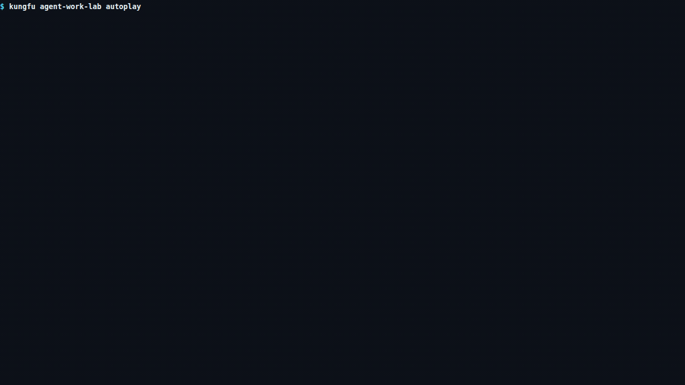
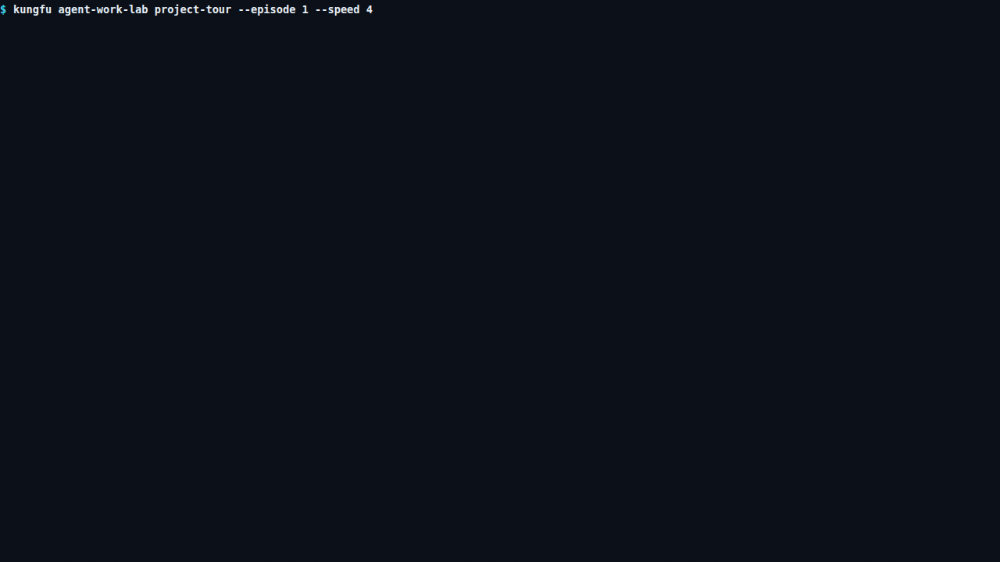
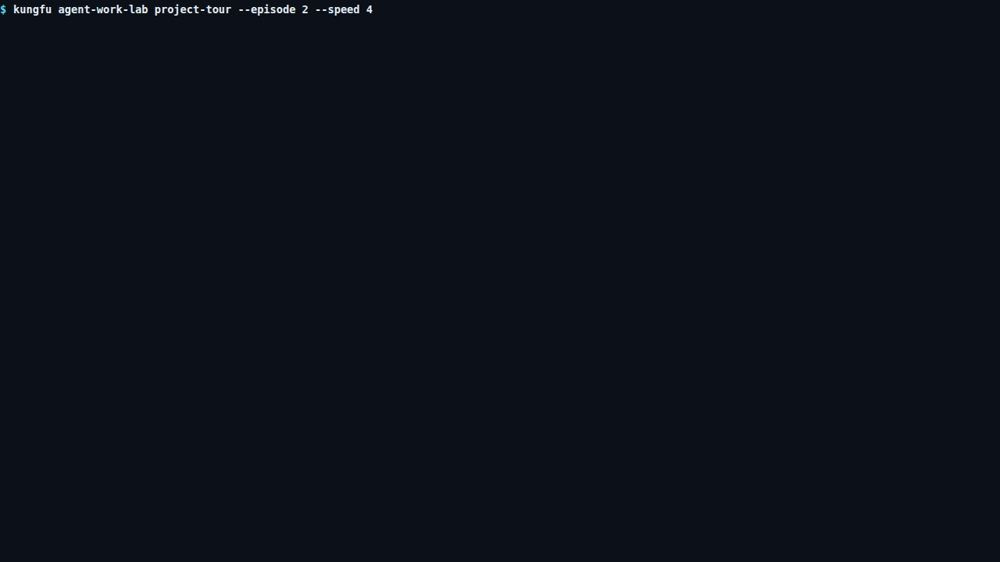

# Declarative Multi-demo Animation Pipeline

Kungfu consumes Buildchain's generic declarative binary-demo capability. The
product owns only its scenario and its standalone binary distribution;
Buildchain owns capture, Gate qualification, native rendering, evidence,
README materialization, and the update pull request.

The single source of scenario intent is
`.buildchain/auditable-demo.json`. It declares three demos:

| Demo | Exact installed-binary argv | Bound |
| --- | --- | --- |
| Agent Work Lab autoplay | `kungfu agent-work-lab autoplay` | 90 seconds |
| Guided Project Tour episode 1 | `kungfu agent-work-lab project-tour --episode 1 --speed 4` | 360 seconds |
| Guided Project Tour episode 2 | `kungfu agent-work-lab project-tour --episode 2 --speed 4` | 360 seconds |

All three playback commands are self-driving, deterministic under the declared
isolated environment, credential-free, and bounded by the `long-form` duration
class. They intentionally run inside native PTYs and are executed directly as
argv, never through a shell command string.

Before upload, a distinct non-interactive transport smoke runs
`kungfu agent-work-lab demo --json` from the copied standalone distribution and
requires the `kungfu.agent-work-lab.report/v1` sentinel. This verifies that
transport retained an executable product without pretending that a pipe is a
PTY or replacing either native playback capture.

## One reusable path

```text
exact same-run Kungfu Linux artifact
-> standalone binary metadata and digest verification
-> declarative scenario validation
-> isolated PTY capture for every demo and rendition
-> required Buildchain Gate
-> immutable Build Images renderer
-> content-addressed media and Release Passport
-> protected README materialization pull request
```

`.github/workflows/auditable-demo.yml` is the only animation entry. A manual
run, Alpha refresh, and Release refresh execute the same three jobs: build one
Linux x64 binary, bind its same-run artifact coordinate, then call one exact
`.declarative-auditable-demo.yml` revision. The manual input can stop after the
Gate or continue through rendering and materialization. It has no preflight
run id, Release Cut, KFD, Windows sentinel, compiler-cache, promotion, or
four-platform dependency. Alpha keeps the required Gate strict but treats only
the full-media step as advisory: renderer failure remains visible and
suppresses materialization without blocking binary publication. Release and
explicit media refreshes remain strict. There is no product-specific adapter,
trigger-plan compiler, Passport writer, renderer wrapper, or README updater.

The Linux build artifact contains the exact standalone distribution at
`product/dist/cli/kungfu-episodes-cli-linux-x64/`. The latter includes the
launcher and `auditable-demo-binary.json`, which binds the launcher SHA-256,
platform id, metadata contract, and an empty runtime-dependency set. Capture
therefore runs the product binary produced by the same workflow run instead of
rebuilding Kungfu or using npm as an execution layer.

## Native responsive renditions

Every demo is captured twice from the same deterministic replay window:

- `1920x1080` uses a `150x36` PTY;
- `1280x720` keeps the same 150-column full-width grid with a shorter 28-row
  viewport.

The 720p rendition is not a resized 1080p recording. Each PTY receives the
same timed terminal events, while the shorter 720p row budget independently
reflows the real TUI without shrinking its active content to a 100-column
island. The declared `terminal-fill` composition requires each native PTY
viewport to begin at `(0, 0)`, fill the exact output dimensions, and provide
cell geometry whose columns and rows resolve to the complete frame. The
renderer retains ANSI color and emits GIF,
MP4, WebM, poster, probe, inspection, receipt, and checksum evidence. The
long-form web profile keeps a 10 fps capture budget and rejects duration,
dimension, output-size, native-rendition, or renderer-contract drift.

## Materialization and evidence

Kungfu owns the public argument around the media: the three proof labels,
questions, summaries, and the transitions from continuity to failure retention
to review and settlement. The scenario binds those semantics to the same demo
titles used by exact-artifact capture. Buildchain validates and materializes
that declaration without inventing product copy.

For this consumer, Buildchain updates only one media block per demo in the
README:

```text
kungfu:auditable-demo:agent-work-lab-autoplay
kungfu:auditable-demo:project-tour-episode-1
kungfu:auditable-demo:project-tour-episode-2
```

Qualified media is copied under the content-addressed root
`docs/qualification/evidence/auditable-demo/<evidence-root>/<demo-id>/`.
Each compact README block links its GIF to `public-evidence.json`; the
human-authored headings, explanations, and bridge remain outside generated
markers. Buildchain writes the full command list, native 1080p and 720p video
links, claim boundary, Release Passport, evidence links, and declared
transition into ordered generated blocks on this technical page. Re-running
the same evidence is idempotent; a changed source, scenario, capture, Gate, or
media bundle produces a different evidence root.

The workflow token may create the bounded materialization pull request only.
It does not grant package publication, deployment, release-channel promotion,
or arbitrary repository-write authority.

## Authority boundary

The scenario, binary metadata, capture, renderer output, checked-in media,
Product System identity, first-party/System identity, KFD compliance, package
metadata, registry history, scan results, and standalone generation are not
authorization sources. The scenario declares `grants: []`.

Authorization must come from the exact Release Passport, Core policy, Work or
Warrant, an explicit capability grant, and runtime isolation. Product System
is assembly and distribution metadata only. A passing demo proves only that
the exact retained product artifact executed the named deterministic scenario
and that its observations passed the declared Gate and media profile.

## Fail-closed checks

The path rejects, at minimum:

- a missing or mismatched binary metadata digest;
- network or secret use, shell command strings, unsafe paths, or undeclared
  runtime dependencies;
- a timeout beyond the selected duration class;
- missing completion sentinels or unexpected exit codes;
- capture timelines not derived from actual PTY read times;
- identical or scaled native-rendition frame sets;
- an unpinned Buildchain workflow or renderer image;
- checksum, Gate-root, media-root, scenario-root, or source-coordinate drift;
- any implicit authority or capability grant; and
- incomplete or ambiguous README markers.

Only a retained passing run and its content-addressed evidence may update the
README. A failed or cancelled run is diagnostic evidence, never qualification.

<!-- kungfu:auditable-demo:technical:agent-work-lab-autoplay:start -->
## Continuity: Can Work survive a new Agent?

The first proof isolates continuity: one Work continues across two fresh Agent Sessions without copied chat.

[](evidence/auditable-demo/de5bb4ed63b336a8940b9645f736c608e3632222811cec74b2332ef0f125bf94/agent-work-lab-autoplay/public-evidence.json)

Commands:

```text
$ kungfu agent-work-lab autoplay
```

Native renditions: [1080p MP4](evidence/auditable-demo/de5bb4ed63b336a8940b9645f736c608e3632222811cec74b2332ef0f125bf94/agent-work-lab-autoplay/demo.mp4) · [1080p WebM](evidence/auditable-demo/de5bb4ed63b336a8940b9645f736c608e3632222811cec74b2332ef0f125bf94/agent-work-lab-autoplay/demo.webm) · [720p MP4](evidence/auditable-demo/de5bb4ed63b336a8940b9645f736c608e3632222811cec74b2332ef0f125bf94/agent-work-lab-autoplay/demo-720p.mp4) · [720p WebM](evidence/auditable-demo/de5bb4ed63b336a8940b9645f736c608e3632222811cec74b2332ef0f125bf94/agent-work-lab-autoplay/demo-720p.webm)

Claim boundary: This exact standalone Kungfu artifact proves only the bounded offline Agent Work Lab autoplay observed in two independently captured native PTYs; it grants no Work, release, capability, or production authority.

[Release Passport](evidence/auditable-demo/de5bb4ed63b336a8940b9645f736c608e3632222811cec74b2332ef0f125bf94/agent-work-lab-autoplay/release-passport.json) · [auditable evidence](evidence/auditable-demo/de5bb4ed63b336a8940b9645f736c608e3632222811cec74b2332ef0f125bf94/agent-work-lab-autoplay/public-evidence.json)

The mechanism exists; the next proof asks whether it still holds under real failure conditions.
<!-- kungfu:auditable-demo:technical:agent-work-lab-autoplay:end -->

<!-- kungfu:auditable-demo:technical:project-tour-episode-1:start -->
## Failure retention: Can Work survive failure?

Inside a disposable Project, a dropped connection and a crashed replacement process remain as Attempts under the same Work.

[](evidence/auditable-demo/2f8cd55f05b186a52e0af87087b7751b21e8d4cffec898c0c0b333fcf2abfa12/project-tour-episode-1/public-evidence.json)

Commands:

```text
$ kungfu agent-work-lab project-tour --episode 1 --speed 4
```

Native renditions: [1080p MP4](evidence/auditable-demo/2f8cd55f05b186a52e0af87087b7751b21e8d4cffec898c0c0b333fcf2abfa12/project-tour-episode-1/demo.mp4) · [1080p WebM](evidence/auditable-demo/2f8cd55f05b186a52e0af87087b7751b21e8d4cffec898c0c0b333fcf2abfa12/project-tour-episode-1/demo.webm) · [720p MP4](evidence/auditable-demo/2f8cd55f05b186a52e0af87087b7751b21e8d4cffec898c0c0b333fcf2abfa12/project-tour-episode-1/demo-720p.mp4) · [720p WebM](evidence/auditable-demo/2f8cd55f05b186a52e0af87087b7751b21e8d4cffec898c0c0b333fcf2abfa12/project-tour-episode-1/demo-720p.webm)

Claim boundary: This exact standalone Kungfu artifact proves only the bounded disposable Project Tour episode 1 observed at 4x in two independently captured native PTYs; Mock Agent output and terminal observations grant no Work, release, capability, or production authority.

[Release Passport](evidence/auditable-demo/2f8cd55f05b186a52e0af87087b7751b21e8d4cffec898c0c0b333fcf2abfa12/project-tour-episode-1/release-passport.json) · [auditable evidence](evidence/auditable-demo/2f8cd55f05b186a52e0af87087b7751b21e8d4cffec898c0c0b333fcf2abfa12/project-tour-episode-1/public-evidence.json)

Work survival is only the first step. If an Agent can approve its own result, continuity still is not trustworthy.
<!-- kungfu:auditable-demo:technical:project-tour-episode-1:end -->

<!-- kungfu:auditable-demo:technical:project-tour-episode-2:start -->
## Review and settlement: Who is allowed to complete Work?

The final proof separates Agent exit, independent review, and Kungfu settlement: an Agent can produce a candidate and evidence, but cannot approve its own Work.

[](evidence/auditable-demo/de510c545b8be553502db1428aa629aa31fd8c5aadc8c1cd911dd49e598ea3f3/project-tour-episode-2/public-evidence.json)

Commands:

```text
$ kungfu agent-work-lab project-tour --episode 2 --speed 4
```

Native renditions: [1080p MP4](evidence/auditable-demo/de510c545b8be553502db1428aa629aa31fd8c5aadc8c1cd911dd49e598ea3f3/project-tour-episode-2/demo.mp4) · [1080p WebM](evidence/auditable-demo/de510c545b8be553502db1428aa629aa31fd8c5aadc8c1cd911dd49e598ea3f3/project-tour-episode-2/demo.webm) · [720p MP4](evidence/auditable-demo/de510c545b8be553502db1428aa629aa31fd8c5aadc8c1cd911dd49e598ea3f3/project-tour-episode-2/demo-720p.mp4) · [720p WebM](evidence/auditable-demo/de510c545b8be553502db1428aa629aa31fd8c5aadc8c1cd911dd49e598ea3f3/project-tour-episode-2/demo-720p.webm)

Claim boundary: This exact standalone Kungfu artifact proves only the bounded disposable Project Tour episode 2 observed at 4x in two independently captured native PTYs; Mock Agent output and terminal observations grant no Work, release, capability, or production authority.

[Release Passport](evidence/auditable-demo/de510c545b8be553502db1428aa629aa31fd8c5aadc8c1cd911dd49e598ea3f3/project-tour-episode-2/release-passport.json) · [auditable evidence](evidence/auditable-demo/de510c545b8be553502db1428aa629aa31fd8c5aadc8c1cd911dd49e598ea3f3/project-tour-episode-2/public-evidence.json)
<!-- kungfu:auditable-demo:technical:project-tour-episode-2:end -->
